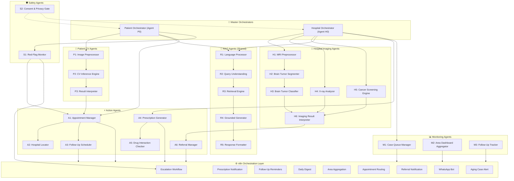
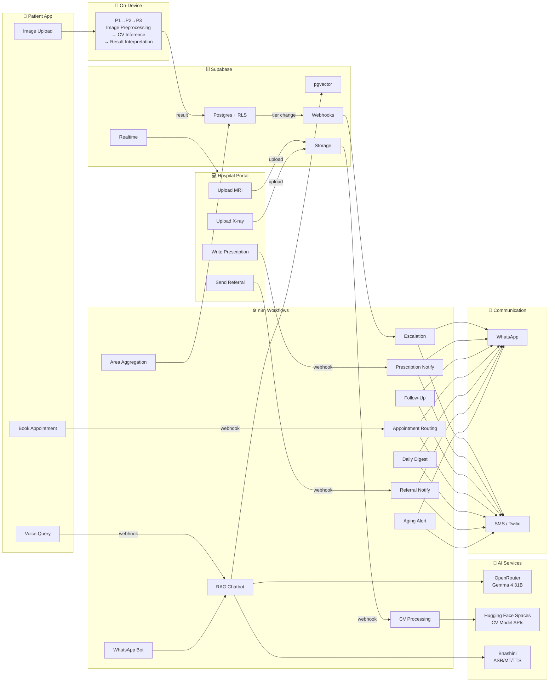

# Agents & AI Pipeline — ArogyaMitra

**Multi-Agent System Specification**  
**Parent Spec:** [arogyamitra.md](file:///f:/Maverick2026/arogyamitra.md)  
**Patient-Side Agents:** [patient.md](file:///f:/Maverick2026/patient.md)  
**Hospital-Side Agents:** [hospital.md](file:///f:/Maverick2026/hospital.md)

> This document is the **single source of truth** for ArogyaMitra's entire multi-agent AI system — every agent, every trained model, every RAG pipeline, every n8n workflow, how they're trained, how they connect, what dataset powers each one, and how n8n orchestrates the whole system into a cohesive product. If you need to understand "what AI does what, and how does it all fit together," this is the file.

---

## Table of Contents

1. [Multi-Agent System Overview](#1-multi-agent-system-overview)
2. [Complete Agent Registry](#2-complete-agent-registry)
3. [Agent Group 1 — Computer Vision Agents (Patient Side)](#3-agent-group-1--computer-vision-agents-patient-side)
4. [Agent Group 2 — RAG Chatbot Agents (Shared)](#4-agent-group-2--rag-chatbot-agents-shared)
5. [Agent Group 3 — Medical Imaging Agents (Hospital Side)](#5-agent-group-3--medical-imaging-agents-hospital-side)
6. [Agent Group 4 — Action & Workflow Agents](#6-agent-group-4--action--workflow-agents)
7. [Agent Group 5 — Safety & Cross-Cutting Agents](#7-agent-group-5--safety--cross-cutting-agents)
8. [RAG Pipeline — Complete Specification](#8-rag-pipeline--complete-specification)
9. [RAG Model Training — What It's Trained For](#9-rag-model-training--what-its-trained-for)
10. [Computer Vision Model Training — Complete Guide](#10-computer-vision-model-training--complete-guide)
11. [NLP & Language Model Training](#11-nlp--language-model-training)
12. [Complete Dataset Registry with Links](#12-complete-dataset-registry-with-links)
13. [n8n as the Agent Orchestration Layer](#13-n8n-as-the-agent-orchestration-layer)
14. [n8n Workflow Specifications — All Workflows](#14-n8n-workflow-specifications--all-workflows)
15. [How Agents Connect via n8n — Wiring Diagram](#15-how-agents-connect-via-n8n--wiring-diagram)
16. [Agent-to-Agent Communication Protocol](#16-agent-to-agent-communication-protocol)
17. [Model Serving & Deployment](#17-model-serving--deployment)
18. [Training Infrastructure — Kaggle Notebooks](#18-training-infrastructure--kaggle-notebooks)
19. [OpenRouter Integration — LLM API Layer](#19-openrouter-integration--llm-api-layer)
20. [Failure Handling & Agent Resilience](#20-failure-handling--agent-resilience)
21. [Agent Performance Benchmarks](#21-agent-performance-benchmarks)

---

## 1. Multi-Agent System Overview

ArogyaMitra is NOT a single monolithic AI. It's a **multi-agent system** where **27 specialized agents** handle distinct tasks, communicate through standardized protocols, and are orchestrated by **n8n workflows** and **two master orchestrator agents**.

### 1.1 Why Multi-Agent?

| Reason | Explanation |
|---|---|
| **Separation of concerns** | The skin disease CNN shouldn't know about prescription generation. Each agent does one thing exceptionally well. |
| **Independent training** | The MRI model is trained on BraTS. The X-ray model is trained on CheXpert. The RAG embedder is pre-trained multilingual. They have zero dependency on each other during training. |
| **Independent deployment** | Swap the skin model without touching the chatbot. Upgrade the LLM without retraining any CV model. Replace OpenRouter with Ollama without touching a single agent. |
| **Parallel execution** | Image preprocessing and language detection run simultaneously. Retrieval and translation overlap. |
| **Fault isolation** | If the TTS agent fails, the text response still works. If the MRI model crashes, the X-ray analyzer still runs. |
| **Scalability** | Scale the heavy agents (CV inference, LLM generation) independently from lightweight agents (queue manager, consent gate). |

### 1.2 System-Wide Agent Architecture



---

## 2. Complete Agent Registry

### 2.1 All 27 Agents at a Glance

| ID | Agent Name | Group | Panel | Trained Model? | n8n Connected? |
|---|---|---|---|---|---|
| **P0** | Patient Orchestrator | Master | Patient | ❌ Logic only | ✅ Triggers webhooks |
| **H0** | Hospital Orchestrator | Master | Hospital | ❌ Logic only | ✅ Triggers webhooks |
| **P1** | Image Preprocessor | CV (Patient) | Patient | ❌ OpenCV logic | ❌ |
| **P2** | CV Inference Engine | CV (Patient) | Patient | ✅ YOLOv8/YOLOv11 (.pt) | ✅ via n8n HTTP Request (HF Spaces) |
| **P3** | Result Interpreter | CV (Patient) | Patient | ❌ Rule-based + lookup | ✅ Triggers escalation |
| **R1** | Language Processor | RAG (Shared) | Both | ✅ ASR (Wav2Vec2), MT (IndicTrans2), TTS | ❌ API calls |
| **R2** | Query Understanding | RAG (Shared) | Both | ✅ DistilBERT (fine-tuned NER) | ❌ |
| **R3** | Retrieval Engine | RAG (Shared) | Both | ✅ Multilingual MiniLM (embeddings) | ✅ n8n Vector Store node |
| **R4** | Grounded Generator | RAG (Shared) | Both | ✅ Gemma 4 31B via OpenRouter | ✅ n8n AI Agent node |
| **R5** | Response Formatter | RAG (Shared) | Both | ❌ Template + translation | ❌ |
| **H1** | MRI Preprocessor | Imaging (Hospital) | Hospital | ❌ DICOM parsing logic | ❌ |
| **H2** | Brain Tumor Segmenter | Imaging (Hospital) | Hospital | ✅ YOLOv8-seg (segmentation) | ✅ via HTTP Request |
| **H3** | Brain Tumor Classifier | Imaging (Hospital) | Hospital | ✅ YOLOv8-cls (classification) | ✅ via HTTP Request |
| **H4** | X-ray Analyzer | Imaging (Hospital) | Hospital | ✅ YOLOv8-cls / YOLOv11 | ✅ via HTTP Request |
| **H5** | Cancer Screening Engine | Imaging (Hospital) | Hospital | ✅ YOLOv8-cls (multi-organ) | ✅ via HTTP Request |
| **H6** | Imaging Result Interpreter | Imaging (Hospital) | Hospital | ❌ Rule-based + RAG context | ✅ Triggers queue update |
| **A1** | Appointment Manager | Action | Both | ❌ Workflow logic | ✅ Core n8n workflow |
| **A2** | Hospital Locator | Action | Both | ❌ PostGIS queries | ❌ Supabase direct |
| **A3** | Follow-Up Scheduler | Action | Both | ❌ Scheduling logic | ✅ n8n cron workflows |
| **A4** | Prescription Generator | Action | Hospital | ❌ Form + validation logic | ✅ Triggers notification |
| **A5** | Drug Interaction Checker | Action | Hospital | ✅ RAG retrieval (drug DB) | ❌ Internal to A4 |
| **A6** | Referral Manager | Action | Hospital | ❌ Packet assembly logic | ✅ Triggers n8n referral |
| **S1** | Red-Flag Monitor | Safety | Both | ✅ Keyword NER + rules | ✅ Triggers emergency escalation |
| **S2** | Consent & Privacy Gate | Safety | Both | ❌ Policy enforcement | ❌ |
| **M1** | Case Queue Manager | Monitoring | Hospital | ❌ Realtime subscription logic | ✅ Aging alerts |
| **M2** | Area Dashboard Aggregator | Monitoring | Hospital | ❌ SQL aggregation | ✅ n8n cron workflow |
| **M3** | Follow-Up Tracker | Monitoring | Hospital | ❌ Status tracking | ✅ n8n cron workflow |

### 2.2 Agent Count by Category

| Category | Count | Trained Models |
|---|---|---|
| Master Orchestrators | 2 | 0 |
| Patient CV Agents | 3 | 1 (skin/eye/oral YOLO) |
| RAG Agents (Shared) | 5 | 3 (ASR, embedder, LLM) |
| Hospital Imaging Agents | 6 | 4 (segmenter, classifier, X-ray, cancer) |
| Action Agents | 6 | 1 (drug interaction RAG) |
| Safety Agents | 2 | 1 (red-flag NER) |
| Monitoring Agents | 3 | 0 |
| **Total** | **27** | **10 trained models** |

---

## 3. Agent Group 1 — Computer Vision Agents (Patient Side)

These agents handle skin, eye, and oral disease screening. YOLO models are trained on Kaggle, exported as `.pt` files, deployed to **Hugging Face Spaces** (Gradio API), and called by n8n via HTTP Request nodes — enabling full automation of the CV pipeline.

### Agent P1: Image Preprocessor

| Property | Detail |
|---|---|
| **Responsibility** | Validate, assess quality, and prepare patient-uploaded photos for CV inference |
| **Trained model?** | ❌ No — uses OpenCV algorithms (blur detection via Laplacian variance, brightness via histogram analysis) |
| **Runs where** | On-device (JavaScript/WASM in PWA) |
| **Input** | Raw image file (JPEG/PNG from phone camera) |
| **Output** | Preprocessed image (640×640, normalized) + quality report |
| **Key functions** | `validate_image()`, `assess_quality()` (blur, brightness, focus), `detect_roi()` (saliency-based crop), `preprocess()` (resize, normalize), `augment_for_robustness()` (test-time augmentation) |
| **Failure behavior** | Returns specific re-capture instruction: "Image too blurry — hold phone steady" / "Too dark — find better lighting" |
| **n8n connection** | ❌ None — fully on-device |

### Agent P2: CV Inference Engine

| Property | Detail |
|---|---|
| **Responsibility** | Run YOLO inference on preprocessed images via Hugging Face Spaces API and return detection/classification results |
| **Trained model?** | ✅ Yes — 3 separate YOLO `.pt` models |
| **Runs where** | Server-side via Hugging Face Spaces (Gradio API) — called by n8n HTTP Request node or Supabase Edge Function |
| **Input** | Preprocessed image from P1 (uploaded to Supabase Storage, URL passed to HF Spaces) |
| **Output** | YOLO detection results: bounding boxes + class labels + confidence scores (for detection models) OR class probability vector (for classification models) |
| **Key functions** | `call_hf_inference()` (HTTP POST to Gradio predict endpoint), `parse_yolo_output()` (extract boxes/classes/confidence from YOLO results), `generate_annotated_image()` (draw bounding boxes on original), `compute_confidence()` (top-1 class + margin) |
| **Performance** | < 1s on Hugging Face T4 GPU, < 3s including network round-trip |
| **n8n connection** | ✅ n8n HTTP Request node → Hugging Face Spaces Gradio API → returns JSON result |

**Models inside P2:**

| Model | Architecture | Trained On | Classes | Export Format & Size | Dataset Links |
|---|---|---|---|---|---|
| **Skin Screener** | YOLOv8n-cls (Ultralytics, fine-tuned) | HAM10000 + ISIC + Dermnet + Fitzpatrick17k | 11 classes: akiec, bcc, bkl, df, mel, nv, vasc, eczema, psoriasis, fungal, scabies | `.pt` ~6MB | [HAM10000](https://www.kaggle.com/datasets/kmader/skin-cancer-mnist-ham10000), [ISIC 2019](https://www.kaggle.com/datasets/salviohexia/isic-2019-skin-lesion-images-for-classification), [Dermnet](https://www.dermnet.com/images), [Fitzpatrick17k](https://github.com/mattgroh/fitzpatrick17k) |
| **Eye Screener** | YOLOv8n-cls (Ultralytics, fine-tuned) | ODIR-5K + APTOS 2019 | 8 eye conditions + diabetic retinopathy severity | `.pt` ~6MB | [ODIR-5K](https://www.kaggle.com/datasets/andrewmvd/ocular-disease-recognition-odir5k), [APTOS](https://www.kaggle.com/c/aptos2019-blindness-detection) |
| **Oral Screener** | YOLOv8n-cls (Ultralytics, fine-tuned) | Oral Cancer Dataset + Dental Conditions | Normal, OSCC, multiple oral conditions | `.pt` ~6MB | [Oral Cancer](https://www.kaggle.com/datasets/zaidpy/oral-cancer-dataset), [Oral Diseases](https://www.kaggle.com/datasets/salmansajid05/oral-diseases) |

### Agent P3: Result Interpreter

| Property | Detail |
|---|---|
| **Responsibility** | Translate raw model output into patient-understandable results and make the escalation decision |
| **Trained model?** | ❌ No — rule-based mapping + severity lookup table |
| **Runs where** | On-device (JavaScript logic) |
| **Input** | Class probabilities + Grad-CAM from P2 |
| **Output** | Disease name (localized), confidence, severity tier, explanation, action recommendation |
| **Key functions** | `map_class_to_disease()`, `determine_severity_tier()` (Melanoma/BCC → auto-Red; high-confidence suspicious → Orange), `generate_patient_explanation()`, `check_auto_escalation()`, `build_result_card()`, `log_screening()` |
| **Safety rules** | Confidence < 60% on ALL classes → no classification shown; Melanoma/BCC at ANY confidence → minimum Orange tier |
| **n8n connection** | ✅ If tier is Orange/Red → triggers Supabase webhook → n8n escalation workflow |

---

## 4. Agent Group 2 — RAG Chatbot Agents (Shared)

These agents power the medical knowledge chatbot used by **both** panels — with the detail level adjusted based on the user (patient vs. doctor).

### Agent R1: Language Processor

| Property | Detail |
|---|---|
| **Responsibility** | Handle all speech-to-text, language detection, translation, and text-to-speech |
| **Trained models used** | ✅ ASR: Wav2Vec2/Conformer (via Bhashini API), MT: IndicTrans2-class (via Bhashini), TTS: Regional language synthesis (via Bhashini) |
| **Runs where** | Server-side (Bhashini API calls); offline fallback: on-device whisper-tiny for Hindi ASR |
| **Input** | Raw voice audio OR text in any supported language |
| **Output** | English text (for retrieval) + original language text (for context) + detected language code |
| **Key functions** | `transcribe_speech()`, `detect_language()`, `translate_to_english()`, `translate_from_english()`, `synthesize_speech()` |
| **Languages** | Hindi (P0), Tamil (P0), Telugu (P1), Kannada (P1), Bengali (P2), Marathi (P2), English (P0) |
| **Latency** | ASR: ~1–2s/10s utterance. MT: <500ms/sentence. TTS: ~1s/paragraph |
| **n8n connection** | ❌ Called directly by orchestrator; not an n8n node |

**Models/APIs used by R1:**

| Function | Model/API | Source | Free? |
|---|---|---|---|
| Speech → Text (ASR) | Wav2Vec2 / Conformer (Indic) | [Bhashini API](https://bhashini.gov.in/ulca/model/explore-models) / [AI4Bharat](https://ai4bharat.iitm.ac.in/) | ✅ Government API |
| Translation (MT) | IndicTrans2 | [AI4Bharat IndicTrans2](https://github.com/AI4Bharat/IndicTrans2) / Bhashini | ✅ Open-source / API |
| Text → Speech (TTS) | Bhashini TTS / AI4Bharat TTS | [Bhashini](https://bhashini.gov.in/) | ✅ Government API |
| Offline Hindi ASR | Whisper-tiny (fine-tuned Indic) | [Hugging Face](https://huggingface.co/openai/whisper-tiny) | ✅ Open-source |

### Agent R2: Query Understanding

| Property | Detail |
|---|---|
| **Responsibility** | Parse the patient/doctor's question to understand intent and extract medical entities |
| **Trained model?** | ✅ DistilBERT fine-tuned on MedQuAD + custom medical NER |
| **Runs where** | Server-side (Edge Function or n8n) |
| **Input** | Translated English text from R1 |
| **Output** | Intent label + extracted entities + red-flag boolean |
| **Key functions** | `classify_intent()` (disease_info, medicine_info, symptom_check, emergency, general_health, appointment_request), `extract_entities()` (symptom names, body parts, drug names, condition names, duration), `check_red_flags()` (emergency keyword scan), `contextualize()` (resolve pronouns from session history) |
| **Training data** | [MedQuAD](https://github.com/abachaa/MedQuAD) (47,457 QA pairs) + [Symptom2Disease](https://www.kaggle.com/datasets/niyarrbarman/symptom2disease) (1,200 entries) + custom red-flag keyword annotations |
| **Model size** | ~60MB |
| **n8n connection** | ❌ Internal pipeline step |

**Training details for R2's NER model:**

| Property | Detail |
|---|---|
| **Base model** | `distilbert-base-uncased` (Hugging Face) |
| **Fine-tuning task** | Token classification (NER) for medical entities |
| **Entity types** | `SYMPTOM`, `BODY_PART`, `DRUG_NAME`, `CONDITION`, `DURATION`, `SEVERITY` |
| **Training data** | MedQuAD questions annotated with entity spans + [BC5CDR](https://github.com/JHnlp/BC5CDR-corpus) for chemical/disease NER |
| **Training platform** | Kaggle (T4 GPU), ~1 hour |
| **Dataset link** | [MedQuAD](https://github.com/abachaa/MedQuAD), [BC5CDR](https://github.com/JHnlp/BC5CDR-corpus), [Symptom2Disease](https://www.kaggle.com/datasets/niyarrbarman/symptom2disease) |

### Agent R3: Retrieval Engine

| Property | Detail |
|---|---|
| **Responsibility** | Find the most relevant medical knowledge passages for the query |
| **Trained model?** | ✅ Pre-trained multilingual sentence-transformer (no custom training needed) |
| **Runs where** | Server-side — Supabase pgvector for storage, embedding model for query encoding |
| **Input** | Processed query + intent + entities from R2 |
| **Output** | Ranked list of top-5 relevant passages with source metadata |
| **Key functions** | `embed_query()` (multilingual MiniLM), `vector_search()` (cosine similarity on pgvector, top-20), `rerank()` (cross-encoder re-scores to top-5), `filter_by_intent()` (boost drug formulary for medicine queries, boost WHO guidelines for disease queries), `format_context()` (structured passage block with citations) |
| **Embedding model** | `sentence-transformers/paraphrase-multilingual-MiniLM-L12-v2` — 118MB, supports 50+ languages including Hindi, Tamil, Telugu, Bengali |
| **Reranker** | `cross-encoder/ms-marco-MiniLM-L-6-v2` — 80MB |
| **Vector store** | Supabase pgvector — `rag_documents` table, 768-dim vectors |
| **n8n connection** | ✅ **This is where n8n connects to RAG** — n8n's "Vector Store Retriever" node queries pgvector |

**How R3 connects via n8n:**

```
n8n Workflow: RAG Chatbot
    │
    ├── Trigger: Webhook (patient/doctor sends query)
    │
    ├── Node 1: "OpenAI Embeddings" node
    │           Model: text-embedding-3-small (via OpenRouter)
    │           OR: paraphrase-multilingual-MiniLM (via Ollama)
    │           → Embeds the query into a 768-dim vector
    │
    ├── Node 2: "Supabase Vector Store" node
    │           Table: rag_documents
    │           Similarity: cosine
    │           Top-k: 20
    │           → Returns 20 most similar passages
    │
    ├── Node 3: (Optional) Reranker via HTTP Request
    │           → Re-scores 20 passages → keeps top 5
    │
    └── Output: Ranked passages → fed to R4 (Generator)
```

### Agent R4: Grounded Generator

| Property | Detail |
|---|---|
| **Responsibility** | Generate the actual answer text, strictly grounded in retrieved passages |
| **Trained model?** | ✅ Uses pre-trained LLM via OpenRouter API (no custom training) |
| **Runs where** | Server-side — API call to OpenRouter |
| **Input** | Retrieved passages from R3 + original query + session context |
| **Output** | Generated answer text with inline citations |
| **Key functions** | `build_prompt()` (system instructions + context + query), `generate_response()` (LLM API call), `add_citations()` (tag claims with source), `apply_safety_filter()` (remove prescription-like language), `check_confidence()` (low grounding → add caveat) |
| **n8n connection** | ✅ **This is where n8n connects to the LLM** — n8n's "AI Agent" or "Basic LLM Chain" node |

**LLM models used by R4 (via OpenRouter free tier):**

| Model | OpenRouter ID | Role | Strengths |
|---|---|---|---|
| **Gemma 4 31B** (Primary) | `google/gemma-4-31b-it:free` | Main chatbot generation | Best multilingual (Hindi/Tamil/Telugu), 128K context, top-tier quality |
| **Gemma 4 26B MoE** (Fallback 1) | `google/gemma-4-26b-a4b-it:free` | Rotation when 31B hits limit | Faster inference, multimodal (can process images), 200 req/day |
| **DeepSeek V4 Flash** (Fallback 2) | `deepseek/deepseek-v4-flash:free` | Complex symptom reasoning | Reasoning-first architecture, excellent for multi-symptom differential |
| **Qwen3 Coder** (Tool-use) | `qwen/qwen3-coder:free` | Structured extraction, JSON output | Strong function-calling for entity extraction + tool use |

**How R4 connects via n8n:**

```
n8n Workflow: RAG Chatbot (continued from R3)
    │
    ├── Node 4: "AI Agent" node OR "Basic LLM Chain" node
    │           Provider: OpenAI-compatible (OpenRouter)
    │           Base URL: https://openrouter.ai/api/v1
    │           Model: google/gemma-4-31b-it:free
    │           System Prompt: [see §8.3 below]
    │           Context: {{retrieved_passages from R3}}
    │           User Query: {{original_query}}
    │           → Generates grounded answer with citations
    │
    ├── Node 5: "IF" node — Red-flag check
    │           Condition: response contains urgency flag?
    │           True → Branch to escalation workflow
    │           False → Continue to response
    │
    └── Node 6: Webhook response / WhatsApp reply
                → Sends answer back to patient/doctor
```

### Agent R5: Response Formatter

| Property | Detail |
|---|---|
| **Responsibility** | Format the generated answer into a patient-friendly, multi-modal response |
| **Trained model?** | ❌ No — template-based formatting + calls R1 for translation/TTS |
| **Runs where** | Server-side |
| **Input** | Raw generated text from R4 + language info from R1 |
| **Output** | Final formatted response: translated text + TTS audio + visual components |
| **Key functions** | `translate_response()` (calls R1), `generate_audio()` (calls R1's TTS), `format_citations()` (expandable "Sources" section), `add_urgency_banner()` (if red-flag), `add_follow_up_suggestions()` (2–3 suggested next questions), `render_result_card()` |
| **n8n connection** | ❌ Internal formatting step |

---

## 5. Agent Group 3 — Medical Imaging Agents (Hospital Side)

These agents run **server-side** (Hugging Face Spaces) for MRI, X-ray, and cancer screening — doctor-portal only.

### Agent H1: MRI Preprocessor

| Property | Detail |
|---|---|
| **Responsibility** | Validate and prepare MRI scans for the brain tumor pipeline |
| **Trained model?** | ❌ No — DICOM parsing + normalization logic (pydicom, nibabel) |
| **Key functions** | `parse_dicom()`, `extract_slices()` (axial T1-Gd, T2-FLAIR), `normalize_intensity()` (z-score), `resize_and_pad()` (240×240), `validate_quality()` |
| **n8n connection** | ❌ Internal to imaging pipeline |

### Agent H2: Brain Tumor Segmenter

| Property | Detail |
|---|---|
| **Responsibility** | Segment tumor regions from healthy brain tissue in MRI scans |
| **Trained model?** | ✅ YOLOv8m-seg (Ultralytics segmentation, fine-tuned on brain tumor data) |
| **Training data** | BraTS 2021 (2,000 scans, 4 modalities) + BraTS 2020 (369 cases) |
| **Training platform** | Kaggle T4 GPU — ~4–6 hours for 100 epochs |
| **Input** | Preprocessed MRI tensor from H1 |
| **Output** | Binary segmentation mask + sub-region masks (enhancing tumor, edema, necrotic core) |
| **Key functions** | `run_segmentation()` (forward pass → pixel-level probability map), `threshold_mask()` (0.5 threshold), `identify_subregions()` (ET, ED, NCR sub-regions), `calculate_volume()` (tumor volume in cm³), `create_overlay()` (colored mask on original MRI) |
| **Model size** | ~150MB |
| **Inference time** | 2–5s (GPU) / 10–15s (CPU) |
| **Expected performance** | Dice score 0.85–0.90 on BraTS test set |
| **Dataset links** | [BraTS 2021](https://www.kaggle.com/datasets/dschettler8845/brats-2021-task1), [BraTS 2020](https://www.kaggle.com/datasets/awsaf49/brats2020-training-data) |
| **n8n connection** | ✅ Served via Hugging Face Spaces API → n8n HTTP Request node |

### Agent H3: Brain Tumor Classifier

| Property | Detail |
|---|---|
| **Responsibility** | Classify the type of brain tumor detected by H2 |
| **Trained model?** | ✅ YOLOv8n-cls (Ultralytics classification, fine-tuned on brain tumor data) |
| **Training data** | Figshare Brain Tumor (3,064 images) + Brain Tumor MRI Kaggle (7,023 images) |
| **Training platform** | Kaggle T4 GPU — ~2–3 hours for 50 epochs |
| **Input** | Cropped tumor region from H2's segmentation |
| **Output** | Class probabilities: Glioma / Meningioma / Pituitary / No Tumor + Grad-CAM heatmap |
| **Classes** | 4: Glioma (auto-Red), Meningioma (auto-Orange), Pituitary (auto-Yellow), No Tumor (Green) |
| **Key functions** | `classify_tumor()` (forward pass → softmax), `generate_gradcam()`, `assess_grade()` (low-grade vs. high-grade glioma), `compute_confidence()` (+ uncertainty via MC-dropout) |
| **Model size** | ~90MB |
| **Expected accuracy** | 90–95% on test set |
| **Dataset links** | [Figshare Brain Tumor](https://figshare.com/articles/dataset/brain_tumor_dataset/1512427), [Brain Tumor MRI](https://www.kaggle.com/datasets/masoudnickparvar/brain-tumor-mri-dataset), [Brain Tumor Classification](https://www.kaggle.com/datasets/sartajbhuvaji/brain-tumor-classification-mri) |
| **n8n connection** | ✅ Served via Hugging Face Spaces API → n8n HTTP Request node |

### Agent H4: X-ray Analyzer

| Property | Detail |
|---|---|
| **Responsibility** | Analyze chest X-rays for multiple pathologies simultaneously |
| **Trained model?** | ✅ YOLOv8n-cls / YOLOv11-cls (Ultralytics, fine-tuned on chest X-ray data) |
| **Training data** | CheXpert (224K X-rays) + ChestX-ray14 (112K X-rays) + Montgomery TB (138) + Shenzhen TB (662) |
| **Training platform** | Kaggle T4 GPU — ~6–8 hours for 50 epochs (large dataset) |
| **Input** | Preprocessed chest X-ray (PA view) |
| **Output** | Multi-label classification (independent probability per condition) + per-condition heatmaps |
| **Conditions detected** | Pneumonia, Tuberculosis, Cardiomegaly, Pleural Effusion, Lung Mass/Nodule, Atelectasis, Consolidation, Normal |
| **Key functions** | `preprocess_xray()` (normalize, CLAHE), `run_multilabel_inference()` (sigmoid per condition), `generate_per_condition_heatmap()` (separate Grad-CAM per finding), `detect_tuberculosis()` (high-sensitivity TB branch), `assess_severity()` (unilateral vs bilateral, cavitary vs non-cavitary) |
| **Model size** | ~80MB |
| **Expected performance** | AUC 0.85–0.92 per condition |
| **Dataset links** | [CheXpert](https://stanfordmlgroup.github.io/competitions/chexpert/), [ChestX-ray14](https://www.kaggle.com/datasets/nih-chest-xrays/data), [RSNA Pneumonia](https://www.kaggle.com/c/rsna-pneumonia-detection-challenge), [Montgomery TB](https://lhncbc.nlm.nih.gov/LHC-downloads/downloads.html#tuberculosis-image-data-sets), [Shenzhen TB](https://lhncbc.nlm.nih.gov/LHC-downloads/downloads.html#tuberculosis-image-data-sets), [VinDr-CXR](https://www.kaggle.com/datasets/vinbigdata/vindr-cxr) |
| **n8n connection** | ✅ Served via Hugging Face Spaces API → n8n HTTP Request node |

### Agent H5: Cancer Screening Engine

| Property | Detail |
|---|---|
| **Responsibility** | Multi-organ cancer screening across imaging modalities |
| **Trained models?** | ✅ Multiple — one per cancer type |
| **Key functions** | `detect_modality()` (auto-identify image type), `route_to_model()` (brain/lung/breast), `run_lung_cancer_inference()`, `run_breast_cancer_inference()`, `aggregate_findings()` (multi-slice composite) |
| **n8n connection** | ✅ Served via Hugging Face Spaces API → n8n HTTP Request node |

**Models inside H5:**

| Cancer Type | Architecture | Training Data | Classes | Dataset Links |
|---|---|---|---|---|
| **Lung Cancer** | YOLOv8n-cls (Ultralytics, fine-tuned) | Lung Cancer CT + LUNA16 | Adenocarcinoma, Large Cell, Squamous Cell, Normal | [Lung Cancer CT](https://www.kaggle.com/datasets/mohamedhanyyy/chest-ctscan-images), [LUNA16](https://luna16.grand-challenge.org/), [LIDC-IDRI](https://wiki.cancerimagingarchive.net/display/Public/LIDC-IDRI) |
| **Breast Cancer** | YOLOv8n-cls (Ultralytics, fine-tuned) | BreakHis + IDC | Malignant, Benign | [BreakHis](https://www.kaggle.com/datasets/ambarish/breakhis), [IDC](https://www.kaggle.com/datasets/paultimothymooney/breast-histopathology-images), [CBIS-DDSM](https://wiki.cancerimagingarchive.net/pages/viewpage.action?pageId=22516629) |

### Agent H6: Imaging Result Interpreter

| Property | Detail |
|---|---|
| **Responsibility** | Translate raw imaging model outputs into clinically-framed results for doctors |
| **Trained model?** | ❌ No — rule-based tier mapping + calls R3/R4 for clinical context |
| **Key functions** | `format_result_card()`, `fetch_clinical_context()` (auto-triggers RAG for condition info), `determine_tier()` (imaging → Red/Orange/Yellow/Green), `suggest_next_steps()`, `generate_report()` (radiology-style report), `log_screening()` (writes to `cv_screenings`) |
| **n8n connection** | ✅ Result logged → triggers n8n queue update + escalation if Orange/Red |

---

## 6. Agent Group 4 — Action & Workflow Agents

These agents handle the **business logic** — appointment creation, prescription management, referrals, follow-ups. They are the primary agents that **connect to n8n**.

### Agent A1: Appointment Manager

| Property | Detail |
|---|---|
| **Responsibility** | Create, track, and manage appointments between Patient Panel and Hospital Panel |
| **Triggers** | Auto-triggered by P3 (CV critical), S1 (red-flag), or manual patient request |
| **Key functions** | `create_appointment()`, `assign_nearest_facility()` (calls A2), `notify_hospital()` (Supabase Realtime push), `track_status()`, `handle_cancellation()`, `queue_follow_up()` (calls A3) |
| **n8n connection** | ✅ Creates appointment → Supabase webhook → n8n routes notification to on-call doctor |

### Agent A2: Hospital Locator

| Property | Detail |
|---|---|
| **Responsibility** | Find nearest appropriate healthcare facility using PostGIS |
| **Key functions** | `geocode_village()`, `query_nearest()` (PostGIS nearest-neighbor on `facilities`), `rank_facilities()` (capability match + distance + tier), `format_results()` |
| **n8n connection** | ❌ Direct Supabase query — no n8n needed |

### Agent A3: Follow-Up Scheduler

| Property | Detail |
|---|---|
| **Responsibility** | Schedule and manage follow-up reminders for patients |
| **Key functions** | `schedule_reminder()` (creates n8n cron workflow), `parse_response()` (parses patient reply for red-flags), `track_compliance()`, `escalate_non_response()` (after 2 missed → flag for in-person check) |
| **n8n connection** | ✅ Core n8n functionality — creates scheduled workflows for WhatsApp/SMS reminders |

### Agent A4: Prescription Generator

| Property | Detail |
|---|---|
| **Responsibility** | Manage structured prescription creation (doctor-only) |
| **Key functions** | `validate_prescription()`, `run_interaction_check()` (calls A5), `save_prescription()`, `update_patient_history()`, `trigger_notification()` (n8n webhook → WhatsApp/SMS to patient), `schedule_follow_up()`, `generate_printable()` (PDF) |
| **n8n connection** | ✅ Prescription saved → Supabase webhook → n8n sends WhatsApp/SMS in patient's language |

### Agent A5: Drug Interaction Checker

| Property | Detail |
|---|---|
| **Responsibility** | Check prescribed medicines against existing medications for interactions |
| **Trained model?** | ✅ Uses RAG retrieval from drug interaction database (DrugBank-style data embedded in pgvector) |
| **Key functions** | `check_pairwise_interactions()`, `assess_severity()` (Minor/Moderate/Major/Contraindicated), `check_allergy_conflict()`, `check_condition_contraindication()`, `format_alert()` |
| **Data source** | Drug interaction data from [DrugBank](https://go.drugbank.com/) + [WHO Essential Medicines](https://www.who.int/groups/expert-committee-on-selection-and-use-of-essential-medicines/essential-medicines-lists) + [Indian National Formulary](https://cdsco.gov.in/) embedded in pgvector |
| **n8n connection** | ❌ Internal to A4's pipeline |

### Agent A6: Referral Manager

| Property | Detail |
|---|---|
| **Responsibility** | Create and manage patient referrals to higher facilities |
| **Key functions** | `build_referral_packet()` (complete patient data package), `find_appropriate_facility()` (calls A2), `send_referral()` (push to receiving facility's queue or PDF via WhatsApp), `notify_patient()`, `track_referral()` |
| **n8n connection** | ✅ Referral created → n8n notifies receiving facility + patient |

---

## 7. Agent Group 5 — Safety & Cross-Cutting Agents

### Agent S1: Red-Flag Monitor

| Property | Detail |
|---|---|
| **Responsibility** | Cross-cutting safety agent — monitors ALL patient interactions for emergency signals |
| **Trained model?** | ✅ Keyword NER (DistilBERT) + hard-coded emergency rules |
| **Monitors** | Every text input, voice transcript, CV result, vitals reading, follow-up response |
| **Red-flag keywords** | Chest pain, severe breathlessness, active convulsion, uncontrolled bleeding, sudden facial droop/slurred speech, severe abdominal pain in pregnancy, fever with neck stiffness, suicidal ideation |
| **Key functions** | `scan_for_emergencies()`, `override_tier()` (can override ANY Green/Yellow to Orange/Red), `trigger_immediate_escalation()` (bypasses normal flow → instant WhatsApp/SMS to doctor), `log_alert()` (records to `risk_flags` with full rationale) |
| **Priority** | **Highest in the system** — overrides all other agents |
| **n8n connection** | ✅ Emergency detected → Supabase webhook → n8n instant escalation (WhatsApp/SMS within seconds) |
| **Failure fallback** | If S1 crashes, the orchestrator (P0/H0) has a hardcoded fallback: if input contains ANY keyword from the red-flag list, escalate regardless |

### Agent S2: Consent & Privacy Gate

| Property | Detail |
|---|---|
| **Responsibility** | Ensure no data operation occurs without patient consent |
| **Trained model?** | ❌ Policy enforcement logic |
| **Key functions** | `check_consent()`, `request_consent()`, `log_consent()`, `gate_abdm_sync()` (ABDM/FHIR sharing behind explicit opt-in), `enforce_data_minimization()` |
| **n8n connection** | ❌ Enforced at the application layer before any data operation |

### Monitoring Agents (M1, M2, M3)

| Agent | Responsibility | n8n Connection |
|---|---|---|
| **M1: Case Queue Manager** | Manages real-time prioritized case queue for doctors | ✅ Aging case alerts (hourly cron) |
| **M2: Area Dashboard Aggregator** | Aggregates de-identified disease data for area dashboard | ✅ Daily/weekly aggregation cron |
| **M3: Follow-Up Tracker** | Tracks patient follow-up schedules and responses | ✅ Pending follow-up alerts |

---

## 8. RAG Pipeline — Complete Specification

### 8.1 What RAG Is (for this project)

RAG = **Retrieval-Augmented Generation**. Instead of relying on the LLM's memorized training data (which may be outdated, wrong, or hallucinated), we:
1. **Store** trusted medical documents as vector embeddings in Supabase pgvector
2. **Retrieve** the most relevant passages for each user query
3. **Generate** an answer using ONLY those retrieved passages as context
4. **Cite** which passage backs each claim

This means the chatbot can NEVER hallucinate a drug name, dosage, or medical fact — if it's not in the retrieved documents, it says "I don't have enough information."

### 8.2 RAG Pipeline Flow (n8n Implementation)

```
User query (voice or text, any language)
    │
    ▼
┌─────────────────────────────────────────────────┐
│  n8n Workflow: "ArogyaMitra RAG Chatbot"         │
│                                                   │
│  Node 1: Webhook Trigger                         │
│  ← receives query from app/WhatsApp              │
│                                                   │
│  Node 2: Language Processing (R1)                │
│  ← Bhashini API: ASR + translation to English    │
│                                                   │
│  Node 3: Query Understanding (R2)                │
│  ← OpenRouter Qwen3-Coder for entity extraction  │
│  ← Check red-flag keywords                       │
│                                                   │
│  Node 4: IF — Red Flag Detected?                 │
│  ├─ YES → Branch to Escalation Workflow          │
│  └─ NO → Continue                                │
│                                                   │
│  Node 5: Embed Query                              │
│  ← OpenRouter embeddings or Supabase function     │
│  → 768-dim vector                                │
│                                                   │
│  Node 6: Supabase Vector Store Retrieval (R3)    │
│  ← pgvector cosine similarity search              │
│  ← top-20 passages retrieved                     │
│                                                   │
│  Node 7: Reranker (optional)                     │
│  ← Cross-encoder rescores → top-5                │
│                                                   │
│  Node 8: AI Agent / LLM Chain (R4)               │
│  ← OpenRouter: google/gemma-4-31b-it:free        │
│  ← System prompt: grounding instructions          │
│  ← Context: retrieved passages                    │
│  ← User query: original question                  │
│  → Generates grounded answer with citations       │
│                                                   │
│  Node 9: Safety Filter                            │
│  ← Remove prescription-like language              │
│  ← Ensure "consult a doctor" caveat present       │
│                                                   │
│  Node 10: Back-Translation (R1)                  │
│  ← Translate response to patient's language       │
│                                                   │
│  Node 11: Webhook Response / WhatsApp Reply       │
│  → Final answer to user                           │
└─────────────────────────────────────────────────┘
```

### 8.3 System Prompt for RAG Generator (R4)

```
You are ArogyaMitra, a medical information assistant for rural healthcare 
in India. You MUST follow these rules WITHOUT EXCEPTION:

1. GROUNDING: Answer ONLY based on the reference passages provided below. 
   If the passages don't contain relevant information, say "I don't have 
   enough information to answer this reliably. Please consult a healthcare 
   professional."

2. CITATIONS: For every medical fact in your answer, cite the source 
   passage in brackets: [Source: WHO IMCI Guide, Ch. 4] or 
   [Source: ICMR Treatment Protocol, p. 12].

3. NEVER PRESCRIBE: Never recommend specific drug names, dosages, or 
   treatment regimens. You may explain what a medicine does if asked, 
   but never say "take X mg of Y."

4. NEVER DIAGNOSE: Use language like "this could be consistent with" or 
   "symptoms may suggest" — never "you have" or "this is."

5. ALWAYS RECOMMEND CARE: Even for mild concerns, include "if symptoms 
   worsen or persist, please see a healthcare professional."

6. TONE: Simple, clear, compassionate. The user may be a rural patient 
   with limited health literacy. Avoid medical jargon unless speaking 
   to a doctor (you will be told which mode you're in).

7. RED FLAGS: If the user describes chest pain, severe breathlessness, 
   convulsions, uncontrolled bleeding, sudden facial droop, or any 
   life-threatening symptom, IMMEDIATELY respond with: "⚠️ This sounds 
   like it could be a medical emergency. Please seek immediate medical 
   help or call emergency services."

Reference passages:
{retrieved_passages}

User's question:
{user_query}
```

### 8.4 Patient Mode vs. Doctor Mode

The same pipeline serves both panels, but with different system prompt additions:

| Mode | System Prompt Addition | Response Style |
|---|---|---|
| **Patient mode** | "Speak in simple, non-medical terms. The user may not read well. Keep answers under 3 paragraphs." | Plain language, short, actionable |
| **Doctor mode** | "Use full clinical terminology. Present differential diagnoses, treatment protocols, and cite specific guideline chapters. Include dosing information from references." | Clinical depth, protocol-level, full citations |

---

## 9. RAG Model Training — What It's Trained For

### 9.1 "Training" for RAG = Document Ingestion (NOT model fine-tuning)

A critical distinction: **RAG does not require training a language model from scratch**. What we "train" is the **knowledge base**:

```
Step 1: Collect trusted medical documents
            │
            ▼
Step 2: Chunk them into passages (500-1000 tokens each)
            │
            ▼
Step 3: Embed each passage using multilingual MiniLM
            │
            ▼
Step 4: Store embeddings in Supabase pgvector
            │
            ▼
Step 5: At query time, embed the question → find similar passages → feed to LLM
```

### 9.2 RAG Knowledge Corpus — What We Ingest

| Source Document | Content | Chunk Count (est.) | Language | Link |
|---|---|---|---|---|
| **WHO IMCI Chart Booklet** | Integrated Management of Childhood Illness — symptoms, signs, treatment protocols | ~200 chunks | English | [WHO Publications](https://www.who.int/publications/i/item/9789241506823) |
| **ICMR Standard Treatment Guidelines** | India-specific treatment protocols for common diseases | ~300 chunks | English | [ICMR](https://main.icmr.nic.in/) |
| **Indian National Formulary** | Drug information, dosages, contraindications, side effects | ~500 chunks | English | [CDSCO](https://cdsco.gov.in/) |
| **WHO Essential Medicines List** | Core medicines with usage guidance | ~150 chunks | English | [WHO EML](https://www.who.int/groups/expert-committee-on-selection-and-use-of-essential-medicines/essential-medicines-lists) |
| **NAMASTE Portal** | Ayurveda/Siddha/Unani terminology, ICD-11 mapped | ~100 chunks | English | [NAMASTE](https://namaste-portal.ayush.gov.in/) |
| **MedlinePlus** | Plain-language patient health information | ~400 chunks | English | [MedlinePlus](https://medlineplus.gov/) |
| **MSD Manual (Consumer)** | Disease descriptions, symptoms, when to see a doctor | ~350 chunks | English | [MSD Manual](https://www.msdmanuals.com/) |
| **State Health Advisories** | Regional disease alerts, treatment updates | ~50 chunks | English/Hindi | Various state sites |
| **Drug Interaction Data** | Drug-drug interactions, severities, mechanisms | ~300 chunks | English | [DrugBank](https://go.drugbank.com/) |
| **First Aid Guidelines** | WHO/Red Cross first aid for common emergencies | ~100 chunks | English | [WHO First Aid](https://www.who.int/publications) |
| **Total** | | **~2,450 chunks** | | |

### 9.3 RAG Ingestion Pipeline (n8n Workflow)

This is a **one-time setup workflow** that loads documents into pgvector:

```
n8n Workflow: "RAG Document Ingestion"
    │
    ├── Node 1: Read Files
    │   ← PDF/TXT medical documents from a folder
    │
    ├── Node 2: Text Splitter node
    │   ← Chunk size: 800 tokens
    │   ← Overlap: 200 tokens
    │   ← Separator: paragraph boundaries
    │
    ├── Node 3: Embeddings node
    │   ← Model: paraphrase-multilingual-MiniLM-L12-v2
    │   ← OR: OpenRouter text-embedding via API
    │   → 768-dim vector per chunk
    │
    ├── Node 4: Supabase Vector Store node (Insert)
    │   ← Table: rag_documents
    │   ← Fields: content, embedding, source, language_code
    │   → Stored in pgvector
    │
    └── Done. Knowledge base ready for retrieval.
```

### 9.4 RAG Classification — What the RAG Classifies / Handles

| Classification Task | How RAG Handles It | Model Used |
|---|---|---|
| **Disease identification from symptoms** | Retrieves guideline passages matching symptoms → LLM presents possible conditions | Gemma 4 31B (generation) |
| **Medicine information lookup** | Retrieves drug formulary entries → LLM explains usage, dosage ranges, side effects | Gemma 4 31B |
| **Disease explanation** | Retrieves WHO/ICMR disease descriptions → LLM generates plain-language explanation | Gemma 4 31B |
| **Treatment protocol lookup** | Retrieves treatment guidelines → LLM presents treatment options (doctor mode only) | Gemma 4 31B |
| **Drug interaction checking** | Retrieves drug-drug interaction data → LLM presents interaction severity and mechanism | Gemma 4 31B + structured extraction |
| **First aid guidance** | Retrieves WHO/Red Cross first-aid protocols → LLM generates step-by-step guidance | Gemma 4 31B |
| **Ayurvedic information** | Retrieves NAMASTE-coded formulations → LLM presents wellness information | Gemma 4 31B |
| **Differential diagnosis** | Retrieves multi-condition guidelines → DeepSeek V4 Flash reasons through differentials | DeepSeek V4 Flash (reasoning) |
| **Emergency detection** | R2 scans for red-flag keywords → bypasses RAG → immediate escalation | DistilBERT NER + rules |

---

## 10. Computer Vision Model Training — Complete Guide

### 10.1 Training Platform: Kaggle

All CV models are trained on **Kaggle Notebooks** (free T4/P100 GPU, 30 hours/week).

### 10.2 Unified Training Pipeline

Every CV model follows the same YOLO training pipeline using **Ultralytics** (differing only in dataset, task type, and classes):

```python
# Unified YOLO Training Pipeline — same structure for ALL models
from ultralytics import YOLO
import os

# ─── Step 1: Prepare dataset in YOLO format ───
# For classification: organize into folders: dataset/train/class_name/*.jpg
# For detection/segmentation: YOLO .txt annotation format
dataset_path = "/kaggle/input/dataset-name"

# ─── Step 2: Create data.yaml (for detection/segmentation) ───
# data.yaml:
# train: /kaggle/input/dataset/train/images
# val: /kaggle/input/dataset/val/images
# nc: 11  # number of classes
# names: ['akiec', 'bcc', 'bkl', 'df', 'mel', 'nv', 'vasc', 'eczema', 'psoriasis', 'fungal', 'scabies']

# ─── Step 3: Load pretrained YOLO model ───
model = YOLO('yolov8n-cls.pt')  # For classification tasks
# model = YOLO('yolov8m-seg.pt')  # For segmentation tasks (brain tumor)
# model = YOLO('yolov8n.pt')      # For detection tasks

# ─── Step 4: Train with built-in augmentation ───
results = model.train(
    data=dataset_path,           # Path to dataset (or data.yaml for detection)
    epochs=50,                   # Training epochs
    imgsz=640,                   # YOLO standard input size
    batch=16,                    # Batch size (adjust for T4 GPU memory)
    patience=10,                 # Early stopping patience
    optimizer='AdamW',           # Optimizer
    lr0=0.001,                   # Initial learning rate
    lrf=0.01,                    # Final learning rate (cosine decay)
    augment=True,                # Built-in YOLO augmentation (mosaic, mixup, hsv, flip, etc.)
    pretrained=True,             # Use COCO pretrained weights as starting point
    project='arogyamitra',
    name='skin_screener_v1'
)

# ─── Step 5: Evaluate ───
metrics = model.val()            # Runs validation, generates confusion matrix + metrics
print(f"Accuracy: {metrics.top1}")
print(f"mAP50: {metrics.box.map50}" if hasattr(metrics, 'box') else "")

# ─── Step 6: Export as .pt file ───
# The trained model is automatically saved as:
#   arogyamitra/skin_screener_v1/weights/best.pt
best_model_path = 'arogyamitra/skin_screener_v1/weights/best.pt'
print(f"Model saved to: {best_model_path}")

# ─── Step 7: Test inference ───
model = YOLO(best_model_path)
results = model.predict('test_image.jpg', conf=0.25)
for r in results:
    print(r.probs.top5)       # Top-5 class indices (classification)
    print(r.probs.top5conf)   # Top-5 confidences
    # Or for detection:
    # print(r.boxes.xyxy)     # Bounding boxes
    # print(r.boxes.conf)     # Confidences
    # print(r.boxes.cls)      # Class indices

# ─── Step 8: Deploy to Hugging Face Spaces ───
# Upload best.pt to HF Spaces with a Gradio app:
# See §17.2 for the Gradio serving code
```

### 10.3 Model-by-Model Training Schedule

| Model | Architecture | Dataset | Kaggle Time | Epochs | Expected Accuracy | Export |
|---|---|---|---|---|---|---|
| Skin Screener | YOLOv8n-cls | HAM10000 + ISIC + Dermnet + Fitzpatrick17k | ~2 hours | 50 | 85–92% | `best.pt` (~6MB) |
| Eye Screener | YOLOv8n-cls | ODIR-5K + APTOS 2019 | ~1.5 hours | 50 | 82–88% | `best.pt` (~6MB) |
| Oral Screener | YOLOv8n-cls | Oral Cancer + Dental | ~1 hour | 50 | 80–87% | `best.pt` (~6MB) |
| Brain Segmenter | YOLOv8m-seg | BraTS 2021 + 2020 | ~4 hours | 100 | Dice 0.85–0.90 | `best.pt` (~50MB) |
| Brain Classifier | YOLOv8n-cls | Figshare + Brain Tumor MRI | ~2 hours | 50 | 90–95% | `best.pt` (~6MB) |
| X-ray Analyzer | YOLOv8n-cls / YOLOv11 | CheXpert + ChestX-ray14 + TB | ~5 hours | 50 | AUC 0.85–0.92 | `best.pt` (~6MB) |
| Lung Cancer | YOLOv8n-cls | Lung Cancer CT + LUNA16 | ~2 hours | 50 | 85–90% | `best.pt` (~6MB) |
| Breast Cancer | YOLOv8n-cls | BreakHis + IDC | ~2 hours | 50 | 88–93% | `best.pt` (~6MB) |
| **Total training time** | | | **~20 hours** | | Fits in 1 week of Kaggle quota | All `.pt` files |

---

## 11. NLP & Language Model Training

### 11.1 Models We Train vs. Models We Use Pre-Trained

| Model | Train or Pre-trained? | Why |
|---|---|---|
| **Medical NER (R2)** | ✅ Fine-tune DistilBERT on MedQuAD | Custom medical entity types not in general NER |
| **Red-Flag Keyword Detector (S1)** | ✅ Fine-tune + hardcoded rules | Safety-critical — needs to catch ALL emergencies |
| **Multilingual Embedder (R3)** | ❌ Pre-trained — paraphrase-multilingual-MiniLM | Already multilingual, no medical fine-tuning needed for retrieval |
| **Cross-Encoder Reranker (R3)** | ❌ Pre-trained — ms-marco-MiniLM | Works well out of the box for passage reranking |
| **LLM Generator (R4)** | ❌ Pre-trained — Gemma 4 31B via OpenRouter | RAG grounding eliminates the need for medical fine-tuning |
| **ASR / MT / TTS (R1)** | ❌ Pre-trained — Bhashini/AI4Bharat | Government-provided, production-grade for Indian languages |

### 11.2 Medical NER Training (R2)

```
Dataset: MedQuAD (47,457 QA pairs) + BC5CDR (chemical/disease NER)
    │
    ├── Annotate with custom entity types:
    │   SYMPTOM, BODY_PART, DRUG_NAME, CONDITION, DURATION, SEVERITY
    │
    ├── Base model: distilbert-base-uncased
    │
    ├── Fine-tune on Kaggle (T4 GPU), ~1 hour
    │
    ├── Evaluate: F1 per entity type
    │
    └── Export: model.pt (~60MB)
        Deploy: Supabase Edge Function or Hugging Face Spaces
```

---

## 12. Complete Dataset Registry with Links

### 12.1 Computer Vision Datasets

| # | Dataset | Use | Size | Link |
|---|---|---|---|---|
| 1 | **HAM10000** | Skin lesion classification (primary) | 10,015 images, 7 classes | [Kaggle](https://www.kaggle.com/datasets/kmader/skin-cancer-mnist-ham10000) / [Harvard Dataverse](https://dataverse.harvard.edu/dataset.xhtml?persistentId=doi:10.7910/DVN/DBW86T) |
| 2 | **ISIC 2019** | Skin lesion extended training | 25,331 images, 8 classes | [Kaggle](https://www.kaggle.com/datasets/salviohexia/isic-2019-skin-lesion-images-for-classification) / [ISIC Archive](https://www.isic-archive.com/) |
| 3 | **Dermnet** | Extended skin conditions | 23,000+ images, 23 classes | [Dermnet](https://www.dermnet.com/images) |
| 4 | **SD-198** | Fine-grained skin disease | 6,584 images, 198 classes | [GitHub](https://github.com/jeremykenedy/skin-disease-dataset) |
| 5 | **PAD-UFES-20** | Skin tone diversity (Brazil) | 2,298 images, 6 classes | [Kaggle](https://www.kaggle.com/datasets/mahdavi1202/skin-lesion) |
| 6 | **Fitzpatrick17k** | Bias testing across skin tones | 16,577 images, Fitzpatrick-labeled | [GitHub](https://github.com/mattgroh/fitzpatrick17k) |
| 7 | **ODIR-5K** | Eye disease recognition | 5,000 images, 8 conditions | [Kaggle](https://www.kaggle.com/datasets/andrewmvd/ocular-disease-recognition-odir5k) |
| 8 | **APTOS 2019** | Diabetic retinopathy | 3,662 images, 5 severity levels | [Kaggle](https://www.kaggle.com/c/aptos2019-blindness-detection) |
| 9 | **Oral Cancer Dataset** | Oral cancer screening | 1,600+ images | [Kaggle](https://www.kaggle.com/datasets/zaidpy/oral-cancer-dataset) |
| 10 | **Oral Diseases Dataset** | Multiple oral conditions | 5,000+ images | [Kaggle](https://www.kaggle.com/datasets/salmansajid05/oral-diseases) |
| 11 | **BraTS 2021** | Brain tumor MRI segmentation | 2,000 cases, 4 modalities each | [Kaggle](https://www.kaggle.com/datasets/dschettler8845/brats-2021-task1) |
| 12 | **BraTS 2020** | Brain tumor MRI segmentation | 369 cases | [Kaggle](https://www.kaggle.com/datasets/awsaf49/brats2020-training-data) |
| 13 | **Figshare Brain Tumor** | Brain tumor classification | 3,064 images, 3 types | [Figshare](https://figshare.com/articles/dataset/brain_tumor_dataset/1512427) |
| 14 | **Brain Tumor MRI Dataset** | Brain tumor classification | 7,023 images, 4 classes | [Kaggle](https://www.kaggle.com/datasets/masoudnickparvar/brain-tumor-mri-dataset) |
| 15 | **Brain Tumor Classification** | Brain tumor classification | 3,264 images, 4 classes | [Kaggle](https://www.kaggle.com/datasets/sartajbhuvaji/brain-tumor-classification-mri) |
| 16 | **CheXpert** | Chest X-ray multi-label | 224,316 X-rays, 14 labels | [Stanford](https://stanfordmlgroup.github.io/competitions/chexpert/) |
| 17 | **ChestX-ray14 (NIH)** | Chest X-ray multi-label | 112,120 X-rays, 14 labels | [Kaggle](https://www.kaggle.com/datasets/nih-chest-xrays/data) |
| 18 | **RSNA Pneumonia** | Pneumonia with bounding boxes | 30,000 X-rays | [Kaggle](https://www.kaggle.com/c/rsna-pneumonia-detection-challenge) |
| 19 | **Montgomery TB** | Tuberculosis X-rays | 138 X-rays | [LHNCBC](https://lhncbc.nlm.nih.gov/LHC-downloads/downloads.html#tuberculosis-image-data-sets) |
| 20 | **Shenzhen TB** | Tuberculosis X-rays | 662 X-rays | [LHNCBC](https://lhncbc.nlm.nih.gov/LHC-downloads/downloads.html#tuberculosis-image-data-sets) |
| 21 | **VinDr-CXR** | Chest X-ray with local labels | 18,000 X-rays, 22 labels | [Kaggle](https://www.kaggle.com/datasets/vinbigdata/vindr-cxr) |
| 22 | **Lung Cancer CT** | Lung cancer classification | 1,000 CT images | [Kaggle](https://www.kaggle.com/datasets/mohamedhanyyy/chest-ctscan-images) |
| 23 | **LIDC-IDRI** | Lung nodule detection | 1,018 CT scans | [TCIA](https://wiki.cancerimagingarchive.net/display/Public/LIDC-IDRI) |
| 24 | **LUNA16** | Lung nodule challenge | 888 CT scans | [Grand Challenge](https://luna16.grand-challenge.org/) |
| 25 | **BreakHis** | Breast cancer histopathology | 7,909 images | [Kaggle](https://www.kaggle.com/datasets/ambarish/breakhis) |
| 26 | **CBIS-DDSM** | Breast mammography | 2,620 mammograms | [TCIA](https://wiki.cancerimagingarchive.net/pages/viewpage.action?pageId=22516629) |
| 27 | **IDC** | Invasive ductal carcinoma | 277,524 patches | [Kaggle](https://www.kaggle.com/datasets/paultimothymooney/breast-histopathology-images) |

### 12.2 NLP & RAG Datasets

| # | Dataset | Use | Size | Link |
|---|---|---|---|---|
| 28 | **MedQuAD** | Medical QA + NER training | 47,457 QA pairs | [GitHub](https://github.com/abachaa/MedQuAD) |
| 29 | **HealthSearchQA** | Medical query evaluation | 3,375 queries | [GitHub](https://github.com/google-research/google-research/tree/master/health_search_qa) |
| 30 | **Symptom2Disease** | Symptom → disease mapping | 1,200 entries | [Kaggle](https://www.kaggle.com/datasets/niyarrbarman/symptom2disease) |
| 31 | **BC5CDR** | Chemical/Disease NER | 1,500 PubMed articles | [GitHub](https://github.com/JHnlp/BC5CDR-corpus) |
| 32 | **AI4Bharat IndicNLP** | Indic language understanding | Multiple corpora | [AI4Bharat](https://ai4bharat.iitm.ac.in/) |

### 12.3 RAG Knowledge Corpus Sources

| # | Source | Type | Link |
|---|---|---|---|
| 33 | **WHO IMCI** | Clinical guideline | [WHO](https://www.who.int/publications/i/item/9789241506823) |
| 34 | **ICMR STG** | National guideline | [ICMR](https://main.icmr.nic.in/) |
| 35 | **Indian National Formulary** | Drug reference | [CDSCO](https://cdsco.gov.in/) |
| 36 | **WHO Essential Medicines** | Drug list | [WHO](https://www.who.int/groups/expert-committee-on-selection-and-use-of-essential-medicines/essential-medicines-lists) |
| 37 | **NAMASTE Portal** | AYUSH terminology | [NAMASTE](https://namaste-portal.ayush.gov.in/) |
| 38 | **MedlinePlus** | Patient education | [MedlinePlus](https://medlineplus.gov/) |
| 39 | **DrugBank** | Drug interactions | [DrugBank](https://go.drugbank.com/) |
| 40 | **OpenMRS Concepts** | Medical terminology | [OpenMRS](https://openmrs.org/) |

**Total: 40 datasets and sources powering the entire AI system.**

---

## 13. n8n as the Agent Orchestration Layer

### 13.1 What n8n Does in This System

n8n is NOT an AI model. It's the **workflow automation platform** that:
- **Connects** agents to each other
- **Routes** data between Patient Panel, Hospital Panel, and external services
- **Triggers** actions based on events (new case, new prescription, red-flag)
- **Schedules** recurring tasks (follow-ups, digests, area aggregation)
- **Sends** notifications (WhatsApp, SMS, email)
- **Hosts** the RAG pipeline (embedding → retrieval → LLM → response)

### 13.2 Why n8n Instead of Custom Backend Code

| Reason | Detail |
|---|---|
| **Visual workflows** | Judges can literally see the logic — "here's how a Red flag becomes a doctor's WhatsApp alert" |
| **No-code for non-engineers** | Team members without backend experience can modify escalation rules |
| **Built-in AI nodes** | AI Agent, Vector Store, Embeddings nodes — purpose-built for RAG |
| **Built-in integrations** | Supabase, WhatsApp, Telegram, Email, HTTP — no custom adapters |
| **Self-hosted** | Runs on your own server — no data leaves your infrastructure |
| **Hackathon speed** | Build a complete RAG chatbot in 2–4 hours instead of 15+ hours custom |

---

## 14. n8n Workflow Specifications — All Workflows

### Workflow 1: RAG Medical Chatbot

| Property | Detail |
|---|---|
| **Trigger** | Webhook (from app) OR WhatsApp message trigger |
| **Agents involved** | R1 → R2 → R3 → R4 → R5 |
| **n8n nodes** | Webhook → HTTP Request (Bhashini ASR) → AI Agent (entity extraction) → IF (red-flag?) → Embeddings → Supabase Vector Store → AI Agent (Gemma 4 31B) → IF (safety check) → HTTP Request (Bhashini MT) → Webhook Response |
| **LLM** | `google/gemma-4-31b-it:free` via OpenRouter |
| **Output** | Grounded medical answer in patient's language |

### Workflow 2: Red-Flag Emergency Escalation

| Property | Detail |
|---|---|
| **Trigger** | Supabase webhook on new `risk_flags` row where `tier in ('orange','red')` |
| **Agents involved** | S1 → A1 → M1 |
| **n8n nodes** | Webhook → Supabase (lookup patient details) → Supabase (lookup on-call doctor) → Supabase (lookup nearest hospital) → WhatsApp node (alert doctor) → Supabase (update appointment status) |
| **Timing** | Doctor alert lands within 30–60 seconds of flag creation |
| **Output** | WhatsApp/SMS to on-call doctor with case summary |

### Workflow 3: CV Result Processing (Hospital Imaging)

| Property | Detail |
|---|---|
| **Trigger** | Supabase webhook on new record in `cv_screenings` where `modality in ('mri','xray')` |
| **Agents involved** | H6 → R3 → R4 (for clinical context) → M1 |
| **n8n nodes** | Webhook → HTTP Request (Hugging Face Spaces — model inference API) → Supabase (store result) → AI Agent (RAG clinical context) → IF (tier?) → Supabase (update case queue) → WhatsApp (if Orange/Red) |
| **Output** | CV result stored, queue updated, doctor alerted if critical |

### Workflow 4: Prescription Notification

| Property | Detail |
|---|---|
| **Trigger** | Supabase webhook on new `prescriptions` row |
| **Agents involved** | A4 → R1 (translation) |
| **n8n nodes** | Webhook → Supabase (lookup patient language) → HTTP Request (Bhashini MT — translate prescription) → WhatsApp node (send to patient) |
| **Output** | Patient receives prescription in their language via WhatsApp/SMS |

### Workflow 5: Follow-Up Reminders

| Property | Detail |
|---|---|
| **Trigger** | Cron (daily scan of patients due for check-in) |
| **Agents involved** | A3 → S1 (parse response for red-flags) |
| **n8n nodes** | Schedule trigger → Supabase (query patients due for follow-up) → WhatsApp node (send check-in message) → Wait for response → IF (red-flag keywords?) → Supabase (create new risk_flag if concerning) → Escalation branch |
| **Output** | Check-in message sent; auto-re-escalation if response is concerning |

### Workflow 6: Doctor Daily Digest

| Property | Detail |
|---|---|
| **Trigger** | Cron: 8:00 AM daily |
| **Agents involved** | M1 → M3 |
| **n8n nodes** | Schedule trigger → Supabase (query pending Yellow/Orange cases) → Supabase (query unreviewed CV screenings) → Supabase (query overdue follow-ups) → Aggregate → WhatsApp/Email node |
| **Output** | Morning digest: "You have 3 Orange cases, 2 unreviewed scans, 5 follow-ups due today" |

### Workflow 7: Appointment Routing

| Property | Detail |
|---|---|
| **Trigger** | Supabase webhook on new `appointments` row |
| **Agents involved** | A1 → A2 → M1 |
| **n8n nodes** | Webhook → IF (priority_tier?) → Red/Orange: immediate WhatsApp alert → Yellow/Green: add to digest batch → Supabase (update case queue) |
| **Output** | Appointment routed to correct urgency channel |

### Workflow 8: WhatsApp Bot (Zero-Install Access)

| Property | Detail |
|---|---|
| **Trigger** | WhatsApp message received (via WhatsApp Cloud API) |
| **Agents involved** | R1 → R2 → R3 → R4 → R5 + S1 |
| **n8n nodes** | WhatsApp trigger → Extract message → Route: "symptom query" → RAG pipeline / "appointment" → A1 / "status check" → Supabase lookup → WhatsApp reply |
| **Output** | Full chatbot experience over WhatsApp — zero app installation needed |

### Workflow 9: Area Disease Aggregation

| Property | Detail |
|---|---|
| **Trigger** | Cron: daily at midnight |
| **Agents involved** | M2 |
| **n8n nodes** | Schedule trigger → Supabase (aggregate by facility + disease category) → IF (count < 5 → suppress for k-anonymity) → Supabase (upsert area_disease_stats) → IF (cluster threshold exceeded?) → WhatsApp (alert district admin) |
| **Output** | Dashboard data updated; outbreak alert if cluster detected |

### Workflow 10: Referral Notification

| Property | Detail |
|---|---|
| **Trigger** | Supabase webhook on new `referrals` row |
| **Agents involved** | A6 |
| **n8n nodes** | Webhook → Supabase (fetch referral packet data) → Generate PDF (or push to receiving facility's queue) → WhatsApp (notify patient with destination details) → WhatsApp/Email (notify receiving facility) |
| **Output** | Both patient and receiving facility notified with all relevant information |

### Workflow 11: Aging Case Alert

| Property | Detail |
|---|---|
| **Trigger** | Cron: every 1 hour |
| **Agents involved** | M1 |
| **n8n nodes** | Schedule trigger → Supabase (query unreviewed cases: Orange > 2h, Yellow > 24h) → IF (aging cases found?) → WhatsApp (alert assigned doctor) |
| **Output** | "⚠️ You have 2 Orange cases unreviewed for over 2 hours" |

---

## 15. How Agents Connect via n8n — Wiring Diagram

### 15.1 Complete Connection Map



### 15.2 Which Agents Connect to Which n8n Workflow

| Agent | n8n Workflow(s) | Connection Type |
|---|---|---|
| P3 (Result Interpreter) | Escalation, Appointment Routing | Writes to Supabase → webhook triggers n8n |
| R3 (Retrieval Engine) | RAG Chatbot | n8n Vector Store Retriever node |
| R4 (Grounded Generator) | RAG Chatbot | n8n AI Agent node (OpenRouter) |
| H2 (Brain Segmenter) | CV Processing | n8n HTTP Request → Hugging Face API |
| H3 (Brain Classifier) | CV Processing | n8n HTTP Request → Hugging Face API |
| H4 (X-ray Analyzer) | CV Processing | n8n HTTP Request → Hugging Face API |
| H5 (Cancer Screener) | CV Processing | n8n HTTP Request → Hugging Face API |
| A1 (Appointment Manager) | Appointment Routing, Escalation | Writes to Supabase → webhook triggers n8n |
| A3 (Follow-Up Scheduler) | Follow-Up Reminders | Creates n8n scheduled workflows |
| A4 (Prescription Generator) | Prescription Notification | Writes to Supabase → webhook triggers n8n |
| A6 (Referral Manager) | Referral Notification | Writes to Supabase → webhook triggers n8n |
| S1 (Red-Flag Monitor) | Escalation (emergency path) | Writes to Supabase → webhook triggers n8n |
| M1 (Queue Manager) | Aging Case Alert | n8n cron checks queue age |
| M2 (Dashboard Aggregator) | Area Aggregation | n8n cron runs aggregation queries |

---

## 16. Agent-to-Agent Communication Protocol

### 16.1 Message Envelope

```json
{
  "message_id": "uuid-v4",
  "from_agent": "P2_cv_inference",
  "to_agent": "P3_result_interpreter",
  "type": "result",
  "priority": "normal",
  "payload": {
    "class_probabilities": [0.02, 0.91, 0.03, 0.01, 0.01, 0.01, 0.01],
    "gradcam_data": "base64...",
    "inference_time_ms": 342
  },
  "session_id": "uuid",
  "patient_id": "uuid",
  "timestamp": "2026-07-02T00:45:00Z",
  "ttl_ms": 30000
}
```

### 16.2 Communication Patterns

| Pattern | Agents | Example |
|---|---|---|
| **Sequential** | P1 → P2 → P3, H1 → H2 → H3 | Each step depends on the previous |
| **Parallel** | P0 invokes P1 + R1 simultaneously | Patient uploads image AND speaks |
| **Event-driven** | S1 → A1 | Red-flag detected → appointment auto-created |
| **Callback** | A1 ← Hospital Panel | Doctor accepts appointment → patient notified |
| **Broadcast** | P0 → all active agents | Session context updated |

---

## 17. Model Serving & Deployment

### 17.1 Complete Deployment Map

| Model | Trained On | Exported As | Deployed To | Called Via |
|---|---|---|---|---|
| Skin Screener | Kaggle (YOLOv8n-cls) | `best.pt` | Hugging Face Spaces (Gradio API) | n8n HTTP Request node |
| Eye Screener | Kaggle (YOLOv8n-cls) | `best.pt` | Hugging Face Spaces (Gradio API) | n8n HTTP Request node |
| Oral Screener | Kaggle (YOLOv8n-cls) | `best.pt` | Hugging Face Spaces (Gradio API) | n8n HTTP Request node |
| Brain Segmenter | Kaggle (YOLOv8m-seg) | `best.pt` | Hugging Face Spaces (T4 GPU) | n8n HTTP Request node |
| Brain Classifier | Kaggle (YOLOv8n-cls) | `best.pt` | Hugging Face Spaces | n8n HTTP Request node |
| X-ray Analyzer | Kaggle (YOLOv8n-cls) | `best.pt` | Hugging Face Spaces | n8n HTTP Request node |
| Lung Cancer | Kaggle (YOLOv8n-cls) | `best.pt` | Hugging Face Spaces | n8n HTTP Request node |
| Breast Cancer | Kaggle (YOLOv8n-cls) | `best.pt` | Hugging Face Spaces | n8n HTTP Request node |
| Medical NER | Kaggle | `.pt` → API | Hugging Face Spaces or Edge Function | n8n HTTP Request node |
| Embedder (MiniLM) | Pre-trained | N/A | n8n Embeddings node or Edge Function | n8n built-in node |
| LLM (Gemma 4) | Pre-trained | N/A | OpenRouter API | n8n AI Agent node |
| ASR/MT/TTS | Pre-trained | N/A | Bhashini API | n8n HTTP Request node |

### 17.2 Hugging Face Spaces Gradio Serving Code (for .pt models)

Every YOLO `.pt` model is deployed to Hugging Face Spaces using this standard Gradio app:

```python
# app.py — deployed to Hugging Face Spaces
import gradio as gr
from ultralytics import YOLO
from PIL import Image
import json

# Load the trained YOLO model
model = YOLO('best.pt')  # Upload best.pt alongside this app.py

def predict(image):
    """Run YOLO inference and return structured JSON results."""
    results = model.predict(image, conf=0.25)
    r = results[0]
    
    # Classification task
    if hasattr(r, 'probs') and r.probs is not None:
        top5_indices = r.probs.top5
        top5_conf = r.probs.top5conf.tolist()
        class_names = model.names
        predictions = {
            class_names[idx]: round(conf, 4)
            for idx, conf in zip(top5_indices, top5_conf)
        }
        return json.dumps({
            "task": "classification",
            "predictions": predictions,
            "top_class": class_names[r.probs.top1],
            "top_confidence": round(float(r.probs.top1conf), 4)
        })
    
    # Detection task
    if hasattr(r, 'boxes') and r.boxes is not None:
        detections = []
        for box in r.boxes:
            detections.append({
                "class": model.names[int(box.cls)],
                "confidence": round(float(box.conf), 4),
                "bbox": box.xyxy[0].tolist()
            })
        return json.dumps({
            "task": "detection",
            "detections": detections,
            "count": len(detections)
        })
    
    return json.dumps({"error": "No predictions"})

# Gradio interface
demo = gr.Interface(
    fn=predict,
    inputs=gr.Image(type="pil"),
    outputs=gr.Textbox(label="YOLO Results (JSON)"),
    title="ArogyaMitra CV Model",
    description="Upload a medical image for AI screening"
)

demo.launch()
```

**n8n connects to this via HTTP Request node:**
```
n8n HTTP Request Node:
  Method: POST
  URL: https://<username>-<space-name>.hf.space/api/predict
  Body (JSON): {
    "data": ["<base64_image_or_url>"]
  }
  → Returns JSON with predictions
  → Parsed by n8n's JSON node → fed to P3 Result Interpreter / H6 Imaging Result Interpreter
```

---

## 18. Training Infrastructure — Kaggle Notebooks

### 18.1 Notebook Organization

| Notebook | Models Trained | GPU Hours | Priority |
|---|---|---|---|
| `01_skin_disease_yolo.ipynb` | Skin Screener (YOLOv8n-cls) | ~2h | P0 — Demo critical |
| `02_eye_disease_yolo.ipynb` | Eye Screener (YOLOv8n-cls) | ~1.5h | P1 |
| `03_oral_disease_yolo.ipynb` | Oral Screener (YOLOv8n-cls) | ~1h | P1 |
| `04_brain_tumor_segmenter_yolo.ipynb` | Brain Segmenter (YOLOv8m-seg) | ~4h | P0 — Demo critical |
| `05_brain_tumor_classifier_yolo.ipynb` | Brain Classifier (YOLOv8n-cls) | ~2h | P0 — Demo critical |
| `06_xray_analyzer_yolo.ipynb` | X-ray Analyzer (YOLOv8n-cls / YOLOv11) | ~5h | P0 — Demo critical |
| `07_lung_cancer_yolo.ipynb` | Lung Cancer (YOLOv8n-cls) | ~2h | P2 |
| `08_breast_cancer_yolo.ipynb` | Breast Cancer (YOLOv8n-cls) | ~2h | P2 |
| `09_medical_ner.ipynb` | Red-Flag NER (DistilBERT) | ~1h | P0 — Safety critical |
| `10_rag_ingestion.ipynb` | Document embedding + pgvector ingestion | ~1h (CPU) | P0 — Core feature |
| **Total** | **10 models** | **~22h** | Fits in 1 week Kaggle quota |

---

## 19. OpenRouter Integration — LLM API Layer

### 19.1 API Configuration

```json
{
  "base_url": "https://openrouter.ai/api/v1",
  "api_key": "sk-or-v1-xxxxx",
  "headers": {
    "HTTP-Referer": "https://arogyamitra.app",
    "X-Title": "ArogyaMitra"
  }
}
```

### 19.2 Model Routing Strategy

| Task | Primary Model | Fallback | Daily Budget |
|---|---|---|---|
| RAG chatbot (patient) | `google/gemma-4-31b-it:free` | `google/gemma-4-26b-a4b-it:free` | 200 + 200 = 400 |
| RAG chatbot (doctor) | `google/gemma-4-31b-it:free` | `deepseek/deepseek-v4-flash:free` | 200 + 200 = 400 |
| Symptom reasoning | `deepseek/deepseek-v4-flash:free` | `google/gemma-4-31b-it:free` | 200 |
| Entity extraction | `qwen/qwen3-coder:free` | `google/gemma-4-26b-a4b-it:free` | 200 |
| **Total daily capacity** | | | **1,200 requests/day** |

### 19.3 n8n OpenRouter Configuration

In n8n, configure as an OpenAI-compatible credential:
- **Base URL:** `https://openrouter.ai/api/v1`
- **API Key:** Your OpenRouter key (free, no credit card)
- **Model:** `google/gemma-4-31b-it:free` (or swap per workflow)

---

## 20. Failure Handling & Agent Resilience

### 20.1 Failure Matrix

| Agent Fails | Impact | Fallback |
|---|---|---|
| P2 (CV Inference) | No skin screening result | Show: "Screening unavailable. Describe your symptoms to the chatbot instead." → Route to RAG |
| R3 (Retrieval) | RAG can't find passages | R4 responds: "I don't have enough information. Please consult a doctor." |
| R4 (Generator) | LLM API down | Rotate to fallback model (Gemma 26B → DeepSeek). If all down: "Assistant temporarily unavailable." |
| H2/H3 (Brain models) | MRI analysis fails | "AI analysis unavailable. Image saved — will be processed when service resumes." |
| H4 (X-ray) | X-ray analysis fails | Same as above — image queued for retry |
| S1 (Red-Flag Monitor) | Safety agent down | **CRITICAL** — hardcoded fallback in orchestrator: keyword list scan runs even if S1 is down |
| R1 (Language Processor) | Bhashini API down | Fall back to on-device whisper-tiny (Hindi only) or accept text-only input |
| OpenRouter | All free models exhausted | Fall back to local Ollama (Gemma-4-12B) if available; otherwise queue queries for retry |
| Supabase | Database down | Local IndexedDB cache serves reads; writes queued for sync |
| n8n | Workflow engine down | Supabase Edge Functions have minimal fallback logic for critical escalations (direct SMS via Twilio) |

### 20.2 The Unbreakable Rule

**No single agent failure should prevent a patient from getting help.** The system degrades gracefully — if the AI fails, the human pathway (health worker → doctor → referral) still works. The AI accelerates and prioritizes; it never gatekeeps.

---

## 21. Agent Performance Benchmarks

### 21.1 Target Metrics

| Agent/Model | Metric | Target | How Measured |
|---|---|---|---|
| Skin Screener (P2) | Accuracy | >85% | Test set evaluation on Kaggle |
| Skin Screener (P2) | Inference time | <500ms | On mid-range Android |
| Brain Segmenter (H2) | Dice score | >0.85 | BraTS test set |
| Brain Classifier (H3) | Accuracy | >90% | Figshare + Kaggle test sets |
| X-ray Analyzer (H4) | AUC per condition | >0.85 | CheXpert + ChestX-ray14 test sets |
| RAG Retrieval (R3) | Recall@5 | >80% | Manual evaluation on 50 medical queries |
| RAG Generator (R4) | Grounding accuracy | >90% | Manual check: does the answer match retrieved passages? |
| RAG Generator (R4) | Hallucination rate | <5% | Manual check: claims not supported by retrieved passages |
| Red-Flag Detector (S1) | Recall (sensitivity) | >99% | Must catch virtually ALL emergencies — false negatives are unacceptable |
| Red-Flag Detector (S1) | False positive rate | <20% | Some false alarms acceptable; missed emergencies are not |
| Escalation (n8n) | Time-to-doctor-alert | <60 seconds | Measured from tier computation to WhatsApp delivery |
| RAG chatbot | Response time | <5 seconds | End-to-end: query → answer |
| On-device CV | Model download size | <15MB | TFLite int8 quantized |

---

> **Related documents:**
> - [arogyamitra.md](file:///f:/Maverick2026/arogyamitra.md) — System architecture, database schema, design principles
> - [patient.md](file:///f:/Maverick2026/patient.md) — Patient Panel features and patient-side agent details
> - [hospital.md](file:///f:/Maverick2026/hospital.md) — Hospital Panel features, medical imaging, and hospital-side agent details
