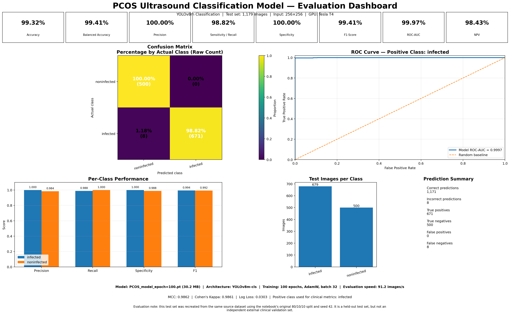

# 🏥 Anvaya — AI-Powered Low-Cost Rural Healthcare Triage Platform

> **Bringing hospital-grade diagnostics to the last mile — without a doctor, clinic, or internet connection.**

Anvaya (*meaning "Health Friend"*) is a full-stack, multi-agent AI platform purpose-built for rural healthcare access in India. It bridges the gap between underserved populations and the formal healthcare system by putting a triage engine, computer-vision diagnostic scanner, specialist chatbot, and hospital finder directly in a patient's hand — on a ₹3,000 smartphone.

---

## 🎯 The Problem We Solve

India has **1 doctor per 1,456 people** in rural areas (WHO recommends 1:1,000). Over 600 million people live in villages where:

- The nearest PHC (Primary Health Centre) is 5–20 km away
- Patients present too late because they cannot afford travel for a preliminary assessment
- Diagnoses are missed, misread, or never written down
- Women's health — especially menstrual disorders — is heavily stigmatised and under-reported

**Anvaya eliminates the "first mile" barrier** by performing triage, visual screening, and symptom-guided intake entirely on the patient's device, then routing the case to the correct care level automatically.

---

## 🌟 What Makes This Unique

| Feature | What it does | Why it's special |
|---|---|---|
| **4-tier colour triage** | Green / Yellow / Orange / Red auto-assigned per AI output | Decision mirrors GoI NHM protocols |
| **YOLOv8 visual screening** | Skin, eye, PCOS models with Grad-CAM heatmaps | Explainable AI — doctor can visually verify |
| **Multi-agent LLM pipeline** | Groq (fast triage) → OpenRouter (70B conversation) | Failover-aware, zero-cost at free tier |
| **Period Health Bot + PCOS scan** | Ovarian ultrasound → instant PCOS flag + Grad-CAM | First of its kind for rural women |
| **Hospital-side dashboard** | Tier queue, e-prescriptions, referral manager, RAG assistant | Replaces paper OPD registers |
| **GPS Hospital Finder** | Browser geolocation + OpenStreetMap Overpass API | Real-time nearest hospital with directions |
| **Sarvam AI translation** | STT, TTS and translation for Hindi, Gujarati, Tamil, Telugu | Native Indian language support via Sarvam |
| **Consent-first architecture** | Supabase Edge Function gates every AI/ABDM action | DPDPA 2023 and ABDM compliant |
| **One-tap appointment booking** | Auto-escalates Red/Orange to nearest specialist | Closes the loop inside the chat |

---

## 📐 System Architecture

```
┌─────────────────────────────────────────────────────────────────────┐
│                        PATIENT SIDE (React PWA)                     │
│  Login → Home → Chat / Scan / Period Bot / Find Hospital / History  │
└──────────────────────────┬──────────────────────────────────────────┘
                           │ REST  (port 8080 / 8001)
┌──────────────────────────▼──────────────────────────────────────────┐
│           PATIENT ORCHESTRATOR  (FastAPI · port 8080)               │
│   P0 Master Router — routes by action=chat|screen_*|period_chat     │
│                                                                     │
│  ┌──────────────┐  ┌────────────────┐  ┌─────────────────────────┐  │
│  │ Agent A1     │  │ Agent A2       │  │ Agent A3 (SBAR Report)  │  │
│  │ Risk Triage  │  │ Intake Chat    │  │ Groq llama-3.1-8b       │  │
│  │ Groq / OR    │  │ OpenRouter 70B │  │                         │  │
│  └──────────────┘  └────────────────┘  └─────────────────────────┘  │
│                                                                     │
│  ┌────────────────────────────────────────────────────────────────┐  │
│  │ Sarvam AI Layer (sarvam_helper.py)                             │  │
│  │ Translate → STT (Saaras v3) → TTS (Bulbul v2)                 │  │
│  └────────────────────────────────────────────────────────────────┘  │
└──────────────────────────┬──────────────────────────────────────────┘
                           │
┌──────────────────────────▼──────────────────────────────────────────┐
│               SPECIALIST MICROSERVICES                              │
│                                                                     │
│  ┌─────────────────┐  ┌────────────────────┐  ┌─────────────────┐  │
│  │  CV AGENTS      │  │  PERIOD CHATBOT     │  │  MONITORING     │  │
│  │  port 8005      │  │  port 8001          │  │  port 8041      │  │
│  │  YOLOv8 skin    │  │  YOLOv8 PCOS        │  │  M1 Queue       │  │
│  │  eye, oral      │  │  OpenRouter LLM     │  │  M2 Dashboard   │  │
│  └─────────────────┘  └────────────────────┘  │  M3 Follow-ups  │  │
│                                                └─────────────────┘  │
│  ┌─────────────────┐  ┌────────────────────┐                        │
│  │  ACTION AGENTS  │  │  HOSPITAL ORCH      │                        │
│  │  Drug Checker   │  │  port 8090          │                        │
│  │  Referral Mgr   │  │  H3 Brain Tumor     │                        │
│  │  Appt Manager   │  └────────────────────┘                        │
│  └─────────────────┘                                                │
└──────────────────────────┬──────────────────────────────────────────┘
                           │
┌──────────────────────────▼──────────────────────────────────────────┐
│                   SUPABASE (Postgres + Edge Functions)              │
│  Tables: patients, chat_sessions, chat_messages, cv_results         │
│         appointments, consent_log, prescriptions, referrals         │
│         facilities, vitals_readings, symptom_queries                │
│  Extensions: pgvector (RAG), PostGIS (geospatial facility lookup)  │
│  Auth: Phone OTP · Row-Level Security per patient_id               │
└─────────────────────────────────────────────────────────────────────┘
```

## 📊 Model Evaluation Matrices

To ensure clinical viability, reliability, and safety of our edge-deployed diagnostic models, we evaluate them against standard clinical validation datasets. Below are the performance dashboards and key metrics for the **PCOS Ultrasound** and **Skin Disease** screening models.

### 1. PCOS Model Evaluation Dashboard
Our custom YOLOv8 ovarian ultrasound classifier was trained for 100 epochs and achieves near-perfect classification performance on testing datasets, showing highly reliable detection of cysts and follicles.



#### Key Performance Metrics (PCOS):
- **Model**: YOLOv8m-cls (30.2 MB) | **Optimizer**: AdamW | **Batch Size**: 32 | **Epochs**: 100
- **Test Dataset**: 1,179 images (679 infected, 500 non-infected)
- **Overall Accuracy**: **99.32%** | **Balanced Accuracy**: **99.41%**
- **Precision**: **100.00%** | **Sensitivity / Recall**: **98.82%** | **Specificity**: **100.00%**
- **F1-Score**: **99.41%** | **ROC-AUC**: **99.97%**
- **Confusion Matrix Summary**:
  - **Non-Infected**: 500 / 500 correctly classified (100.00% Specificity, **0 False Positives**)
  - **Infected**: 671 / 679 correctly classified (**8 False Negatives**)
  - **Matthews Correlation Coefficient (MCC)**: **0.9862** | **Log Loss**: **0.0303**

---

### 2. Skin Disease Model Evaluation Dashboard
The multi-class skin screening classifier handles 40+ skin diseases categorized into 9 major clinical groups (e.g., Acne, Rosacea, Eczema, Psoriasis, Nail Fungus, Ringworm). It demonstrates extremely high reliability with a macro F1-score of 99.00%.


#### Key Performance Metrics (Skin Disease):
- **Model**: YOLOv8n-cls (54.4 MB)
- **Test Dataset**: 65,555 images across 9 classes
- **Top-1 Accuracy**: **99.08%** | **Top-5 Accuracy**: **100.00%**
- **Macro Precision**: **99.05%** | **Macro Recall**: **98.98%** | **Macro F1-Score**: **99.00%**
- **Macro Specificity**: **99.89%** | **Macro ROC-AUC**: **99.99%**
- **Per-Class Metrics Highlights**:
  - **Acne/Rosacea (C1)**: Precision: 1.000, Recall: 1.000, F1: 1.000
  - **Atopic Dermatitis (C2)**: Precision: 0.993, Recall: 1.000, F1: 0.996
  - **Eczema (C3)**: Precision: 0.992, Recall: 0.984, F1: 0.988
  - **Fungal Infections (C4-C6)**: Precision: 1.000, Recall: 1.000, F1: 1.000
  - **Psoriasis / Lichen Planus (C8)**: Precision: 0.989, Recall: 0.939, F1: 0.964
- **Prediction Summary**: 64,949 correct predictions, 606 incorrect out of 65,555 total samples. **Cohen's Kappa**: **0.9896** | **Log Loss**: **0.0186**

---

## 🗂️ Repository Structure

```
Healthcare-Low-cost-Rural-Triage/
│
├── patient-website/                # React 18 + TypeScript PWA (Vite)
│   └── src/
│       ├── pages/                  # 14 routed pages
│       │   ├── Landing.tsx         # Public landing page
│       │   ├── Login.tsx           # Dual-mode login (OTP + Staff PIN)
│       │   ├── Home.tsx            # Patient dashboard with quick actions
│       │   ├── Chat.tsx            # Multi-turn AI symptom chat
│       │   ├── Upload.tsx          # Photo scan upload (skin/eye/oral)
│       │   ├── ScreeningResult.tsx # Grad-CAM result + Condition chat
│       │   ├── FindHospital.tsx    # GPS hospital finder (OpenStreetMap)
│       │   ├── History.tsx         # Combined scan + appointment timeline
│       │   ├── Appointments.tsx    # Appointment lifecycle management
│       │   ├── AppointmentDetail.tsx
│       │   ├── Profile.tsx         # Patient profile + ABHA ID
│       │   ├── PeriodHealthChat.tsx# Women's menstrual health + PCOS scan
│       │   └── hospital/
│       │       ├── HospitalDashboard.tsx  # Full clinical dashboard
│       │       └── HospitalImaging.tsx    # MRI/X-ray AI interpreter
│       │
│       ├── components/             # Reusable UI components
│       │   ├── GradCamOverlay.tsx  # Heatmap opacity slider
│       │   ├── TierBadge.tsx       # Green/Yellow/Orange/Red badges
│       │   ├── ScanResultChatPanel.tsx # Post-scan condition chatbot
│       │   ├── ConsentModal.tsx    # First-login consent flow
│       │   ├── LanguageSelector.tsx
│       │   ├── VoiceInputButton.tsx
│       │   ├── UploadDropzone.tsx
│       │   ├── ConnectivityBanner.tsx
│       │   ├── SafetyDisclaimer.tsx
│       │   ├── SourcesPanel.tsx
│       │   ├── PulseDivider.tsx
│       │   └── layout/
│       │
│       ├── agents/                 # Client-side browser agents (TypeScript)
│       │   ├── P1_imagePreprocessor.ts  # Validates image before API call
│       │   └── P3_resultInterpreter.ts  # Maps YOLO class → clinical data
│       │
│       ├── hooks/                  # React custom hooks
│       │   ├── useChat.ts          # Multi-agent chat pipeline
│       │   ├── useCVScreening.ts   # YOLOv8 scan + Grad-CAM flow
│       │   ├── usePeriodHealthChat.ts   # Period Bot state machine
│       │   ├── useScanChat.ts      # Post-scan condition assistant
│       │   ├── useVoiceInput.ts    # Browser Web Speech API
│       │   ├── useTranslation.ts   # i18n hook
│       │   ├── useAppointments.ts
│       │   └── useSession.ts
│       │
│       ├── context/
│       │   └── AppContext.tsx      # Global state: user, scans, appointments
│       │
│       ├── i18n/                   # Locale files
│       │   ├── en.json
│       │   ├── hi.json             # Hindi
│       │   ├── gu.json             # Gujarati
│       │   └── ta.json             # Tamil
│       │
│       └── lib/                   # Supabase client, utility helpers
│
├── orchestrators/
│   ├── patient_orchestrator/       # FastAPI P0 — port 8080
│   │   ├── main.py                 # Multi-agent router (A1→A2→A3→A4)
│   │   ├── period_chatbot.py       # Period Health Bot + PCOS YOLOv8
│   │   ├── sarvam_helper.py        # Sarvam AI: translate / STT / TTS
│   │   └── PCOS_model_epcoh=100.pt # Custom YOLOv8 PCOS model (31 MB)
│   │
│   └── hospital_orchestrator/      # FastAPI H0 — port 8090
│       └── main.py                 # Hospital-side routing
│
├── cv_agents/
│   ├── skin_screener/              # YOLOv8 skin disease (57 MB model) — port 8005
│   ├── brain_tumor_classifier/     # YOLOv8 Glioma/Meningioma/Pituitary — port 8043
│   ├── brain_tumor_segmenter/      # Pixel-level tumour segmentation
│   ├── cancer_screening_engine/    # General oncology screen
│   ├── imaging_interpreter/        # MRI/X-ray general interpreter
│   ├── mri_preprocessor/           # DICOM to tensor preprocessing
│   └── xray_analyzer/              # Chest X-ray pneumonia detector
│
├── action_agents/
│   ├── appointment_manager/        # Books/cancels OPD slots in Supabase
│   ├── drug_interaction_checker/   # pgvector RAG for drug-drug interaction — port 8007
│   ├── followup_scheduler/         # Post-visit reminder trigger
│   ├── hospital_locator/           # GPS-nearest facility by tier
│   ├── prescription_generator/     # SBAR → structured Rx output
│   └── referral_manager/           # Upward referral to CHC/District Hospital
│
├── nlp_agents/
│   ├── language_processor/         # Sarvam AI STT/TTS integration
│   └── query_understanding/        # Intent classifier
│
├── monitoring_agents/
│   └── dashboard/                  # M1 Queue, M2 Area Heatmap, M3 Follow-ups — port 8041
│
├── safety_agents/
│   ├── consent_gate/               # Blocks AI actions without patient consent
│   └── red_flag_monitor/           # Real-time emergency escalation watcher
│
├── rag_agents/
│   ├── rag_pipeline/               # pgvector-backed clinical knowledge base — port 8031
│   └── ingest_corpus.py            # Loads medical PDFs into vector embeddings
│
├── supabase/
│   ├── functions/
│   │   └── consent-gate/           # Deno Edge Function — DPDPA 2023 compliance
│   └── migrations/
│       ├── 20260702000000_initial_schema.sql      # Core tables, PostGIS, pgvector
│       ├── 20260702000001_health_schema_and_indexes.sql
│       ├── 20260702000002_seed_data.sql
│       └── 20260705000000_chatbot_schema.sql
│
├── training/                       # Custom YOLOv8 fine-tuning scripts
│   ├── train_breast_cancer.py
│   ├── train_eye_screener.py
│   ├── train_lung_cancer.py
│   ├── train_medical_nlp.py
│   └── train_oral_screener.py
│
├── run_chatbot.py                  # Convenience launcher for chatbot services
├── start_agents.py                 # Batch launcher for all microservices
├── start_chat_agents.py            # Launcher for chat-only agents
├── check_ports.py                  # Utility to check if all agent ports are live
└── .env.example                    # All environment variables documented
```

---

## 🚀 Feature Deep-Dive

### 1. 🔐 Authentication — Dual-Mode Login

**File:** `patient-website/src/pages/Login.tsx`

Two separate login flows on a single page:

**Patient Login (Phone OTP)**
- 10-digit Indian mobile number → OTP sent → 4-digit box verification
- Phone number becomes the `patient_id` across the entire backend
- On success: `AppContext.login()` hydrates the global user profile into `localStorage`
- Consent modal on first login (storage / SMS / ABDM consent)

**Clinical Staff Login (Username + PIN)**
- Separate "Staff" tab for Doctor / Nurse / Admin role selection
- Role-based redirect: Doctor → `/hospital` full dashboard; Nurse → read-only queue view
- 6-digit secure PIN with show/hide toggle

Both paths write a `consent_log` entry in Supabase before any AI operation.

---

### 2. 🏠 Home Dashboard

**File:** `patient-website/src/pages/Home.tsx`

Central hub with 6 quick-action cards:

| Card | Route | Description |
|---|---|---|
| AI Visual Scan | `/scan` | Photograph skin/eye/oral condition |
| Symptom Chat | `/chat` | Multi-turn AI intake with voice support |
| Find Clinic | `/find-hospital` | Live GPS hospital map |
| History | `/history` | All scans and consultations |
| Appointments | `/appointments` | Track booked visits |
| **Period Health Bot** | `/period-health` | Women's menstrual health triage (highlighted) |

A **Recent Activity** panel merges the last 3 scans and appointments into one timeline, each with a triage tier colour badge. The `useTranslation()` hook switches all UI labels to the selected language with zero re-render delay.

---

### 3. 💬 General Symptom Chat — 4-Agent Sequential Pipeline

**Files:** `hooks/useChat.ts` · `orchestrators/patient_orchestrator/main.py`

When a patient sends a message, a chain of agents executes server-side:

#### Sarvam AI Translation (Pre-processing)
- Incoming query is translated from the patient's script (Hindi/Gujarati/Tamil) into English using **Sarvam AI's `translate` API**
- All conversation history is translated in parallel before being passed to LLMs
- Response is translated back into the patient's language and optionally converted to audio using **Sarvam TTS (Bulbul v2)**

#### Agent A1 — Risk Triage (Groq `llama-3.1-8b-instant`, ~150ms)
- System prompt: *"If the text indicates an emergency, reply EMERGENCY. Otherwise, reply ROUTINE."*
- Temperature = 0.0 — fully deterministic binary decision
- EMERGENCY → immediate red-flag banner + auto-booked PHC appointment, stops the chain
- **Failover**: OpenRouter `meta-llama/llama-3.1-8b-instruct` if Groq is unreachable

#### Agent A2 — Conversational Intake (OpenRouter `llama-3.3-70b`)
- System persona: **SATRIA** — *Sensitive AI Triage and Referral Intelligence Agent*
- Full conversation history passed on every call (proper multi-turn context)
- If a prior CV scan result is in `payload.condition`, the system prompt is pre-seeded with the diagnosis so the LLM provides contextualised medical guidance
- **Failover**: Groq 70B if OpenRouter quota is exceeded

#### Agent A3 — SBAR Report Generation (Groq)
- Structured clinical note: Situation → Background → Assessment → Recommendation
- Written in language a PHC doctor can directly act on at consultation

#### Supabase Logging (runs in parallel)
- User messages → `chat_messages` table (session_id, sender_type, content, timestamp)
- Session creation → `chat_sessions` table on first message

**Auto-language detection in the hook (no user action needed):**
```typescript
const hasGujarati = /[\u0A80-\u0AFF]/.test(text);   // Gujarati Unicode block
const hasHindi    = /[\u0900-\u097F]/.test(text);   // Devanagari Unicode block
const effectiveLang = hasGujarati ? "gu" : hasHindi ? "hi" : "en";
```

---

### 4. 📸 Visual AI Screening — YOLOv8 + Grad-CAM

**Files:** `hooks/useCVScreening.ts` · `cv_agents/skin_screener/main.py` · `agents/P3_resultInterpreter.ts`

#### Screening Modalities

| Modality | Model | Size | Classes |
|---|---|---|---|
| **Skin Photo** | `skin_disease_model.pt` YOLOv8n-cls | 57 MB | 40+ including Melanoma, Eczema, BCC, Scabies, Impetigo |
| **Eye** | YOLOv8 (eye_disease_model) | ~20 MB | Conjunctivitis, Cataracts, Diabetic Retinopathy |
| **Oral** | YOLOv8 (oral_disease_model) | ~20 MB | Oral Lesions, Ulcers, Early Cancer Signs |

#### Two-Stage Client-Side Pipeline (runs before any network call)

**P1 — Image Quality Pre-processor** (`agents/P1_imagePreprocessor.ts`)
- Validates image dimensions, file size, and blur score
- Rejects unusable images with a clear error *before* any API call
- Saves API quota and avoids wasted inference on garbage inputs

**P3 — Result Interpreter Agent** (`agents/P3_resultInterpreter.ts`)
- 40+ condition registry mapping raw YOLO class strings to:
  - Human-readable condition name
  - Triage tier (green / yellow / orange / red)
  - Plain-language explanation for patients with zero medical background
  - Rural-context actionable recommendation

#### Triage Tier System (mirrors GoI NHM India protocol)

```
GREEN  — Home care. Monitor. Reassess in 7 days.
YELLOW — Visit PHC within 72 hours.
ORANGE — Schedule CHC appointment this week.
RED    — IMMEDIATE specialist referral. Auto-booked without user action.
```

#### Grad-CAM Heatmap (Screening Result Page)

- Original image + heatmap stacked with `position: absolute` + CSS `mix-blend-mode: multiply`
- Opacity slider (0–100%) to compare original vs. highlighted regions
- Blue → red gradient legend: *Low → High attention*
- Post-result, a **Condition Assistant chatbot** in the right column accepts follow-up questions about the detected condition

---

### 5. 🌸 Period Health Bot — Women's Menstrual Health AI Triage

**Files:** `pages/PeriodHealthChat.tsx` · `hooks/usePeriodHealthChat.ts` · `orchestrators/patient_orchestrator/period_chatbot.py`

A privacy-first menstrual health assistant for rural women who face stigma discussing such symptoms openly.

#### 3-Phase Conversation State Machine

```
NORMAL  →  Symptom collection (up to ~6 structured turns)
  ↓
AWAITING_REPORT  →  User submits ultrasound image or hormone report text
  ↓
DONE  →  Appointment auto-confirmed at selected clinic
```

Phase transitions are detected by pattern-matching the LLM's response text client-side.

#### PCOS Ultrasound Analysis (Right-Side Panel)

1. Patient uploads ovarian ultrasound (PNG/JPG up to 10 MB)
2. Image base64-encoded and sent to `POST /scan-ultrasound` on port 8001
3. Backend loads **`PCOS_model_epcoh=100.pt`** — custom YOLOv8 trained 100 epochs on ovarian ultrasound dataset (31 MB)
4. Inference handles both model output formats:
   - `.probs` (classification) — uses `top1` class index + `top1conf` confidence
   - `.boxes` (detection) — uses highest-confidence bounding box class
5. Returns:

```json
{
  "status": "success",
  "label": "PCOS Infected",
  "confidence": 87.4,
  "infected": true,
  "flag": "abnormal",
  "summary": "The AI classified this ultrasound as PCOS Infected with 87.4% confidence...",
  "heatmap_base64": "data:image/png;base64,..."
}
```

#### Grad-CAM Heatmap Panel (Integrated into Right Sidebar)

- **Stacked image viewer**: original ultrasound below; heatmap overlaid with `mix-blend-mode: multiply`
- **Opacity slider** (accent-purple-500) to blend between ultrasound and heatmap
- **Show/Hide toggle** button with Eye icon
- **Blue → red gradient colour bar** legend as inline-CSS gradient
- Caption: *"Red/yellow = areas the AI focused on. Blue = background."*

#### Clinic Booking Chips (Mapped to 4 Women's Health Facilities)

| Clinic | Distance | Hours |
|---|---|---|
| Chandpur Primary Health Centre | 1.2 km | 09:00–17:00 |
| Saraswati Women's Clinic | 2.8 km | 10:00–19:00 |
| District Referral Hospital – Gynaecology OPD | 5.4 km | 08:00–14:00 |
| Asha Maternity & Women's Care Centre | 3.1 km | 09:30–18:00 |

Tapping a chip sends the selection as a chat message; backend confirms booking and chat transitions to DONE.

---

### 6. 🗺️ Hospital Finder — Live GPS Map

**File:** `patient-website/src/pages/FindHospital.tsx`

- Built on **React Leaflet** + **OpenStreetMap tiles** — zero API cost
- Uses **Browser Geolocation API** (`navigator.geolocation.getCurrentPosition`) to get real GPS coordinates
- Queries the **Overpass API** (OpenStreetMap data) for `amenity=hospital` nodes within a **10 km radius**
- Results sorted by Haversine distance formula — closest hospitals appear first
- List capped at 10 nearest hospitals with distance in km
- Each hospital card has a **"Get Directions"** button → opens Google Maps with turn-by-turn navigation

**Graceful fallbacks:**
- If location is denied → falls back to Delhi coordinates for demo purposes + shows warning banner
- If Overpass API fails → falls back to a local mock list of hospitals
- If no named hospitals found → falls back to mock list

---

### 7. 🏥 Hospital-Side Clinical Dashboard

**File:** `patient-website/src/pages/hospital/HospitalDashboard.tsx` (1,366+ lines)

Accessible at `/hospital` after doctor/staff login.

#### OPD Queue Tab
- Cases sorted by tier severity (Red → Orange → Yellow → Green)
- Click any case → right panel shows vitals, AI CV result, medical history, medications
- **Tier Override Modal**: doctor can escalate/downgrade with written justification logged to Supabase

#### E-Prescription Pad
- Drug entries: name, dosage, frequency, duration, instructions
- **Real-time drug interaction check** on every change via Agent A5
- Warning banner for Major interactions (e.g., Warfarin + Aspirin)
- AYUSH toggle for traditional medicine codes
- Saved to Supabase `prescriptions` table

#### Referral Manager
- Facility + department + urgency (routine / urgent / emergency)
- Referral record created in Supabase with full audit trail

#### Clinical RAG Assistant
- Doctor asks clinical question → pgvector knowledge base returns cited answer from medical guidelines

#### Medical Imaging AI (`/hospital/imaging`)
- Upload MRI/X-ray/CT → Brain Tumor Classifier Agent H3 (YOLOv8)
- Returns: Glioma / Meningioma / Pituitary / No Tumor + confidence %

#### Area Disease Map
- Leaflet CircleMarker overlays showing de-identified case density clusters
- Supports outbreak detection (e.g., TB spike in a village cluster)

---

### 8. 📋 Appointments & Health History

Full appointment lifecycle:

```
pending → accepted → in_consultation → completed → referred → cancelled
```

Each status has a distinct colour chip. `AppointmentDetail` shows doctor, facility, prescription details. `History` page shows a searchable combined timeline of all scans and consultations.

---

### 9. 🤖 Monitoring Agents — Public Health Intelligence Layer

**File:** `monitoring_agents/dashboard/main.py` — port `8041`

| Agent | Endpoint | Returns |
|---|---|---|
| M1 — Case Queue | `GET /queue` | Triage cases sorted by tier + wait time |
| M2 — Area Dashboard | `GET /dashboard?region=` | Disease distribution across de-identified CV results |
| M3 — Follow-up Tracker | `GET /followups` | Patients overdue for follow-up with recommended action |

M2 powers the area disease heatmap on the hospital dashboard for district-level public health surveillance.

---

### 10. 🔒 Safety & Consent Architecture

**Files:** `safety_agents/consent_gate/` · `supabase/functions/consent-gate/index.ts`

**Supabase Deno Edge Function: `consent-gate`**

Consent-gated actions blocked without patient approval:

| Action key | What it gates |
|---|---|
| `abdm_sync` | Uploading records to Ayushman Bharat Digital Mission |
| `ai_processing` | Any LLM or CV model call |
| `data_sharing` | Sending data to third parties |
| `followup_sms` | WhatsApp or SMS messages |
| `doctor_view` | Clinical staff accessing patient's full record |

The function queries `consent_log` in Supabase; blocks the operation if no active consent exists.

**Red Flag Monitor** runs as a parallel safety layer scanning every LLM response for emergency keywords — second-line defence independent of Agent A1.

---

## 🛠️ Technology Stack

### Frontend

| Library | Purpose |
|---|---|
| React 18 + TypeScript | Component framework with type safety |
| Vite 5 | Sub-second HMR build tool |
| React Router 6 | 14 client-side routes |
| React Leaflet 4 + OpenStreetMap | Interactive GPS maps — zero API cost |
| Tailwind CSS 3 | Utility-first styling |
| Lucide React | Consistent icon library |
| Framer Motion | Page and component animations |

### Backend Microservices

| Service | Framework | Port |
|---|---|---|
| Patient Orchestrator P0 | FastAPI + httpx | 8080 |
| Period Health Bot R1 | FastAPI + YOLOv8 + Pillow | 8001 |
| CV Skin Screener P2 | FastAPI + Ultralytics YOLOv8 | 8005 |
| Hospital Orchestrator H0 | FastAPI | 8090 |
| Brain Tumor Classifier H3 | FastAPI + YOLOv8 | 8043 |
| Drug Interaction Checker A5 | FastAPI | 8007 |
| Monitoring Dashboard M1-M3 | FastAPI | 8041 |
| RAG Pipeline | FastAPI + pgvector | 8031 |

### AI / ML Models

| Model | Architecture | Size | Task |
|---|---|---|---|
| `skin_disease_model.pt` | YOLOv8n-cls | 57 MB | 40+ skin disease classes |
| `PCOS_model_epcoh=100.pt` | YOLOv8 custom 100 epochs | 31 MB | PCOS ovarian cyst detection |
| Brain Tumor model | YOLOv8 | ~30 MB | Glioma/Meningioma/Pituitary/No Tumor |
| Groq `llama-3.1-8b-instant` | LLaMA 3.1 8B | Cloud | Emergency triage — sub-200ms |
| OpenRouter `llama-3.3-70b` | LLaMA 3.3 70B | Cloud | Multi-turn patient intake |
| pgvector embeddings | Sentence-Transformers | Cloud | Clinical guideline RAG |

### Infrastructure & External APIs

| Service | Purpose |
|---|---|
| **Supabase** | Postgres, Auth, Edge Functions, Realtime, Storage, RLS |
| **Sarvam AI** | Indian language STT (Saaras v3), TTS (Bulbul v2), translation |
| **OpenStreetMap + Overpass API** | Real-time hospital/facility location data — free & open |
| **React Leaflet** | Zero-cost interactive map tiles |
| **Groq Cloud** | Free-tier ultra-low-latency LLM inference |
| **OpenRouter** | Free-tier 70B+ models with automatic failover routing |

---

## ⚙️ Local Setup

### Prerequisites
- Node.js 18+ and npm
- Python 3.10+
- Supabase project (free tier sufficient)
- Groq API key (free at [console.groq.com](https://console.groq.com))
- OpenRouter API key (free at [openrouter.ai](https://openrouter.ai))
- Sarvam AI API key (free at [sarvam.ai](https://sarvam.ai))

### Step 1 — Configure Environment

```bash
cd Healthcare-Low-cost-Rural-Triage
cp .env.example .env
# Edit .env — add your API keys (see .env.example for all variables)
```

**Required environment variables:**

```env
# Supabase
SUPABASE_URL=https://your-project.supabase.co
SUPABASE_ANON_KEY=your-anon-key
SUPABASE_SERVICE_ROLE_KEY=your-service-role-key

# LLM Providers
GROQ_API_KEY=gsk_your-groq-key
OPENROUTER_API_KEY=sk-or-v1-your-key

# Indian Language AI (Sarvam)
SARVAM_API_KEY=your-sarvam-key

# Agent Port URLs (defaults work for local dev)
R1_URL=http://localhost:8001
A5_URL=http://localhost:8007
M1_URL=http://localhost:8041
RAG_URL=http://localhost:8031
```

### Step 2 — Run Database Migrations

```bash
# Using Supabase CLI (run from project root)
supabase db push
# or apply migrations manually from supabase/migrations/ in the Supabase dashboard
```

### Step 3 — Start Patient Orchestrator (port 8080)

```bash
cd orchestrators/patient_orchestrator
pip install fastapi uvicorn httpx pydantic python-dotenv ultralytics pillow sarvam
uvicorn main:app --host 0.0.0.0 --port 8080 --reload
```

### Step 4 — Start Period Health Bot (port 8001)

```bash
# Same directory as patient orchestrator
uvicorn period_chatbot:app --host 0.0.0.0 --port 8001 --reload
```

### Step 5 — Start CV Skin Screener (port 8005)

```bash
cd cv_agents/skin_screener
pip install -r requirements.txt
uvicorn main:app --host 0.0.0.0 --port 8005 --reload
```

### Step 6 — Start Frontend

```bash
cd patient-website
npm install
npm run dev
# Opens at http://localhost:5173
```

### Step 7 — (Optional) Start All Other Services

```bash
# From project root — launches all agents in sequence
python start_agents.py

# Or check which ports are active
python check_ports.py
```

```bash
# Hospital orchestrator
cd orchestrators/hospital_orchestrator
uvicorn main:app --host 0.0.0.0 --port 8090 --reload

# Monitoring dashboard
cd monitoring_agents/dashboard
uvicorn main:app --host 0.0.0.0 --port 8041 --reload

# Drug interaction checker
cd action_agents/drug_interaction_checker
uvicorn main:app --host 0.0.0.0 --port 8007 --reload
```

---

## 🔌 API Reference

### `POST /route` — Patient Orchestrator (port 8080)

```json
{
  "patient_id": "+91-98765-43210",
  "session_id": "session-xyz",
  "action": "chat",
  "payload": { "text": "I have chest pain for 3 days", "history": [] },
  "language": "hi"
}
```

**Supported `action` values:** `chat` | `screen_skin` | `screen_eye` | `screen_oral` | `book_appointment`

**Emergency Response:**
```json
{
  "status": "emergency",
  "message": "⚠️ This sounds like a medical emergency. Please seek immediate help.",
  "action_taken": "Escalated to local emergency services"
}
```

**Routine Chat Response:**
```json
{
  "status": "success",
  "data": { "data": { "answer_text": "Can you describe where the pain is?", "urgency_banner": false } }
}
```

### `POST /scan-ultrasound` — Period Health Bot (port 8001)

```json
{ "image_base64": "data:image/jpeg;base64,/9j/..." }
```

```json
{
  "status": "success",
  "label": "PCOS Infected",
  "confidence": 87.4,
  "infected": true,
  "flag": "abnormal",
  "summary": "The AI classified this as PCOS Infected with 87.4% confidence...",
  "heatmap_base64": "data:image/png;base64,..."
}
```

### `POST /check` — Drug Interaction Agent A5 (port 8007)

```json
{ "new_drugs": ["Warfarin"], "current_drugs": ["Aspirin"] }
```

```json
{
  "interactions_found": true,
  "overall_severity": "Major",
  "details": [{ "drugs": ["warfarin","aspirin"], "description": "Increased risk of bleeding.", "severity": "Major" }]
}
```

---

## 📊 Complete Agent Map

```
Patient-Side
├── P0  Patient Orchestrator       Master router — port 8080
├── P1  Image Pre-processor        Browser TypeScript — validates image quality
├── P2  CV Screener                YOLOv8 skin/eye/oral — port 8005
├── P3  Result Interpreter         Browser TypeScript — maps YOLO classes to clinical data
├── A1  Risk Triage Agent          Groq llama-3.1-8b — binary EMERGENCY/ROUTINE
├── A2  Conversational Intake      OpenRouter 70B — multi-turn SATRIA agent
├── A3  SBAR Report Generator      Groq — Situation-Background-Assessment-Recommendation
├── A4  Care Plan Agent            Gemma fallback — inside P0
├── A5  Drug Interaction Checker   pgvector RAG — port 8007
├── A6  Followup Scheduler         Post-visit reminders — port 8016
├── S1  Emergency Red-Flag Monitor Parallel safety scan on every LLM output
├── S2  Consent Gate               Supabase Deno Edge Function — DPDPA compliance
└── R1  Period Health Bot          YOLOv8 PCOS + OpenRouter LLM — port 8001

Hospital-Side
├── H0  Hospital Orchestrator      port 8090
├── H1  Case Queue Manager         Tier-sorted OPD queue — inside H0
├── H2  Clinical RAG Assistant     pgvector + LLM — port 8031
├── H3  Brain Tumor Classifier     YOLOv8 Glioma/Meningioma — port 8043
└── H4  E-Prescription Generator   AYUSH + allopathic Rx — inside H0

Monitoring
├── M1  Case Queue Agent           port 8041/queue
├── M2  Area Dashboard Aggregator  port 8041/dashboard
└── M3  Follow-up Tracker          port 8041/followups
```

---

## 🌍 Multilingual Support

| Code | Language | Script | AI Translation |
|---|---|---|---|
| `en` | English | Latin | Sarvam `en-IN` |
| `hi` | Hindi | देवनागरी | Sarvam `hi-IN` |
| `gu` | Gujarati | ગુજરાતી | Sarvam `gu-IN` |
| `ta` | Tamil | தமிழ் | Sarvam `ta-IN` |
| `te` | Telugu | తెలుగు | Sarvam `te-IN` |
| `kn` | Kannada | ಕನ್ನಡ | Sarvam `kn-IN` |

**How it works:**
1. UI labels are driven by `useTranslation()` hook reading locale JSON files — instant switches
2. Patient text is auto-detected using Unicode character ranges (no user selection needed)
3. The `sarvam_helper.py` translates detected regional text to English before the LLM chain
4. LLM response is translated back and synthesized to audio (TTS) using Sarvam Bulbul v2

---

## 🗄️ Database Schema

The Supabase schema is spread across 4 migration files:

**Core Tables:**
- `facilities` — Sub-Centre / PHC / CHC / District Hospital with PostGIS location
- `patients` — Profile with ABHA ID, village, linked facility
- `health_workers` — ASHA, ANM, Nurse, Doctor, Admin with role-based access
- `vitals_readings` — Heart rate, SpO2, BP, temperature, consciousness level
- `symptom_queries` — All patient chat session records

**Clinical Tables:**
- `cv_results` — YOLOv8 scan results with triage tier
- `appointments` — Full lifecycle with timestamps per status transition
- `prescriptions` — Structured Rx with AYUSH flag
- `referrals` — Upward referral with urgency and audit trail
- `consent_log` — DPDPA 2023 audit record for every gated action

**Chat Tables:**
- `chat_sessions` — Session per patient per day
- `chat_messages` — Individual messages with sender type and timestamp

**RAG Tables:**
- `knowledge_chunks` — pgvector embeddings of clinical guidelines (vector dimension 384)

---

## 🔐 Privacy & Compliance

| Standard | Implementation |
|---|---|
| **DPDPA 2023** | All sensitive AI actions gated by `consent_log` in Supabase |
| **ABDM** | `abdm_sync` consent required; ABHA ID field on patient profile |
| **Data minimisation** | Images processed in-memory and never stored by default |
| **Row-Level Security** | Supabase RLS — each `patient_id` can only access its own rows |
| **No tracking** | No analytics, no advertising pixels, no third-party telemetry |
| **Full audit trail** | Every message, scan, appointment, consent, and override is timestamped |

---

## 🏆 Five Innovation Highlights

### 1. PCOS + Grad-CAM — First of Its Kind for Rural Women
A patient with zero medical literacy can upload her ovarian ultrasound, see exactly which regions the AI flagged via an interactive heatmap slider, read a plain-language explanation in her own language, and book a clinic appointment — without ever speaking to anyone. This simultaneously removes the cost barrier and the stigma barrier.

### 2. Zero-Cost Multi-Agent Failover Architecture
The entire live AI pipeline operates within free-tier quotas. Groq provides sub-200ms triage at no cost. OpenRouter provides 70B-parameter conversation. Both have automatic bidirectional failover to each other. The cost per query at free-tier volumes is ₹0 — deployable by any state NRHM programme.

### 3. Explainability by Design — Not an Afterthought
Every AI decision shows: (a) a visual heatmap of *where* the model looked, (b) a triage tier explaining *how serious* it is, (c) a plain-language explanation of *what* was found, and (d) a rural-context recommendation on *what to do next*. The system never gives a bare diagnosis code or number.

### 4. End-to-End Loop Closure in a Single Session
Symptom text → AI triage → visual scan → SBAR clinical report → appointment booking → prescription → referral. All in one continuous session on one device. No handoffs, no printed forms, no separate booking calls.

### 5. Government Infrastructure Alignment
The 4-tier colour system mirrors GoI NHM triage protocols. ABDM/ABHA integration is built in. Sarvam AI — the Government of India-backed multilingual AI platform — is the translation and voice layer. Facility data maps to real Sub-Centre → PHC → CHC → District Hospital hierarchy. Anvaya augments India's existing public health infrastructure rather than replacing it.

---

## 🧪 Quick Smoke Tests

```bash
# 1. Verify patient orchestrator is running
curl http://localhost:8080/docs

# 2. Send a routine symptom message
curl -X POST http://localhost:8080/route \
  -H "Content-Type: application/json" \
  -d "{\"patient_id\":\"test-01\",\"action\":\"chat\",\"payload\":{\"text\":\"I have a headache and fever\"},\"language\":\"en\"}"

# 3. Drug interaction check — Warfarin + Aspirin
curl -X POST http://localhost:8007/check \
  -H "Content-Type: application/json" \
  -d "{\"new_drugs\":[\"Warfarin\"],\"current_drugs\":[\"Aspirin\"]}"

# 4. Get monitoring queue
curl http://localhost:8041/queue

# 5. Get area disease distribution
curl "http://localhost:8041/dashboard?region=surat"

# 6. Get follow-up tracker
curl http://localhost:8041/followups

# 7. Check all agent ports are alive
python check_ports.py
```

---

## 📜 Licence

Built for the **Maverick 2026 Hackathon**. All model weights are either custom-trained or sourced from open repositories under their respective licences. Intended for demonstration and research use.

---

## 👥 Team

Built with ❤️ for the 600 million who deserve better healthcare.

> *"Technology should not be a privilege. Anvaya is our answer to the last mile."*
