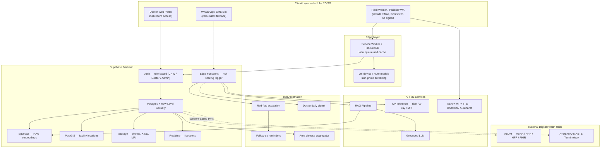
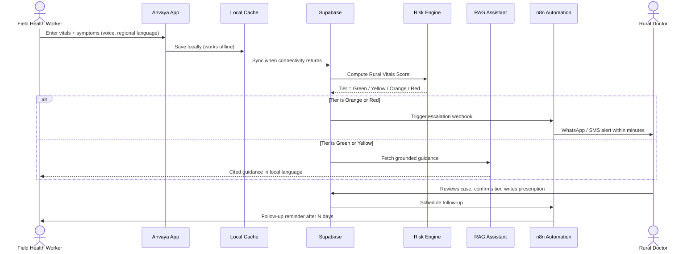

# Anvaya — AI Triage Companion for Low-Bandwidth Rural Clinics

**Maverick Hackathon 2026 — Track: Healthcare | Low-Cost Rural Triage**

> *"Anvaya"* (Hindi/Sanskrit: "Health Friend") is a suggested working name — swap it for your team's branding freely. Everywhere below, it refers to the system this document specifies.

**Official problem statement:** *Create an AI assistant for low-bandwidth clinics that processes basic vitals and symptom queries in regional languages to flag high-risk cases.*

**A note on scope:** This document expands the feature notes your team captured (screenshotted list — computer vision, skin/X-ray/MRI detection, RAG, dual portals, n8n, Supabase, area-wise detection, patient history, follow-ups, hospital locator, and optional Ayurvedic medicine support) into a full technical spec, grounded in published clinical-triage research, real offline-first health-tech deployments, and India's existing digital-health rails. One item in your notes — the second portal — was cut off mid-sentence ("one for ␣"); this doc assumes it means a **Patient / Field Health Worker portal**, since the problem statement centers on frontline clinic use. Adjust §7.4 if you meant something else.

---

## Table of Contents

1. [Why This Problem Matters](#1-why-this-problem-matters)
2. [Solution Summary](#2-solution-summary)
3. [Problem Statement Traceability](#3-problem-statement-traceability)
4. [Design Principles (Non-Negotiable)](#4-design-principles-non-negotiable)
5. [Research & Prior-Art Inspiration](#5-research--prior-art-inspiration)
6. [Users & Personas](#6-users--personas)
7. [Complete Feature Set](#7-complete-feature-set)
8. [System Architecture](#8-system-architecture)
9. [End-to-End Data Flow](#9-end-to-end-data-flow)
10. [Risk-Flagging / Triage Logic — the Clinical Core](#10-risk-flagging--triage-logic--the-clinical-core)
11. [AI/ML Component Design](#11-aiml-component-design)
12. [Database Schema (Supabase / Postgres)](#12-database-schema-supabase--postgres)
13. [n8n Automation Workflows](#13-n8n-automation-workflows)
14. [Low-Bandwidth & Offline-First Engineering](#14-low-bandwidth--offline-first-engineering)
15. [Regional Language & Accessibility](#15-regional-language--accessibility)
16. [Interoperability with India's Digital Health Stack](#16-interoperability-with-indias-digital-health-stack)
17. [Security & Privacy](#17-security--privacy)
18. [Tech Stack Summary](#18-tech-stack-summary)
19. [Hackathon Build Plan (MVP → Stretch)](#19-hackathon-build-plan-mvp--stretch)
20. [Demo Script for Judges](#20-demo-script-for-judges)
21. [Impact Metrics & Success Criteria](#21-impact-metrics--success-criteria)
22. [Limitations, Ethics & Regulatory Notes](#22-limitations-ethics--regulatory-notes)
23. [Future Scope](#23-future-scope)
24. [References](#24-references)

---

## 1. Why This Problem Matters

Global data consistently shows a severe shortage of trained clinicians in exactly the areas this hackathon targets: over 40% of countries have fewer than 10 doctors per 10,000 people, and more than half have fewer than 40 nurses/midwives per 10,000 people — a gap concentrated in rural and low-resource regions. In these settings, a single ASHA worker, ANM, or nurse is often the **only** point of contact for dozens of patients a day, with no specialist to consult and no reliable internet connection to look anything up.

The consequence isn't a lack of care — it's a lack of **prioritization**. Without a fast, low-friction way to tell "this cough is fine, go home and rest" apart from "this cough plus these vitals means sepsis, refer now," critical patients wait in the same queue as routine ones, and deterioration gets caught late. Research on early warning scores in Uganda, Rwanda, Malawi, and South Africa consistently shows that simple, vitals-based scoring — even without lab tests — can flag a large share of patients who go on to deteriorate, sometimes many hours before a crisis event. That's the gap this project closes, using tools a rural sub-center can actually run.

## 2. Solution Summary

**Anvaya is an AI co-pilot for frontline health workers and rural doctors** — not a replacement for either. A health worker enters a patient's basic vitals and describes symptoms by voice or text in their own language. The system:

1. Scores the vitals using a **clinically-grounded triage engine** (inspired by NEWS2/MEWS/SATS-TEWS/PEWS, simplified for CHW-collectible vitals).
2. Runs the symptom description through a **RAG-grounded multilingual assistant** that answers questions and surfaces guidance from trusted medical sources — never from the model's unverified memory.
3. Optionally runs **on-device computer vision** on a skin photo, or a doctor-uploaded X-ray/MRI, to flag visual patterns worth a specialist's attention.
4. Combines all three into a single **Green / Yellow / Orange / Red** flag, and — for anything Orange or Red — automatically escalates to a doctor via an **n8n workflow** over WhatsApp/SMS, even on a 2G connection.
5. Keeps a longitudinal patient record, supports doctor-issued e-prescriptions, shows the nearest referral hospital, tracks area-wide disease patterns, and reminds patients to follow up — all built on **Supabase** and designed offline-first from day one.

The system never auto-diagnoses or auto-prescribes. It is a decision-support and escalation tool that makes the existing health worker → doctor referral chain faster and less likely to miss a critical case.

## 3. Problem Statement Traceability

| Problem statement phrase | Addressed by |
|---|---|
| "AI assistant for **low-bandwidth clinics**" | Offline-first PWA, on-device models, WhatsApp/SMS fallback — §14 |
| "processes **basic vitals**" | Rural Vitals Score engine, works with just a pulse oximeter + thermometer — §10 |
| "and **symptom queries**" | RAG-grounded multilingual symptom assistant — §7.3, §11.1 |
| "in **regional languages**" | ASR / MT / TTS pipeline via Bhashini / AI4Bharat models — §15 |
| "to **flag high-risk cases**" | Tiered Green/Yellow/Orange/Red engine + automated n8n escalation — §10, §13 |

## 4. Design Principles (Non-Negotiable)

These principles should stay fixed even as features get cut for time during the hackathon sprint:

- **AI assists, it never decides alone.** Every Orange/Red flag and every CV screening result requires human (doctor) sign-off before it becomes a clinical action. The system recommends; it does not diagnose or prescribe on its own.
- **Bias toward catching problems, not toward being right on average.** Like every clinical triage score this design borrows from, thresholds are tuned to minimize missed emergencies (false negatives) even at the cost of more false alarms — the opposite of what a typical ML system optimizes for.
- **Offline-first, not offline-tolerant.** The app must be fully usable with zero connectivity for data entry and CV screening; sync is a background concern, not a blocker.
- **Every AI answer is explainable.** RAG answers carry citations back to the source guideline; CV screenings show a heatmap of what the model looked at (Grad-CAM-style), so a doctor can sanity-check the "why."
- **Build on national rails, don't reinvent them.** Where India already has digital health infrastructure (ABDM, Bhashini, AYUSH's NAMASTE terminology), integrate with it rather than creating a parallel silo — this is also what makes the project credible to judges familiar with the space.
- **Privacy and consent are structural, not a checkbox.** Row-level access control and consent logging are part of the schema from the first migration, not something bolted on later.

## 5. Research & Prior-Art Inspiration

This design deliberately borrows patterns that are already proven, rather than inventing new clinical methodology from scratch (which would be both risky and unnecessary for a hackathon-scale build):

| Inspiration | What we took from it |
|---|---|
| **NEWS2 / MEWS / SATS-TEWS / Pediatric PEWS** early warning scores | The core pattern of scoring a handful of vitals into a composite number, with single-parameter override rules for anything acutely abnormal. SATS-TEWS research specifically validated simplified scores (SpO2 + respiratory rate + mental status + mobility) for settings without full vital-sign equipment — exactly our constraint. |
| **Offline-deployable clinical RAG systems** (e.g., hospital-grade offline RAG platforms combining OCR, local vector search, and instruction-tuned LLMs; "MEGA-RAG" multi-evidence refinement for public-health hallucination mitigation) | The architecture pattern of embedding → retrieve → ground → generate with citations, and the finding that multi-source retrieval + reranking meaningfully reduces hallucinated medical answers versus a bare LLM. |
| **On-device dermatology CNNs trained on HAM10000** (TensorFlow-Lite-optimized models reaching ~98% classification accuracy on 7 lesion classes, and lightweight custom CNNs cutting parameter count by ~97% versus ResNet50 with negligible accuracy loss) | Proof that real-time, on-device (no-cloud-round-trip) skin screening is achievable on modest hardware — directly relevant to our low-bandwidth constraint. |
| **BraTS-trained brain tumor classifiers** (transfer learning on VGG-16/ResNet50/EfficientNet, two-stage segment-then-classify pipelines) | The transfer-learning + pretrained-backbone pattern for the MRI module, and the reminder from the literature that imaging models flag *candidate* regions — actual tumor diagnosis still requires histopathology, which shaped our "flag for referral" framing rather than "diagnose." |
| **Community Health Toolkit (CHT)** — an open-source offline-first framework used by real community health worker programs | The principle that the app should *never* depend on connectivity for day-to-day tasks, syncing only as a secondary layer. |
| **n8n community workflow templates for medical triage** (GPT-based urgency scoring routed to Slack/WhatsApp on-call alerts, red-flag symptom detection across 20+ emergency symptoms, WhatsApp-based multilingual symptom-to-doctor routing) | The exact automation shape for our escalation layer — trigger → classify urgency → route → notify — instead of hand-rolling a notification service. |
| **India's Ayushman Bharat Digital Mission (ABDM)** — ABHA health ID, Healthcare Professional & Facility Registries, FHIR-based Health Information Exchange, and its explicit "assisted mode" for poor-connectivity areas | A national interoperability target so patient records aren't trapped in a hackathon silo, plus validation that "offline mode for poor connectivity" is an official design requirement of India's own health-ID system, not just our workaround. |
| **Ministry of AYUSH's NAMASTE portal** — standardized Ayurveda/Siddha/Unani terminology, dual-coded against ICD-11 | The mechanism for the optional Ayurvedic-medicine module: don't invent a new vocabulary, use the terminology WHO and India already standardized. |
| **Bhashini / AI4Bharat** — India's national language AI mission (ASR, machine translation, TTS across 22 scheduled languages, already integrated into eSanjeevani telemedicine) | Proof that production-grade regional-language health interfaces exist and are pluggable, rather than something we need to train from zero for a hackathon. |

Full source list in [§24 References](#24-references).

## 6. Users & Personas

| Persona | Access point | Digital literacy assumption | Primary need |
|---|---|---|---|
| **ASHA / ANM / Rural Nurse** (frontline) | Field Worker portal (PWA) | Low–moderate; voice-first UI | Fast vitals + symptom entry, clear red/green flag, escalate without needing to "diagnose" anything themselves |
| **Rural Doctor / PHC Medical Officer** | Doctor Portal (full access) | Moderate–high | Prioritized case queue, full patient history, one-tap teleconsult, e-prescription |
| **Patient** | Via health worker, or directly through WhatsApp bot | Low; may be non-literate | Understand what's happening in their own language, know where to go next |
| **District Health Administrator** | Aggregated dashboard only (de-identified) | Moderate–high | Area-wise disease trend visibility for resource planning |

## 7. Complete Feature Set

Every item from your notes, expanded — plus the two features the problem statement requires that weren't explicitly listed (vitals risk engine, regional-language layer), folded in at 7.13–7.14.

### 7.1 Computer Vision — Skin Disease Detection
A health worker photographs a skin lesion/rash with any phone camera. A lightweight CNN (MobileNetV2 or EfficientNet-Lite class, fine-tuned on HAM10000-style dermatoscopic/clinical image data) classifies it into common categories and flags anything suspicious for photo-forwarding to a dermatologist or referral. Runs as a **quantized TFLite/ONNX model on-device**, so it works with zero connectivity, and overlays a Grad-CAM-style heatmap so the reviewing doctor can see *what* the model reacted to, not just a label.
> **Known limitation to disclose to judges:** HAM10000 and similar public datasets are known to skew toward lighter Fitzpatrick skin types. Flag this explicitly and plan to fine-tune on locally collected, skin-tone-diverse images before any real deployment — this honesty scores well with technically literate judges.
> **Safety framing:** output is "possible category + confidence + referral recommendation," never a confirmed diagnosis.

### 7.2 Computer Vision — X-ray / MRI: Brain Tumor & Cancer Screening
Doctor-side upload (this stays in the Doctor Portal, not the field-worker app, since it needs a scan performed at a facility with imaging equipment). A transfer-learning CNN (EfficientNet/ResNet/VGG-style backbone, optionally a two-stage segment-then-classify pipeline) trained on BraTS-style MRI data screens for tumor-suggestive regions and returns a bounding/heatmap overlay plus a confidence score. Paired with the RAG assistant (§7.3), the doctor can pull up **detailed background information** on the flagged condition — what it typically means, what the standard referral pathway is — grounded in cited medical sources.
> **Safety framing, stated explicitly in the UI:** *"This is an imaging screening aid, not a diagnosis. Definitive diagnosis requires specialist review and, for tumors, histopathology."* This mirrors how the underlying research literature frames these models — as decision-support for referral prioritization, not a replacement for a radiologist/oncologist.

### 7.3 RAG-Based Multilingual Symptom & Knowledge Assistant ("Rag based training")
This is the system's knowledge layer. A trusted corpus — WHO/IMCI protocols, ICMR/state clinical guidelines, standard treatment guidelines, drug formularies — is chunked and embedded into a vector store (Supabase's `pgvector` extension, so no separate vector database is needed). When a health worker or patient asks a question or describes symptoms (by voice, any supported regional language), the query is embedded, the most relevant guideline passages are retrieved, and a language model generates an answer **grounded only in retrieved text**, with inline citations back to the source guideline. This is the same "retrieve-then-generate-with-citations" pattern used in hospital-grade offline clinical RAG deployments, and it's what keeps the assistant from hallucinating drug names or dosages.
> **Why RAG and not a fine-tuned model alone:** grounding answers in retrievable, swappable source documents means the knowledge base can be corrected or updated (e.g., a new state health advisory) without retraining anything — critical when the team has a weekend, not a training budget.

### 7.4 Dual Portal System
- **Doctor Portal** (full access): prioritized queue sorted by triage tier, complete patient history, CV screening review with heatmaps, RAG assistant, e-prescription issuance, teleconsult trigger, area-wide dashboard.
- **Field Worker / Patient Portal** (the "one for ␣" from your notes, interpreted as CHW + patient-facing): vitals entry, voice symptom intake, own triage flag with plain-language explanation, appointment/follow-up reminders, nearest-hospital map, and — for the patient's own view — their own history and any doctor-issued prescription. Access is role-scoped: a field worker sees only patients registered at their facility; a patient (if given direct login via phone OTP) sees only their own record.

### 7.5 n8n Automation Layer
n8n is the orchestration glue that turns "the system computed a Red flag" into "a doctor's phone buzzed within minutes." Concretely (details in §13): a webhook fires from a Supabase Edge Function whenever a risk tier is computed; n8n branches on tier, sends WhatsApp/SMS alerts to the on-call doctor for Orange/Red, schedules follow-up reminders, compiles a daily digest for doctors, and rolls up anonymized case counts for the area-wide dashboard. Using n8n instead of custom backend code means the triage-routing logic is visual, editable by non-engineers on the team during the hackathon, and swappable per clinic without a redeploy.

### 7.6 Medicine Prescription & One-to-One Doctor Consultation
Only a doctor, inside the Doctor Portal, can issue a prescription — this is a deliberate safety boundary, consistent with how India's telemedicine framework requires a registered medical practitioner to authorize prescriptions. The flow: doctor reviews the flagged case (optionally after a one-to-one audio/video/chat consult triggered from the same screen) → confirms or overrides the AI's tier → writes structured prescription entries → system logs it against the patient's history and (optionally) notifies the patient via WhatsApp/SMS. For Green-tier, low-acuity cases, the field-worker app can surface general **non-pharmacological self-care guidance** (hydration, rest, warning signs to watch for) pulled from the RAG layer — but never specific drug names or dosages without a doctor's sign-off.

### 7.7 Supabase Connection
Supabase is the single backend for almost everything: **Postgres** for structured data, **Row Level Security** for per-role access control, **pgvector** for the RAG embeddings, **PostGIS** for the hospital-locator geospatial queries, **Storage** for skin photos/X-rays/MRIs, **Auth** for phone-OTP login (works for low-literacy users — no password to remember), **Realtime** for live case-queue updates on the Doctor Portal, and **Edge Functions** as the lightweight compute layer that runs the risk-scoring rules and triggers n8n webhooks. Full schema in §12.

### 7.8 Area-Wise Disease Detection
As vitals, symptoms, and CV screenings accumulate across facilities, the system aggregates **de-identified** case counts by geography and condition category (e.g., "12 fever-with-rash cases in Block X this week") and surfaces them on an admin dashboard as a simple heatmap/table. This is deliberately built as an aggregation query over existing data (§12's `area_disease_stats`), not a new data-collection burden on health workers, and applies a minimum-count suppression threshold (e.g., don't display any cell under 5 cases) to avoid re-identifying individuals in small villages.

### 7.9 Patient Detailed History & Past Disease Information
Every visit, vitals reading, symptom query, CV screening, and prescription is appended to a longitudinal `patient_history` timeline tied to the patient record (§12), so the next health worker or doctor who sees this patient — even at a different facility — has context instead of starting from zero. Where a patient has an ABHA ID (§16), this can optionally interoperate with ABDM's Health Information Exchange so records aren't trapped inside this one app.

### 7.10 Regular Patient Update
For chronic-condition or recently-flagged patients, n8n runs a scheduled workflow that sends a WhatsApp/SMS check-in at a clinician-set interval ("How is the patient feeling? Any of these warning signs?"), logs the response, and re-escalates automatically if the reply itself contains a red-flag symptom. This closes the loop after a Yellow/Orange case instead of assuming a one-time flag was the end of the story.

### 7.11 Detect Nearby Hospital
Using Supabase's PostGIS extension, every referral facility is stored with a geographic point. When a case is flagged Orange/Red, the app runs a nearest-neighbor query against `facilities` (optionally filtered by facility type/capability, e.g., "has ICU") and shows the health worker the closest appropriate referral point with distance and contact number — critical in the "where do I even send this patient" moment that's otherwise left to memory.

### 7.12 Optional — Ayurvedic (AYUSH) Recommendations
For low-acuity, Green-tier cases, the system can optionally surface general Ayurvedic/AYUSH wellness information, coded using the **NAMASTE** standardized terminology (Ministry of AYUSH's portal that maps Ayurveda/Siddha/Unani terms to ICD-11) rather than free-text folk remedies — this keeps the feature auditable and aligned with India's own traditional-medicine digitization effort. As with allopathic prescriptions, any AYUSH-system recommendation intended as treatment (not general wellness info) is something a qualified AYUSH practitioner signs off on through the Doctor Portal, not something the AI dispenses autonomously.

### 7.13 *(Implied by the problem statement)* Vitals Intake & Risk-Flagging Engine
The clinical heart of the system — full detail in §10. Worth calling out here as its own feature since it's the literal subject of "processes basic vitals... to flag high-risk cases" in the problem statement, even though it wasn't a separate bullet in your notes (it's presumably folded into "computer vision" + general scope in your notes, but deserves its own build track).

### 7.14 *(Implied by the problem statement)* Regional Language & Low-Literacy Interface
Voice-first intake and read-aloud output, detailed in §15 — the mechanism that makes "symptom queries in regional languages" real rather than aspirational.

### 7.15 *(Cross-cutting, required by "low-bandwidth clinics")* Offline-First Engineering
Not a feature so much as a constraint every other feature is built under — detailed in §14.

## 8. System Architecture



**Layer-by-layer rationale:**
- **Client layer** has three entry points on purpose — a PWA for smartphone users, a WhatsApp/SMS bot for feature-phone or no-app-install users, and a full desktop-friendly portal for doctors — because "low-bandwidth clinic" in rural India covers a wide device spectrum.
- **Edge layer** is what makes offline-first real: the service worker queues writes locally, and skin-screening CV runs entirely on-device so a photo never *needs* to leave the phone to get a first-pass read.
- **Supabase** is one platform instead of five, deliberately — a hackathon team doesn't have time to wire together a separate vector DB, geospatial DB, object store, and auth provider.
- **AI/ML services** sit behind Edge Functions so they can be swapped (e.g., local quantized LLM vs. hosted API) without touching client code.
- **n8n** owns *routing* logic exclusively, so the escalation rules stay visual and editable without a redeploy.
- **National rails** are dotted/optional-sync lines, not hard dependencies — the system works fully standalone, and *gains* interoperability if ABDM/NAMASTE integration is wired up.

## 9. End-to-End Data Flow



Two other flows worth designing explicitly (diagram omitted for brevity — same actors, different branch):
- **CV screening flow:** photo/scan captured → on-device or Edge-Function inference → result + heatmap attached to the case → if flagged, automatically raises the tier to at least Orange regardless of vitals score, and routes into the same escalation path above.
- **Sync/conflict flow:** on reconnect, the local queue pushes any offline-created records; conflicts (e.g., two health workers edited the same patient) resolve last-write-wins at the field level, logged to an audit table so nothing silently disappears.

## 10. Risk-Flagging / Triage Logic — the Clinical Core

This is the piece that actually has to be trustworthy, so it's built from published triage-scoring patterns rather than invented from scratch.

### 10.1 Rural Vitals Score (RVS)
**Minimum tier** — usable with only a pulse oximeter and a watch/timer (no BP cuff needed), mirroring low-resource-setting research showing SpO2 + respiratory rate + mental status + mobility alone perform comparably to fuller scores when equipment is scarce:

| Parameter | Collected via | Contributes to composite score |
|---|---|---|
| SpO2 (%) | Pulse oximeter | 0–3 points by band |
| Respiratory rate | Manual 60-second count | 0–3 points by band |
| Consciousness (AVPU) | Observation | 0–3 points by band |
| Mobility | "Can they walk unassisted?" | 0–2 points |

**Extended tier** — if a BP cuff/thermometer is available, add:

| Parameter | Contributes |
|---|---|
| Temperature | 0–3 points by band |
| Systolic BP | 0–3 points by band |
| Heart rate | 0–3 points by band |

**Hard override rules** (independent of the composite total — this is the same "single-parameter override" design NEWS2-style scores use, because averaging can mask one badly abnormal reading): any of `SpO2 < 90%`, `AVPU = Unresponsive`, `RR > 30 or < 8`, or `unable to walk due to acute weakness` automatically sets the tier to **Red**, full stop.

**Symptom-based override:** independently of any vitals score, a fixed list of red-flag symptoms reported in the free-text/voice symptom query — chest pain, severe breathlessness, active convulsion, uncontrolled bleeding, sudden facial droop/slurred speech (stroke signs), severe abdominal pain in pregnancy, fever with neck stiffness — auto-escalates to at least **Orange**, mirroring the emergency-keyword-detection pattern used in existing n8n medical-triage automations.

### 10.2 Tier Definitions & Actions

| Tier | Meaning | Action |
|---|---|---|
| 🔴 **Red** | Immediate life threat | Instant escalation to doctor + nearest-hospital referral shown; treat as an emergency transport decision |
| 🟠 **Orange** | Urgent, same-day clinician review needed | n8n alerts on-call doctor same day via WhatsApp/SMS |
| 🟡 **Yellow** | Needs review within 24–48 hours | Queued in Doctor Portal; RAG guidance shown to health worker meanwhile |
| 🟢 **Green** | Routine / self-limiting | General self-care guidance shown; routine follow-up scheduled, no forced escalation |

### 10.3 The Non-Negotiable Caveat
The score is **decision support**, not a verdict. Any Orange/Red flag requires a human review before any action beyond "seek care" is taken, and a doctor can always override the computed tier (with the override logged and reasoned, feeding future threshold tuning). This mirrors how every real early-warning-score deployment in the research base is actually used clinically — as a "track-and-trigger" prompt for a human response, not an autonomous decision-maker.

## 11. AI/ML Component Design

### 11.1 RAG Pipeline
1. **Corpus:** WHO/IMCI guidelines, ICMR standard treatment protocols, state health department advisories, drug formularies — chunked into passages.
2. **Embedding:** a multilingual sentence-embedding model (so Hindi/regional-language queries can match English-language source guidelines without a separate translation hop, though translation is also available via §11.3).
3. **Storage & retrieval:** embeddings stored in Supabase `pgvector`; top-k similarity search, optionally reranked with a cross-encoder for precision.
4. **Generation:** a language model generates the answer **strictly conditioned on retrieved passages**, with a system prompt that instructs it to decline (not guess) if retrieval returns nothing relevant, and to cite which source passage backs each claim — the same discrepancy-aware, multi-evidence pattern shown in recent public-health RAG hallucination-mitigation research.
5. **Output:** short, plain-language answer in the user's language, with an expandable "sources" section for the doctor.

### 11.2 Computer Vision Models

| Module | Base architecture | Training data pattern | Deployment |
|---|---|---|---|
| Skin screening | MobileNetV2 / EfficientNet-Lite (transfer learning) | HAM10000-style dermatoscopic + clinical photos, fine-tuned on locally collected diverse-skin-tone images | Quantized TFLite/ONNX, on-device |
| Brain MRI screening | ResNet50 / EfficientNet / VGG-16 backbone (transfer learning), optionally two-stage segment (e.g., DeepLabV3-style) + classify | BraTS-style MRI datasets | Server-side inference via Edge Function (larger model, doctor-portal-only) |
| Explainability | Grad-CAM-style activation overlays on both modules | — | Rendered alongside every prediction |

Both modules output a **class + confidence + heatmap**, logged to `cv_screenings` (§12), and both are explicitly framed in the UI as screening aids that flag for specialist referral — not standalone diagnoses.

### 11.3 Regional Language NLP

| Stage | Approach |
|---|---|
| **ASR** (speech → text) | Wav2Vec2/Conformer-style Indic acoustic models (the approach underlying India's Bhashini/AI4Bharat ecosystem) |
| **MT** (regional language ↔ English, where the corpus is English) | IndicTrans2-class translation model |
| **NLU** (symptom/entity extraction) | Lightweight intent + medical-entity extraction over the transcribed/translated text, feeding the red-flag keyword check in §10.1 |
| **TTS** (text → speech) | Regional-language text-to-speech, so results and guidance can be *heard*, not just read — essential for non-literate users |

Language coverage starts with Hindi + 2–3 languages relevant to the hackathon's demo region, and is architected to extend across Bhashini's broader scheduled-language coverage without a redesign.

## 12. Database Schema (Supabase / Postgres)

```sql
-- Simplified, illustrative schema — extend field-by-field as needed.

create extension if not exists vector;
create extension if not exists postgis;

create table facilities (
  id uuid primary key default gen_random_uuid(),
  name text not null,
  type text check (type in ('sub_center','phc','chc','district_hospital')),
  capabilities text[],                        -- e.g. {'icu','xray','maternity'}
  location geography(point, 4326),             -- PostGIS: nearby-hospital queries
  contact_phone text,
  created_at timestamptz default now()
);

create table health_workers (
  id uuid primary key references auth.users(id),
  full_name text,
  role text check (role in ('asha','anm','nurse','doctor','admin')),
  facility_id uuid references facilities(id),
  preferred_language text default 'hi'
);

create table patients (
  id uuid primary key default gen_random_uuid(),
  abha_id text unique,                          -- optional ABDM linkage, §16
  full_name text,
  dob date,
  gender text,
  phone text,
  village text,
  facility_id uuid references facilities(id),
  created_by uuid references health_workers(id),
  created_at timestamptz default now()
);

create table vitals_readings (
  id uuid primary key default gen_random_uuid(),
  patient_id uuid references patients(id),
  recorded_by uuid references health_workers(id),
  heart_rate int,
  resp_rate int,
  spo2 int,
  temp_c numeric(4,1),
  systolic_bp int,
  diastolic_bp int,
  consciousness text check (consciousness in ('alert','voice','pain','unresponsive')), -- AVPU
  can_walk_unassisted boolean,
  recorded_at timestamptz default now(),
  synced_at timestamptz
);

create table symptom_queries (
  id uuid primary key default gen_random_uuid(),
  patient_id uuid references patients(id),
  raw_audio_path text,
  raw_text text,                 -- original-language transcript
  language_code text,
  translated_text text,
  extracted_symptoms jsonb,
  red_flag_hit boolean default false,
  created_at timestamptz default now()
);

create table risk_flags (
  id uuid primary key default gen_random_uuid(),
  patient_id uuid references patients(id),
  vitals_id uuid references vitals_readings(id),
  score numeric,
  tier text check (tier in ('green','yellow','orange','red')),
  rationale jsonb,               -- which rule(s)/inputs triggered the tier
  overridden_by uuid references health_workers(id),
  override_reason text,
  reviewed_at timestamptz,
  created_at timestamptz default now()
);

create table cv_screenings (
  id uuid primary key default gen_random_uuid(),
  patient_id uuid references patients(id),
  modality text check (modality in ('skin_photo','xray','mri')),
  image_path text,               -- Supabase Storage path
  model_version text,
  prediction jsonb,              -- class probabilities
  heatmap_path text,             -- Grad-CAM-style overlay for explainability
  flagged_for_review boolean default true,
  reviewed_by uuid references health_workers(id),
  created_at timestamptz default now()
);

create table prescriptions (
  id uuid primary key default gen_random_uuid(),
  patient_id uuid references patients(id),
  doctor_id uuid references health_workers(id),
  medicines jsonb,
  ayush_recommendation jsonb,    -- optional, NAMASTE-coded, §7.12
  notes text,
  issued_at timestamptz default now()
);

create table patient_history (
  id uuid primary key default gen_random_uuid(),
  patient_id uuid references patients(id),
  event_type text,               -- 'visit' | 'diagnosis' | 'prescription' | 'follow_up' | 'cv_screening'
  event_data jsonb,
  event_date date,
  created_at timestamptz default now()
);

create table area_disease_stats (
  id uuid primary key default gen_random_uuid(),
  facility_id uuid references facilities(id),
  disease_category text,
  case_count int,
  period_start date,
  period_end date,
  suppressed boolean default false   -- true if case_count < k-anonymity threshold
);

create table rag_documents (
  id uuid primary key default gen_random_uuid(),
  source text,                   -- e.g. 'WHO IMCI Guideline v2024'
  content text,
  embedding vector(768),         -- pgvector
  language_code text default 'en'
);

create table consent_log (
  id uuid primary key default gen_random_uuid(),
  patient_id uuid references patients(id),
  consent_type text,             -- e.g. 'abdm_sync','data_storage','followup_sms'
  granted boolean,
  granted_at timestamptz default now()
);

-- ── Row Level Security examples ──────────────────────────────

alter table patients enable row level security;

create policy "health workers see only their facility patients"
on patients for select
using (
  facility_id in (
    select facility_id from health_workers where id = auth.uid()
  )
);

create policy "doctors see their facility patients"
on patients for select
using (
  exists (
    select 1 from health_workers
    where id = auth.uid() and role = 'doctor' and facility_id = patients.facility_id
  )
);

alter table risk_flags enable row level security;

create policy "facility-scoped risk flag access"
on risk_flags for select
using (
  patient_id in (
    select id from patients where facility_id in (
      select facility_id from health_workers where id = auth.uid()
    )
  )
);
```

## 13. n8n Automation Workflows

| Workflow | Trigger | Steps | Output |
|---|---|---|---|
| **Red-flag escalation** | Supabase webhook on new `risk_flags` row where `tier in ('orange','red')` | Look up on-call doctor for facility → format case summary → send | WhatsApp/SMS alert to doctor within minutes, mirroring the "urgency-scored, auto-routed" pattern from existing medical-triage n8n templates |
| **Follow-up reminder** | Scheduled (daily cron) scan of patients due for check-in | Send check-in message → parse reply for red-flag keywords → if hit, re-create a `risk_flags` row | WhatsApp/SMS to patient/CHW; automatic re-escalation if the reply is concerning |
| **Doctor daily digest** | Scheduled (e.g., 8 AM daily) | Query pending Yellow/Orange cases at doctor's facility → summarize | WhatsApp/SMS/email digest so nothing ages silently in the queue |
| **Area disease aggregator** | Scheduled (daily/weekly) | Aggregate `patient_history`/`symptom_queries` by facility + category → apply k-anonymity suppression → upsert `area_disease_stats` | Powers the admin dashboard; alerts district admin if a cluster crosses a threshold |
| **Appointment / prescription notification** | Supabase webhook on new `prescriptions` row | Format prescription summary | WhatsApp/SMS to patient with instructions in their language |

Building these as n8n flows (rather than hard-coded backend jobs) means a non-backend teammate can demo *and modify* the escalation logic live during judging — a strong hackathon-presentation advantage.

## 14. Low-Bandwidth & Offline-First Engineering

This is the section that actually earns the "low-cost rural triage" claim rather than just asserting it:

- **Offline-first, not offline-fallback:** the PWA reads/writes to a local IndexedDB store by default and treats the Supabase backend as a sync target, not the source of truth for every interaction — the same principle used by the Community Health Toolkit's real-world CHW deployments.
- **Service workers** cache the app shell so it *launches* with no signal at all, not just functions in a degraded way once loaded.
- **On-device CV inference** (skin module) avoids a network round-trip entirely for the most common screening use case.
- **Quantized models:** TFLite int8 quantization keeps the skin-screening model in the low tens of megabytes, sized for budget Android devices common in rural deployments.
- **Text-first, image-light UI:** no custom web fonts, minimal animation, compressed/lazy-loaded images, skeleton screens instead of spinners — standard practice for apps validated against simulated Slow-3G conditions.
- **Delta sync:** only changed fields sync on reconnect, not full records; conflicts resolve last-write-wins at the field level with an audit trail.
- **Zero-app-install fallback:** the WhatsApp/SMS bot channel (via n8n + WhatsApp Cloud API/Twilio) means a clinic that can't install a PWA at all can still submit a symptom query and receive a triage response over plain text messaging.
- **Payload budgeting as a design target:** aim for a sync payload under roughly 50KB per patient visit (vitals + symptom text are tiny; images sync opportunistically on Wi-Fi/stronger signal, never blocking the triage flag itself).

## 15. Regional Language & Accessibility

- **Voice-first intake:** health workers speak symptoms rather than type, both for speed and because typing in some Indic scripts on a basic keyboard is slow.
- **Language coverage:** start the hackathon demo with Hindi + 2–3 regional languages relevant to your demo audience; the ASR/MT/TTS pipeline (§11.3) is architected to extend toward Bhashini's full scheduled-language coverage — India's national platform already spans automatic speech recognition, translation, and text-to-speech across a large set of Indian languages, and is already integrated into government telemedicine (eSanjeevani) and the national health mission, so this isn't a hypothetical extension.
- **Read-aloud everything:** every triage result and RAG answer has a TTS "listen" button, since a meaningful share of target users may not read fluently in any script.
- **Color + icon-coded tiers:** Green/Yellow/Orange/Red with matching icons (not just text labels) reduce reliance on reading altogether for the single most important piece of information — "what do I do now?"

## 16. Interoperability with India's Digital Health Stack

Rather than building a closed system, Anvaya is designed to plug into India's existing digital-health public infrastructure:

- **ABHA-linked identity (optional):** patients can be identified by their Ayushman Bharat Health Account ID; the system works fully without one (offline-first inclusivity for patients without an ABHA yet), but linking one enables the record to travel with the patient across facilities.
- **FHIR-formatted export:** patient history can be exported in FHIR format for ABDM's Health Information Exchange, consistent with how ABDM's federated, consent-based architecture expects participating systems to share records — no centralized data dump, only consent-gated exchange.
- **Healthcare Professional & Facility Registries:** doctors and facilities can be cross-referenced against ABDM's national registries for verification, rather than the app maintaining its own unverified directory.
- **NAMASTE terminology for the AYUSH module (§7.12):** any Ayurveda/Siddha/Unani term used in the optional module is coded against the Ministry of AYUSH's standardized, ICD-11-mapped terminology set rather than free text, which is both more auditable and consistent with India's own traditional-medicine digitization roadmap.
- **"Assisted mode" precedent:** ABDM itself has a documented offline-enrollment mode for poor-connectivity areas, which validates that offline-first design is an accepted, expected pattern for Indian digital health infrastructure — not a workaround this project has to justify from scratch.

None of this is required for the hackathon MVP — it's what elevates the project from "a nice demo" to "a plausible pilot," and it's worth a slide even if only stubbed out.

## 17. Security & Privacy

- **Row Level Security everywhere PHI lives** — patients, vitals, risk flags, screenings, and prescriptions are all RLS-protected by facility/role, following the same default-deny-then-allow pattern recommended for healthcare data on Postgres-based platforms (see §12 policy examples).
- **Least-privilege roles:** the Supabase service-role key never ships to client code; all sensitive writes go through Edge Functions.
- **Encryption in transit and at rest** for all stored data, including images in Storage (private buckets, signed URLs with short expiry — never public reads on PHI-bearing files).
- **Consent logging** as a first-class table (`consent_log`), not an afterthought — every data-sharing action (e.g., syncing to ABDM) is opt-in and recorded.
- **No PHI in logs or analytics** — a hard rule for any error tracking / observability tooling added later.
- **K-anonymity suppression** on the area-wide dashboard so aggregated disease stats can never be used to re-identify an individual in a small village.
- **Alignment with India's Digital Personal Data Protection Act (DPDP) 2023** principles — consent-based collection, purpose limitation, and data minimization — as the governing privacy framework, mirroring how ABDM itself is designed to comply with it.

## 18. Tech Stack Summary

| Layer | Choice | Why |
|---|---|---|
| Field Worker / Patient client | PWA — React + Vite + Tailwind | Installable, offline-capable via service worker, no app-store friction |
| Doctor client | React web app | Full-featured desktop/tablet experience for review workflows |
| Fallback channel | WhatsApp Cloud API / Twilio SMS | Reaches feature-phone and no-app users |
| Backend / database | Supabase (Postgres) | Auth + DB + Storage + Realtime + RLS in one managed platform |
| Vector store | `pgvector` (inside Supabase) | No second database needed for RAG |
| Geospatial | `PostGIS` (inside Supabase) | Nearest-hospital queries |
| Automation / orchestration | n8n (self-hosted) | Visual, editable escalation and reminder workflows |
| CV inference (on-device) | TensorFlow Lite / ONNX Runtime | Quantized, sub-tens-of-MB models for offline skin screening |
| CV inference (server-side) | PyTorch/TensorFlow serving via Edge Function | Larger MRI/X-ray models, doctor-portal-only |
| RAG / LLM | Self-hosted small instruction-tuned model or grounded API LLM behind the RAG layer | Data-sovereignty option for PHI-adjacent queries |
| ASR / MT / TTS | Bhashini APIs / AI4Bharat model family (e.g., IndicTrans2-class translation, Conformer-class ASR) | Purpose-built for Indian regional languages, already production-integrated into government telemedicine |
| Auth | Supabase Auth, phone OTP + role claims | Works without passwords, viable for low-literacy users |
| Hosting | Supabase Cloud (or self-host) + CDN for static assets | Cost-conscious, matches the "low-cost" mandate |

## 19. Hackathon Build Plan (MVP → Stretch)

Realistic sequencing for a time-boxed sprint — build the clinically-critical path first, add the impressive-but-optional modules only if time allows:

**Sprint 1 — Core triage loop**
- Supabase schema (§12) + Auth + RLS
- Vitals + symptom entry form (text first, voice as stretch within this sprint)
- Rural Vitals Score engine (§10) as an Edge Function
- Doctor Portal skeleton: case queue sorted by tier

**Sprint 2 — Make it "AI" and "low-bandwidth"**
- RAG assistant over a small seeded guideline corpus (even 20–30 pages of WHO/IMCI content is enough for a compelling demo)
- One CV module fully working end-to-end — **skin screening is the faster win** (smaller model, easier to demo live with a phone camera) versus MRI (needs sourced scan images and a heavier model)
- n8n red-flag escalation workflow wired to a real WhatsApp/SMS send
- 1–2 regional languages working for voice intake + TTS output (pick what your demo judges will actually understand, plus one true regional language to prove the concept)
- Offline mode: service worker + local queue, demoed literally in airplane mode

**Stretch goals, in priority order if time remains**
1. Nearby-hospital locator (PostGIS query — relatively cheap to add once facilities are seeded)
2. Patient history timeline UI
3. Second CV module (brain MRI)
4. AYUSH/NAMASTE-coded recommendation module
5. Area-wise dashboard
6. ABDM/FHIR export stub

## 20. Demo Script for Judges

A tight 3–4 minute run-through that hits every judged dimension (innovation, technical depth, feasibility, impact):

1. **(30s) The hook:** state the doctor-shortage stat and the "queue prioritization, not lack of care" framing from §1.
2. **(60s) Live triage, offline:** put the phone in airplane mode, have a "health worker" enter vitals + speak a symptom in a regional language, show the instant tier flag computed with zero connectivity.
3. **(45s) Escalation:** reconnect, show the WhatsApp alert land on a "doctor's" phone within seconds via n8n, with the case summary attached.
4. **(45s) AI depth:** ask the RAG assistant a follow-up medical question, show the cited source passage — emphasize *why* grounding matters (no hallucinated dosages).
5. **(30s) CV screening:** photograph a (sample/mock) skin lesion, show the on-device classification + heatmap.
6. **(30s) Close the loop:** show the doctor confirming the case and issuing a prescription, and the nearest-hospital map for a Red case.
7. **(20s) Vision slide:** one slide on ABDM/NAMASTE interoperability and the k-anonymized area dashboard, framed as "what we'd build next," to show technical maturity beyond the 48-hour build.

## 21. Impact Metrics & Success Criteria

Metrics worth instrumenting even in a prototype, since judges reward measurable claims over adjectives:

- **Time-to-escalation:** seconds/minutes from Red-tier computation to doctor notification landing.
- **Data payload per visit:** actual KB synced per patient encounter (proof of the low-bandwidth claim, not just an assertion).
- **Red-flag recall on test scenarios:** run a small set of scripted "should-be-Red" cases (e.g., adapted from published early-warning-score validation cases) through the engine and report how many were correctly flagged — a concrete, honest number beats a vague accuracy claim.
- **Language coverage demoed:** number of working regional languages at demo time vs. architected-for.
- **Offline functionality proof:** literally demoing in airplane mode is the strongest possible "metric."

## 22. Limitations, Ethics & Regulatory Notes

State these proactively — hackathon judges in health tracks consistently reward teams that show they understand the stakes, rather than overclaiming:

- **This is a decision-support prototype, not a certified medical device.** A real deployment would need clinical validation studies and, in India, would likely fall under CDSCO's medical device regulatory pathway before any claims of diagnostic accuracy could be made publicly.
- **Imaging models flag candidate regions; they do not diagnose.** Especially for the brain-MRI/cancer-screening module — definitive diagnosis of tumors clinically requires histopathology, not imaging alone, and the product framing should never suggest otherwise.
- **Dataset bias is a known, addressable risk.** Public dermatology datasets like HAM10000 skew toward lighter skin tones; a real deployment needs locally-sourced, diverse training data and fairness testing before trust is warranted across all patients.
- **AI-issued self-care guidance vs. AI-issued prescriptions are treated differently, and that boundary should never blur** — general non-pharmacological guidance can be shown directly to a Green-tier patient; anything resembling a prescription requires a licensed doctor's sign-off, consistent with India's telemedicine practice framework.
- **Consent is required, not implied**, for anything that syncs beyond the local clinic (ABDM sync, follow-up messaging) — captured structurally via `consent_log`, not assumed.

## 23. Future Scope

- Bluetooth-connected low-cost IoT vitals devices (pulse oximeter, BP cuff) to remove manual entry error entirely.
- Federated learning across participating clinics so CV models improve from real cases without raw images ever leaving a facility.
- Full ABDM sandbox certification and FHIR conformance testing.
- Expansion to the full set of Bhashini-supported scheduled languages.
- Formal clinical validation study of the Rural Vitals Score thresholds against outcomes, in partnership with a public health research group, before any real-world triage claims.

## 24. References

Research and prior art consulted while designing this document, grouped by topic. All content above has been synthesized and rewritten in original language — treat these as pointers for your team's own further reading, not as sources to quote from directly in your submission.

**Clinical triage & early warning scores**
- "Two simple replacements for the Triage Early Warning Score to facilitate SATS in low-resource settings" — PMC (pmc.ncbi.nlm.nih.gov/articles/PMC7806646)
- "Implementation of a Pediatric Early Warning Score... Rwanda" — PMC (pmc.ncbi.nlm.nih.gov/articles/PMC7784060)
- "Modified Early Warning Score (MEWS)... Kampala, Uganda" — PMC (pmc.ncbi.nlm.nih.gov/articles/PMC4795640)
- "Benchmarking Early Deterioration Prediction... Constrained Sensing" — arXiv (2602.20168)
- "The Utility of Early Warning Score in Adults Presenting With Sepsis..." — PMC (PMC7406184)
- "Inability to Walk Predicts Death among Adult Patients in Hospitals in Malawi" — PMC (PMC6642788)

**RAG for clinical decision support**
- "RAGnosis: Retrieval-Augmented Generation for Enhanced Medical Decision Making" — medRxiv
- "Open-Source Offline-Deployable RAG LLM for Pancreatic Cancer Staging" — medRxiv
- "Privacy-Preserving RAG on Local Devices for Regenerative Medicine" — medRxiv
- "MEGA-RAG: multi-evidence guided answer refinement for public health" — PMC (PMC12540348)
- "Retrieval-augmented generation elevates local LLM quality in radiology" — PMC (PMC12223273)
- "A Memory-Efficient Retrieval Architecture for RAG-Enabled Wearable Medical LLM-Agents" — arXiv (2510.27107)

**Computer vision — skin disease detection**
- "Explainable CNN framework with Grad-CAM analysis for real-time skin disease detection" — ScienceDirect
- "An Efficient Deep Learning-Based Skin Cancer Classifier for an Imbalanced Dataset" — PMC (PMC9497837)
- "Classification of Skin Disease Using MobileNetV2 and LSTM" — PMC (PMC8074091)
- "DSCC_Net: Multi-Classification Deep Learning for Skin Cancer" — PMC (PMC10093058)
- "Optimizing Deep Learning for Skin Cancer Classification: efficient CNN" — arXiv (2505.21597)
- "Low-cost high-performance data augmentation for skin lesion classification" — arXiv (2101.02353)

**Computer vision — brain tumor MRI**
- "Brain Tumor Detection Based on Deep Learning Approaches and MRI" — PMC (PMC10453020)
- "A scalable and reliable deep learning framework for brain tumor detection" — PMC (PMC12902835)
- "Advanced deep learning-based brain tumor classification: customized CNN + ResNet" — PLOS ONE
- "A hybrid deep CNN model for brain tumor image multi-classification" — BMC Medical Imaging
- "Comparative Analysis of Resource-Efficient CNN Architectures for Brain Tumor Classification" — arXiv (2411.15596)
- "Comparative analysis of ML techniques on the BraTS dataset" — PMC (PMC12477006)

**Offline-first & low-bandwidth architecture**
- "Offline-First in the CHT" — Community Health Toolkit documentation
- "Implementing Offline-First Web Apps for Remote Healthcare Monitoring" — ResearchGate
- "Designing for Rural Areas: Low-Bandwidth Healthcare App UX" — sctinfo.com

**Regional language / Indic NLP**
- "Digital India Bhashini" — IMPRI Impact and Policy Research Institute
- "BHASHINI Boosts Health Platform Accessibility with 22-Language AI" — AI CERTs News
- "Intent Identification and Entity Extraction for Healthcare Queries in Indic Languages" — arXiv (2302.09685)

**India digital health infrastructure**
- "Update on Ayushman Bharat Digital Mission" — Ministry of Health & Family Welfare, Government of India
- "Ayushman Bharat Digital Mission (ABDM): Transforming India's Healthcare Landscape" — Digital Health News
- "Ayush Grid: Digital health platform" — International Journal of Ayurveda Research
- "AYUSH digital initiatives: Harnessing digital technology for India's traditional medical systems" — PMC (PMC8728069)

**Backend / automation tooling**
- "Supabase for Healthcare" — supabase.com/solutions/healthcare
- "Shared Responsibility Model" — Supabase Docs
- n8n community workflow templates: medical triage & appointment automation, patient intake symptom triage, WhatsApp-based multilingual symptom checker — n8n.io/workflows

---

*Document prepared for hackathon submission prep. Treat clinical thresholds, dataset choices, and regulatory notes above as starting points for your team to validate — not as medically certified defaults.*
