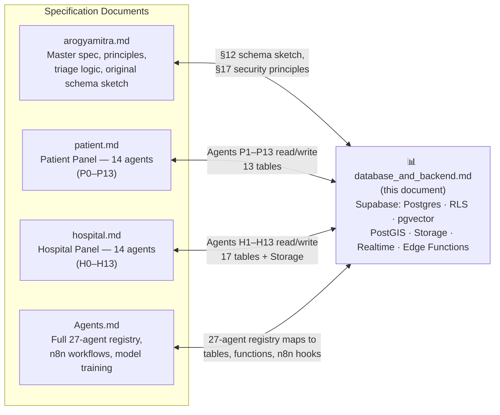
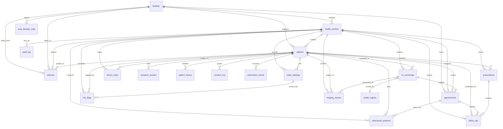
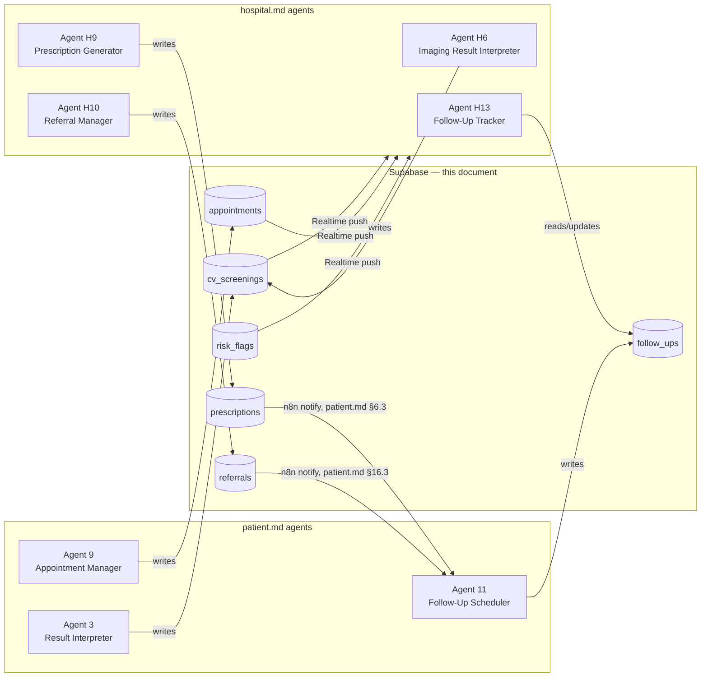

# Database & Backend — ArogyaMitra

**Module Owner:** Database & Backend Infrastructure (Supabase)
**Parent Spec:** [arogyamitra.md](file:///f:/Maverick2026/arogyamitra.md)
**Consumed By:** [patient.md](file:///f:/Maverick2026/patient.md) · [hospital.md](file:///f:/Maverick2026/hospital.md) · [Agents.md](file:///f:/Maverick2026/Agents.md)
**Supersedes:** arogyamitra.md §12 ("Database Schema") and hospital.md §18–19 ("Supabase — Unified Database", "Hospital-Side Supabase Tables") — both remain in place as historical/introductory context, but this document is the single canonical schema going forward. Where they disagree with this file, this file wins.

> Every other document in this project describes **what a feature does**. This document describes **what it's built on** — every table, extension, storage bucket, Realtime channel, Edge Function, and access-control rule in the Supabase backend, plus an explicit map of exactly which agent, in which document, reads or writes each one. If you're editing `patient.md`, `hospital.md`, or `Agents.md` and touch anything data-related, this is the file to update in lockstep — see §18.

---

## Table of Contents

0. [Document Purpose & Relationship Map](#0-document-purpose--relationship-map)
1. [Backend Platform Overview](#1-backend-platform-overview)
2. [Entity Relationship Diagram](#2-entity-relationship-diagram)
3. [Complete Schema Reference (DDL)](#3-complete-schema-reference-ddl)
4. [New Tables & Fields Introduced by This Document](#4-new-tables--fields-introduced-by-this-document)
5. [Storage Buckets](#5-storage-buckets)
6. [Authentication & Role Model](#6-authentication--role-model)
7. [Row Level Security — Consolidated Reference](#7-row-level-security--consolidated-reference)
8. [Realtime Channels](#8-realtime-channels)
9. [Edge Functions Catalog](#9-edge-functions-catalog)
10. [pgvector — RAG Retrieval Configuration](#10-pgvector--rag-retrieval-configuration)
11. [PostGIS — Geospatial Configuration](#11-postgis--geospatial-configuration)
12. [Document Connectivity Matrix](#12-document-connectivity-matrix)
13. [Per-Document Connection Details](#13-per-document-connection-details)
14. [Cross-Document Data Flow](#14-cross-document-data-flow)
15. [Offline Sync & Conflict Resolution](#15-offline-sync--conflict-resolution)
16. [Free-Tier Resource Budget](#16-free-tier-resource-budget)
17. [Migration & Versioning Strategy](#17-migration--versioning-strategy)
18. [Keeping These Documents in Sync](#18-keeping-these-documents-in-sync)
19. [Environment & Config Reference](#19-environment--config-reference)

---

## 0. Document Purpose & Relationship Map

ArogyaMitra is specified across five documents. Four describe product behavior; this one describes the data layer all four actually run on.



**How to use this document alongside the others:**

| If you're reading... | ...and you hit a table name, Supabase feature, or "writes to X" | Come here for |
|---|---|---|
| `arogyamitra.md` §7.7, §12, §17 | Original schema sketch and security principles | The current, extended version of the same schema — §3, §7 |
| `patient.md` §10–§12 (agent specs) | "`log_screening()` writes to `cv_screenings`" etc. | Full column list, RLS rule, and who else reads that table — §3, §12 |
| `hospital.md` §18–§19 | "Supabase Usage by Module" table, additional tables | The merged, non-duplicated version of both — §3, §4, §12 |
| `Agents.md` §2, §14–§17 | Agent registry, n8n workflow specs, model deployment map | Edge Function catalog, `model_registry`, `automation_events` — §9, §4 |

A companion hackathon-pitch document (`ArogyaMitra-Rural-Triage-AI-Architecture.md`) also sketches a schema for judge-facing purposes — that one is intentionally simplified for a 3-minute demo narrative and is **not** in scope for this document's "keep in sync" rules (§18); this file and the four project docs above are the working spec.

---

## 1. Backend Platform Overview

Everything runs on **one Supabase project** — deliberately, so a hackathon team (or a small pilot team) never has to operate a separate vector DB, geo DB, object store, and auth provider.

| Supabase capability | Used for | Primary consumers |
|---|---|---|
| **Postgres** | All structured data — patients, vitals, prescriptions, etc. | Every agent in every document |
| **Row Level Security (RLS)** | Per-role, per-facility access control, enforced in the database itself, not in app code | Both panels — §7 |
| **`pgvector` extension** | RAG embeddings for the medical knowledge base | patient.md Agent 6, hospital.md Agent H7, Agents.md R3 — §10 |
| **`postgis` extension** | Nearest-hospital / nearest-facility geospatial queries | patient.md Agent 10, hospital.md Agent H10, Agents.md A2 — §11 |
| **Storage** | Skin photos, X-rays, MRIs, heatmaps, generated PDFs | §5 |
| **Auth** | Phone OTP (patients, CHWs) and email/password (doctors), role claims via JWT | §6 |
| **Realtime** | Live case-queue updates, live risk-flag pushes | §8 |
| **Edge Functions** | Risk scoring, CV-result processing, RAG retrieval, consent gating, n8n webhook dispatch | §9 |

`n8n` (self-hosted, documented fully in `Agents.md` §13–§15) sits **beside** Supabase, not inside it — it's the automation/orchestration layer that reacts to Postgres webhooks and Edge Function calls and turns them into WhatsApp/SMS messages. This document treats n8n as a consumer of the backend (it reads/writes `automation_events`, see §4) rather than re-specifying the workflows themselves, which are already fully detailed in `Agents.md` §14.

---

## 2. Entity Relationship Diagram

All 21 tables (17 already defined across `arogyamitra.md`/`hospital.md`, 4 new — see §4), with every foreign-key relationship in the system:



`rag_documents` has no foreign keys (it's a standalone knowledge base, keyed only by its own `id` and queried by vector similarity, not joins) — see §10.

---

## 3. Complete Schema Reference (DDL)

This is the full, run-as-one-script schema: the 12 tables from `arogyamitra.md` §12, the 5 added in `hospital.md` §19.1, and the 4 introduced here (§4), merged with no duplication. Comments mark which document each block originated in.

```sql
-- ════════════════════════════════════════════════════════════════
-- Extensions
-- ════════════════════════════════════════════════════════════════
create extension if not exists vector;    -- pgvector, for RAG embeddings
create extension if not exists postgis;   -- geospatial, for facility lookup

-- ════════════════════════════════════════════════════════════════
-- Core tables — originally specified in arogyamitra.md §12
-- ════════════════════════════════════════════════════════════════

create table facilities (
  id uuid primary key default gen_random_uuid(),
  name text not null,
  type text check (type in ('sub_center','phc','chc','district_hospital')),
  capabilities text[],                        -- e.g. {'icu','xray','maternity'}
  location geography(point, 4326),             -- PostGIS: nearby-hospital queries, §11
  contact_phone text,
  created_at timestamptz default now()
);

create table health_workers (
  id uuid primary key references auth.users(id),
  full_name text,
  role text check (role in ('asha','anm','nurse','doctor','admin')),
  facility_id uuid references facilities(id),
  preferred_language text default 'hi'
);

create table patients (
  id uuid primary key default gen_random_uuid(),
  abha_id text unique,                          -- optional ABDM linkage, arogyamitra.md §16
  auth_user_id uuid references auth.users(id),  -- NEW, nullable — see §4.2
  full_name text,
  dob date,
  gender text,
  phone text,
  village text,
  facility_id uuid references facilities(id),
  created_by uuid references health_workers(id),
  created_at timestamptz default now()
);

create table vitals_readings (
  id uuid primary key default gen_random_uuid(),
  patient_id uuid references patients(id),
  recorded_by uuid references health_workers(id),
  heart_rate int,
  resp_rate int,
  spo2 int,
  temp_c numeric(4,1),
  systolic_bp int,
  diastolic_bp int,
  consciousness text check (consciousness in ('alert','voice','pain','unresponsive')), -- AVPU
  can_walk_unassisted boolean,
  recorded_at timestamptz default now(),
  synced_at timestamptz
);

create table symptom_queries (
  id uuid primary key default gen_random_uuid(),
  patient_id uuid references patients(id),
  raw_audio_path text,
  raw_text text,                 -- original-language transcript
  language_code text,
  translated_text text,
  extracted_symptoms jsonb,
  red_flag_hit boolean default false,
  created_at timestamptz default now(),
  synced_at timestamptz                  -- offline sync marker, see §15
);

create table risk_flags (
  id uuid primary key default gen_random_uuid(),
  patient_id uuid references patients(id),
  vitals_id uuid references vitals_readings(id),
  score numeric,
  tier text check (tier in ('green','yellow','orange','red')),
  rationale jsonb,               -- which rule(s)/inputs triggered the tier
  overridden_by uuid references health_workers(id),
  override_reason text,
  reviewed_at timestamptz,
  created_at timestamptz default now()
);

create table cv_screenings (
  id uuid primary key default gen_random_uuid(),
  patient_id uuid references patients(id),
  modality text check (modality in ('skin_photo','eye_photo','oral_photo','xray','mri','ct','histopath')),
  image_path text,               -- Supabase Storage path, §5
  model_version text,            -- FK-by-convention to model_registry.model_key, §4.1
  prediction jsonb,              -- class probabilities
  heatmap_path text,             -- Grad-CAM-style overlay for explainability
  flagged_for_review boolean default true,
  reviewed_by uuid references health_workers(id),
  created_at timestamptz default now(),
  synced_at timestamptz                  -- offline sync marker, see §15
);

create table prescriptions (
  id uuid primary key default gen_random_uuid(),
  patient_id uuid references patients(id),
  doctor_id uuid references health_workers(id),
  medicines jsonb,
  ayush_recommendation jsonb,    -- optional, NAMASTE-coded, arogyamitra.md §7.12
  notes text,
  follow_up_days int,            -- referenced by follow_ups, §4.1
  issued_at timestamptz default now()
);

create table patient_history (
  id uuid primary key default gen_random_uuid(),
  patient_id uuid references patients(id),
  event_type text,               -- 'visit' | 'diagnosis' | 'prescription' | 'follow_up' | 'cv_screening'
  event_data jsonb,
  event_date date,
  created_at timestamptz default now()
);

create table area_disease_stats (
  id uuid primary key default gen_random_uuid(),
  facility_id uuid references facilities(id),
  disease_category text,
  case_count int,
  period_start date,
  period_end date,
  suppressed boolean default false   -- true if case_count < k-anonymity threshold
);

create table rag_documents (
  id uuid primary key default gen_random_uuid(),
  source text,                   -- e.g. 'WHO IMCI Guideline v2024'
  content text,
  embedding vector(768),         -- pgvector, §10
  language_code text default 'en'
);

create table consent_log (
  id uuid primary key default gen_random_uuid(),
  patient_id uuid references patients(id),
  granted_by uuid references health_workers(id),  -- NEW, nullable — see §4.2
  consent_type text,             -- e.g. 'abdm_sync','data_storage','followup_sms'
  granted boolean,
  granted_at timestamptz default now()
);

-- ════════════════════════════════════════════════════════════════
-- Hospital-side tables — originally specified in hospital.md §19.1
-- ════════════════════════════════════════════════════════════════

create table appointments (
  id uuid primary key default gen_random_uuid(),
  patient_id uuid references patients(id),
  facility_id uuid references facilities(id),
  assigned_doctor uuid references health_workers(id),
  priority_tier text check (priority_tier in ('green','yellow','orange','red')),
  source text check (source in ('cv_screening','chatbot_flag','manual_request','follow_up_escalation')),
  cv_screening_id uuid references cv_screenings(id),
  symptom_summary text,
  vitals_snapshot jsonb,
  status text check (status in ('pending','accepted','in_consultation','completed','referred','cancelled'))
    default 'pending',
  notes text,
  scheduled_at timestamptz,
  completed_at timestamptz,
  created_at timestamptz default now()
);

create table referrals (
  id uuid primary key default gen_random_uuid(),
  patient_id uuid references patients(id),
  from_facility uuid references facilities(id),
  to_facility uuid references facilities(id),
  from_doctor uuid references health_workers(id),
  department text,
  urgency text check (urgency in ('emergency','urgent','routine')),
  reason text,
  attached_data jsonb,     -- CV results, vitals, history summary
  status text check (status in ('sent','acknowledged','patient_arrived','completed','cancelled'))
    default 'sent',
  created_at timestamptz default now()
);

create table teleconsult_sessions (
  id uuid primary key default gen_random_uuid(),
  patient_id uuid references patients(id),
  doctor_id uuid references health_workers(id),
  appointment_id uuid references appointments(id),
  channel text check (channel in ('video','audio','chat','whatsapp')),
  started_at timestamptz,
  ended_at timestamptz,
  duration_minutes int,
  doctor_notes text,
  created_at timestamptz default now()
);

create table doctor_notes (
  id uuid primary key default gen_random_uuid(),
  patient_id uuid references patients(id),
  doctor_id uuid references health_workers(id),
  note_text text,
  is_internal boolean default true,    -- true = doctor-only, false = shared with patient
  created_at timestamptz default now()
);

create table imaging_reports (
  id uuid primary key default gen_random_uuid(),
  cv_screening_id uuid references cv_screenings(id),
  patient_id uuid references patients(id),
  doctor_id uuid references health_workers(id),
  modality text,
  ai_findings jsonb,            -- raw model output
  doctor_assessment text,       -- doctor's interpretation
  doctor_agrees_with_ai boolean,
  final_tier text check (final_tier in ('green','yellow','orange','red')),
  recommendations text,
  created_at timestamptz default now()
);

-- ════════════════════════════════════════════════════════════════
-- New tables — introduced by this document, see §4.1 for rationale
-- ════════════════════════════════════════════════════════════════

create table follow_ups (
  id uuid primary key default gen_random_uuid(),
  patient_id uuid references patients(id),
  source_type text check (source_type in ('prescription','appointment','risk_flag')),
  source_id uuid,                   -- polymorphic pointer into prescriptions/appointments/risk_flags
  scheduled_for date,
  interval_days int,
  channel text default 'whatsapp',
  status text check (status in ('scheduled','sent','responded','escalated','missed','completed'))
    default 'scheduled',
  response_text text,
  response_red_flag boolean default false,
  attempts int default 0,
  created_by uuid references health_workers(id),
  created_at timestamptz default now()
);

create table model_registry (
  id uuid primary key default gen_random_uuid(),
  model_key text unique,            -- e.g. 'skin_screener_v3' — matches cv_screenings.model_version
  display_name text,                -- e.g. 'Skin Screener'
  architecture text,                -- e.g. 'MobileNetV2 (transfer learning)'
  modality text check (modality in ('skin_photo','eye_photo','oral_photo','mri','xray','ct','histopath')),
  training_data text[],             -- dataset names, e.g. {'HAM10000','ISIC2019','Dermnet','Fitzpatrick17k'}
  classes text[],
  size_mb numeric,
  target_metric text,               -- e.g. 'accuracy 85-92%' or 'Dice 0.85-0.90'
  deployment text check (deployment in ('on_device','edge_function','hf_spaces')),
  is_active boolean default true,
  deployed_at timestamptz default now()
);

create table automation_events (
  id uuid primary key default gen_random_uuid(),
  workflow_name text,               -- matches Agents.md §14 workflow names, e.g. 'red_flag_escalation'
  trigger_table text,               -- e.g. 'risk_flags'
  trigger_row_id uuid,
  patient_id uuid references patients(id),
  status text check (status in ('triggered','sent','failed','acknowledged')),
  channel text,                     -- 'whatsapp' | 'sms' | 'email'
  latency_ms int,                   -- trigger-row creation → this event; powers arogyamitra.md §21 metrics
  payload jsonb,
  created_at timestamptz default now()
);

create table audit_log (
  id uuid primary key default gen_random_uuid(),
  table_name text,
  row_id uuid,
  action text check (action in ('insert','update','delete','conflict_resolved','override')),
  actor_id uuid references health_workers(id),
  before_data jsonb,
  after_data jsonb,
  reason text,
  created_at timestamptz default now()
);

-- ════════════════════════════════════════════════════════════════
-- Row Level Security — see §7 for the full consolidated reference
-- and rationale per policy. Enable statements only, here:
-- ════════════════════════════════════════════════════════════════

alter table patients enable row level security;
alter table risk_flags enable row level security;
alter table prescriptions enable row level security;
alter table area_disease_stats enable row level security;
alter table appointments enable row level security;
alter table referrals enable row level security;
alter table teleconsult_sessions enable row level security;
alter table doctor_notes enable row level security;
alter table imaging_reports enable row level security;
alter table consent_log enable row level security;
alter table follow_ups enable row level security;
alter table model_registry enable row level security;   -- no public policies: service-role only
alter table automation_events enable row level security; -- no public policies: service-role only
alter table audit_log enable row level security;
```

---

## 4. New Tables & Fields Introduced by This Document

Consolidating four documents' worth of table definitions surfaced a few real gaps — places where one document *describes* behavior that has nowhere to persist in the schema as originally written. These are flagged transparently rather than silently patched in.

### 4.1 New tables

| Table | Why it's needed | What breaks without it |
|---|---|---|
| **`follow_ups`** | "Regular Patient Update" is a named feature (`patient.md` §9, `hospital.md` Feature 9, `Agents.md` Agent A3 & H13), and both `patient.md` Agent 11 (`schedule_reminder()`) and `hospital.md` Agent H9 (`schedule_follow_up()`) describe scheduling one — but no table records the schedule, the channel, or the patient's reply. Without it, `hospital.md` Agent H13's `list_pending_followups()` / `display_responses()` / `flag_non_responders()` have nothing to query. |
| **`model_registry`** | `Agents.md` §10.3 and §17 document ten trained models in detail (architecture, dataset, size, accuracy, deployment target) but that information lives only in prose — `cv_screenings.model_version` is a bare text field with nothing to join against. This table makes "which model made this call, and how accurate is it expected to be" queryable, which matters for the bias-audit and override-pattern-detection use cases both `hospital.md` §13.2 and `arogyamitra.md` §22 call for. |
| **`automation_events`** | `Agents.md` §14 specifies 11 n8n workflows and §21 sets a target of "<60 seconds time-to-doctor-alert," but nothing in the original schema records when a workflow fired, on what, or how long it took — so that metric (also cited in `arogyamitra.md` §21) has no data source. This table is what n8n writes back to after every webhook it handles. |
| **`audit_log`** | `patient.md` §14.2 explicitly says offline sync conflicts are "logged to an audit table," and `hospital.md` §13.2 shows a worked example of a tier-override log — but no such table exists in either document's schema section. This table is that missing sink. |

### 4.2 New fields on existing tables

| Table.field | Why |
|---|---|
| `patients.auth_user_id` | The original `patients` table (`arogyamitra.md` §12) has no link to `auth.users`, but `patient.md` §2 describes patients authenticating directly via phone OTP in one of three registration paths. Without this column, "a patient views only their own record" can't be written as an RLS policy the way "a health worker sees only their facility" can. Nullable, because the other two registration paths (health-worker-assisted, WhatsApp bot) may never produce a patient-owned login. |
| `consent_log.granted_by` | `patient.md` §2 says consent is granted "by the patient (or assisting health worker)" — the original table only recorded *that* consent was granted, not *who* obtained it, which matters if a consent grant is ever disputed. Nullable for the same reason as above. |
| `prescriptions.follow_up_days` | `hospital.md` §9.2's prescription form has a "Follow-up in: [7 days]" field and §9.3 says "Follow-up scheduled: n8n creates a reminder workflow" — but the original `prescriptions` table had nowhere to store the chosen interval. Now feeds directly into `follow_ups.interval_days`. |

None of these are breaking changes — every addition is a nullable column or a wholly new table, so existing inserts from any of the four documents' described flows continue to work unmodified.

---

## 5. Storage Buckets

Originally specified in `hospital.md` §19.2; reproduced here as canonical and extended with the RAG corpus note.

| Bucket | Content | Access | Max File Size | Written By |
|---|---|---|---|---|
| `skin-photos` | Patient-uploaded skin images | Private — signed URLs, 1hr expiry | 10MB | `patient.md` Agent 1 |
| `mri-scans` | MRI scan uploads (DICOM/JPEG/NIfTI) | Private — doctor access only | 100MB (multi-slice) | `hospital.md` Agent H1 |
| `xray-images` | Chest X-ray uploads | Private — doctor access only | 20MB | `hospital.md` Agent H4 |
| `heatmaps` | Grad-CAM overlays from any CV model | Private — linked to `cv_screenings` record | 5MB | `patient.md` Agent 2, `hospital.md` Agents H2/H3/H4/H5 |
| `prescriptions-pdf` | Generated printable prescriptions | Private — patient + doctor access | 2MB | `hospital.md` Agent H9 (`generate_printable()`) |
| `referral-packets` | Generated referral PDFs | Private — referring + receiving doctor | 10MB | `hospital.md` Agent H10 (`send_referral()`) |

> **Note on `rag_documents`:** the RAG corpus is stored as `text` directly in Postgres (§3), not in a Storage bucket — chunks are small enough (500–1000 tokens) that a bucket + fetch round-trip would add latency for no benefit. If your team ingests very large source PDFs, keep the *raw* PDFs in a `rag-source-pdfs` bucket for provenance, but keep the chunked/embedded text in the table, which is what retrieval actually queries.

---

## 6. Authentication & Role Model

| Actor | Auth method | Table row | Role claim | RLS scope |
|---|---|---|---|---|
| ASHA / ANM / Nurse | Phone OTP | `health_workers.id = auth.users.id` | `role = 'asha' \| 'anm' \| 'nurse'` | Own `facility_id` only |
| Doctor / Medical Officer | Email + password (optionally TOTP MFA, `hospital.md` §2.2) | `health_workers.id = auth.users.id` | `role = 'doctor'` | Own `facility_id`; only role that can insert `prescriptions`/`imaging_reports` |
| District Admin | Email + password | `health_workers.id = auth.users.id` | `role = 'admin'` | `area_disease_stats` only — **no** row-level access to any PHI table |
| Patient (self-registered) | Phone OTP | `patients.auth_user_id = auth.users.id` *(§4.2 addition)* | none — patients aren't in `health_workers` | Own patient row only |
| Patient (health-worker-registered or WhatsApp-bot-registered) | None — no `auth.users` row at all | `patients.auth_user_id is null` | n/a | Accessed only through the registering health worker's session, or via phone-number lookup from the WhatsApp bot's service-role Edge Function |

**Why `health_workers` and `patients` use two different identity patterns:** every health worker needs an ongoing login (they return daily), so binding `health_workers.id` directly to `auth.users.id` (as `arogyamitra.md` §12 already does) is the simplest correct design. Patients are different — `patient.md` §2 explicitly supports three onboarding paths, and two of them (health-worker-assisted, WhatsApp bot) may never produce a patient who logs in directly. Forcing every patient into `auth.users` would mean creating throwaway accounts for people who will never use them. The nullable `auth_user_id` (§4.2) lets both cases coexist without weakening RLS for the patients who *do* self-register.

**Service-role usage:** the Supabase service-role key is never shipped to client code (`arogyamitra.md` §17) — it's used only inside Edge Functions (§9) and by n8n's Supabase node, both of which run server-side. This is what lets the WhatsApp bot create/update `patients` rows for people who have no `auth.users` row of their own.

---

## 7. Row Level Security — Consolidated Reference

Every policy across all four source documents, plus the gaps this document closes (marked **NEW**).

| Table | Policy | Op | Rule | Source |
|---|---|---|---|---|
| `patients` | health workers see only their facility patients | SELECT | `facility_id` matches caller's `health_workers.facility_id` | `arogyamitra.md` §12 |
| `patients` | doctors see their facility patients | SELECT | caller is a doctor at the same `facility_id` | `arogyamitra.md` §12 |
| `patients` | doctors_facility_patients | SELECT | equivalent doctor-scoped rule | `hospital.md` §2.3 |
| `patients` | **patients see own record** | SELECT | `patients.auth_user_id = auth.uid()` | **NEW, §4.2** |
| `risk_flags` | facility-scoped risk flag access | SELECT | patient's facility matches caller's facility | `arogyamitra.md` §12 |
| `prescriptions` | only_doctors_prescribe | INSERT | caller has `role = 'doctor'` | `hospital.md` §2.3 |
| `area_disease_stats` | admin_stats_only | SELECT | caller has `role = 'admin'` | `hospital.md` §2.3 |
| `appointments` | facility_appointments | SELECT | `facility_id` matches caller's facility | `hospital.md` §19.1 |
| `doctor_notes` | own_notes | SELECT | caller is the authoring doctor, or `is_internal = false` | `hospital.md` §19.1 |
| `imaging_reports` | doctors_create_reports | INSERT | caller has `role = 'doctor'` | `hospital.md` §19.1 |
| `consent_log` | **patient- or facility-scoped read** | SELECT | patient sees own consent rows; health worker sees their facility's | **NEW — no policy existed in either source doc** |
| `follow_ups` | **facility-scoped** | SELECT | via join on `patients.facility_id` | **NEW** |
| `model_registry` | **service-role only** | ALL | no policy defined — inaccessible except via service role | **NEW** |
| `automation_events` | **service-role only** | ALL | no policy defined — n8n's service-role credential only | **NEW** |
| `audit_log` | **admin-read** | SELECT | caller has `role = 'admin'` | **NEW** |

```sql
-- The two gap-filling policies most likely to matter for a demo:

create policy "patients see own record"
on patients for select
using (auth_user_id = auth.uid());

create policy "consent scoped to patient or facility"
on consent_log for select
using (
  patient_id in (
    select id from patients where auth_user_id = auth.uid()
    union
    select id from patients where facility_id in (
      select facility_id from health_workers where id = auth.uid()
    )
  )
);
```

**Default-deny is the baseline everywhere:** every table above has `enable row level security` called (§3) with no catch-all `using (true)` policy — a table with RLS on and zero matching policies denies all access to non-service-role callers by default. `model_registry` and `automation_events` are deliberately left with *no* end-user-facing policy at all, since neither should ever be queried by a patient, health worker, or doctor session — only by the deployment pipeline and n8n's service-role credential, respectively.

---

## 8. Realtime Channels

| Channel | Table(s) | Filter | Subscribed by | Source |
|---|---|---|---|---|
| `risk-flags` | `risk_flags` | `patient_id in (patients at caller's facility)` | Doctor Portal case queue | `hospital.md` §3.3 (worked code example) |
| `appointments` | `appointments` | `facility_id = caller's facility` | Doctor Portal appointment inbox | `hospital.md` §3.2, `Agents.md` Workflow 7 |
| `cv-screenings` | `cv_screenings` | facility-scoped | Doctor Portal skin-review queue | `hospital.md` §7.1, `patient.md` §16.2 |
| `teleconsult` | `teleconsult_sessions` | `appointment_id` | In-call UI, both portals | `hospital.md` §10 |
| `area-dashboard` | `area_disease_stats` | `role = 'admin'` only | Admin dashboard | `hospital.md` §12.2 |

Every channel follows the same pattern as `hospital.md`'s worked example: a `postgres_changes` subscription filtered server-side by facility, with a client-side branch for Red-tier events specifically (play sound, toast, bump to top of queue). New Realtime channels should filter at the database level (as above) rather than fetching broadly and filtering in JavaScript — the latter would defeat the payload-budgeting goal in `arogyamitra.md` §14.

---

## 9. Edge Functions Catalog

The compute layer between client actions and either Postgres or n8n. Every Edge Function below is referenced by name (or by clear description) somewhere in the other three documents; this table is where the implied function gets a name, a signature, and a single home.

| Function | Triggered by | Reads | Writes | Calls out to | Referenced in |
|---|---|---|---|---|---|
| `compute-risk-score` | New row in `vitals_readings` or `symptom_queries` | `vitals_readings`, `symptom_queries` | `risk_flags` | n8n Red-Flag Escalation workflow if tier ∈ {orange, red} | `arogyamitra.md` §10, §12 ("Edge Functions — risk scoring trigger"); `patient.md` Agent 3 `check_auto_escalation()`, Agent 12 |
| `process-cv-result` | New row in `cv_screenings` | `cv_screenings`, `model_registry` | `risk_flags` (raises tier if needed), `appointments` (if auto-escalated) | n8n CV Result Processing workflow | `patient.md` Agent 3 `log_screening()`; `hospital.md` Agent H6; `Agents.md` Workflow 3 |
| `rag-retrieve` | Chat query from either portal, or n8n RAG workflow | `rag_documents` via pgvector similarity | — (returns passages) | Reranker, then the grounded LLM | `Agents.md` R3; `patient.md` Agent 6; `hospital.md` Agent H7 |
| `consent-gate` | Called before any sensitive read/write | `consent_log` | `consent_log` (new grant) | — | `patient.md` Agent 13 `check_consent()`; `Agents.md` S2 |
| `nearest-facility` | Hospital Locator UI action | `facilities` (PostGIS query, §11) | — | — | `patient.md` Agent 10; `Agents.md` A2 |
| `fhir-export` | Doctor or patient requests ABDM sync | `patients`, `patient_history`, `prescriptions`, `cv_screenings` | — | ABDM Health Information Exchange | `arogyamitra.md` §16 |
| `webhook-dispatch` | Called by any of the above on a tier change, new appointment, new prescription, or new referral | Relevant row from `risk_flags` / `appointments` / `prescriptions` / `referrals` | `automation_events` (logs the outcome) | n8n | `Agents.md` §14 (all 11 workflows); `arogyamitra.md` §13 |

`webhook-dispatch` is the one function every n8n-triggering event in the system ultimately calls — it's what turns "a Postgres row changed" into "n8n knows about it," and its writes to `automation_events` are what make the `arogyamitra.md` §21 "time-to-escalation" metric computable after the fact instead of only observable live.

---

## 10. pgvector — RAG Retrieval Configuration

| Setting | Value | Rationale |
|---|---|---|
| Embedding column | `rag_documents.embedding vector(768)` | Matches a 768-dim multilingual sentence-embedding model, per `arogyamitra.md` §11.1 / `Agents.md` R3 |
| Embedding model | Multilingual sentence-transformer (e.g. `paraphrase-multilingual-MiniLM-L12-v2` class) | Lets Hindi/regional-language queries match English-language source guidelines without a mandatory translation hop first — `arogyamitra.md` §11.1 |
| Similarity metric | Cosine similarity | Standard for sentence-embedding retrieval |
| Initial retrieval | Top-20 candidates | `Agents.md` R3 |
| Reranking | Cross-encoder rescoring to top-5 | `Agents.md` R3, `arogyamitra.md` §11.1 |
| Index type | `ivfflat` (or `hnsw` if the corpus grows past a few hundred thousand chunks) | Standard pgvector indexing choice for this corpus size (`Agents.md` §9.2 estimates ~2,450 chunks total) |
| Filtering | `language_code`, and intent-based boosting (drug formulary vs. WHO guideline) applied post-retrieval | `patient.md` Agent 6 `filter_by_intent()` |

```sql
-- Example index (create after the corpus is loaded, not before —
-- ivfflat index quality depends on having representative data to cluster)
create index on rag_documents
  using ivfflat (embedding vector_cosine_ops)
  with (lists = 100);

-- Example retrieval query, called from the rag-retrieve Edge Function
select id, source, content, language_code,
       1 - (embedding <=> :query_embedding) as similarity
from rag_documents
where language_code = :language_code or :language_code is null
order by embedding <=> :query_embedding
limit 20;
```

Ingestion (chunking source documents, embedding them, and inserting into `rag_documents`) is a one-time/periodic n8n workflow, fully specified in `Agents.md` §9.3 — this section covers only the storage and retrieval side.

---

## 11. PostGIS — Geospatial Configuration

`facilities.location` is a `geography(point, 4326)` column (WGS84 lat/lng) — the standard SRID for real-world GPS coordinates, which is what both `patient.md` Agent 10 and `hospital.md` Agent H10 need for nearest-neighbor queries.

```sql
-- Nearest N facilities, optionally filtered by required capability
-- (patient.md Agent 10 query_nearest(); hospital.md Agent H10 find_appropriate_facility())
select
  id, name, type, contact_phone,
  round((ST_Distance(location, ST_MakePoint(:lng, :lat)::geography) / 1000)::numeric, 1) as distance_km
from facilities
where (:required_capability is null or capabilities @> array[:required_capability]::text[])
order by location <-> ST_MakePoint(:lng, :lat)::geography
limit 5;
```

The `<->` operator is a KNN (k-nearest-neighbor) distance operator, which lets PostGIS use a spatial index (`GIST`) instead of computing distance to every row — matters once `facilities` grows past a handful of seeded rows.

```sql
create index facilities_location_idx on facilities using gist (location);
```

`patient.md` Agent 10's `geocode_village()` (resolving a village name to coordinates for offline use, via a pre-seeded lookup) is a separate, small local table/JSON asset shipped with the client — it is intentionally **not** part of this backend schema, since it needs to work with zero connectivity (`arogyamitra.md` §14).

---

## 12. Document Connectivity Matrix

The core of this document: every table, who defines it, who writes it, who reads it, and which Supabase features it depends on — with a document section pointer for each.

| Table | Defined in | Written by | Read by | Key features |
|---|---|---|---|---|
| `facilities` | `arogyamitra.md` §12 | Onboarding/seed process | `patient.md` Agent 10; `hospital.md` Agent H10; `Agents.md` A2 | PostGIS (§11) |
| `health_workers` | `arogyamitra.md` §12 | Registration (Supabase Auth trigger) | Every RLS policy in both panels; `hospital.md` §2 | Auth, RLS |
| `patients` | `arogyamitra.md` §12 | `patient.md` Agent 0/13; `hospital.md` facility-side registration | Nearly every agent in both panels | RLS (§7), Auth (§6) |
| `vitals_readings` | `arogyamitra.md` §12 | `patient.md` vitals entry flow; `hospital.md` nurse entry | `patient.md` Agent 12; `hospital.md` §3.2 queue; `compute-risk-score` | Realtime (§8) |
| `symptom_queries` | `arogyamitra.md` §12 | `patient.md` Agent 5, via Agent 4 | `patient.md` Agent 12; `hospital.md` §11.1; `Agents.md` R2 | — |
| `risk_flags` | `arogyamitra.md` §12 | `compute-risk-score`; `patient.md` Agent 3/12; `hospital.md` tier override §13 | `hospital.md` §3 case queue; `patient.md` Agent 9; `Agents.md` S1 | Realtime, RLS |
| `cv_screenings` | `arogyamitra.md` §12 | `patient.md` Agent 3 `log_screening()`; `hospital.md` Agent H6 `log_screening()` | `hospital.md` §7 skin review, §4–6 imaging; patient history timeline | Storage, Realtime, `model_registry` FK |
| `prescriptions` | `arogyamitra.md` §12 | `hospital.md` Agent H9 — doctors only | `patient.md` §6.3 prescription view; `patient.md` Agent 9 | RLS `only_doctors_prescribe` |
| `patient_history` | `arogyamitra.md` §12 | Nearly every write-agent in both panels | `patient.md` §6 timeline; `hospital.md` §11 history view | — |
| `area_disease_stats` | `arogyamitra.md` §12 | `Agents.md` M2 / `hospital.md` H12, via n8n cron | `hospital.md` §12 area dashboard; admin RLS | k-anonymity suppression |
| `rag_documents` | `arogyamitra.md` §12 | One-time n8n ingestion (`Agents.md` §9.3) | `patient.md` Agent 6; `hospital.md` Agent H7; `Agents.md` R3 | pgvector (§10) |
| `consent_log` | `arogyamitra.md` §12 | `patient.md` Agent 13 | `Agents.md` S2; `fhir-export` gate | RLS (new, §7) |
| `appointments` | `hospital.md` §19.1 | `patient.md` Agent 9 `create_appointment()` | `hospital.md` §3 queue, §22 workflows; `Agents.md` A1 | Realtime |
| `referrals` | `hospital.md` §19.1 | `hospital.md` Agent H10 | `patient.md` §16.3 (referral info shown to patient) | Storage (`referral-packets`) |
| `teleconsult_sessions` | `hospital.md` §19.1 | `hospital.md` §10 teleconsult flow | `hospital.md` §11 history; patient history (summary only) | Realtime |
| `doctor_notes` | `hospital.md` §19.1 | Doctors, free text | `hospital.md` only — explicitly not shown to patient | RLS `own_notes` |
| `imaging_reports` | `hospital.md` §19.1 | `hospital.md` Agent H6 `generate_report()` | `hospital.md` §4 imaging display; attached to `referrals` | RLS `doctors_create_reports` |
| `follow_ups` | **this document, §4.1** | `patient.md` Agent 11; `hospital.md` Agent H9/H13 | `patient.md` §9; `hospital.md` Feature 9; `Agents.md` A3/H13 | n8n scheduled workflows |
| `model_registry` | **this document, §4.1** | Deployment pipeline (`Agents.md` §18 Kaggle → HF Spaces/on-device) | Every CV agent's `load_model()`; `cv_screenings.model_version` | Service-role only |
| `automation_events` | **this document, §4.1** | `webhook-dispatch`, on every n8n trigger | `Agents.md` §21 benchmarks; `arogyamitra.md` §21 impact metrics | Service-role only |
| `audit_log` | **this document, §4.1** | Sync conflicts (`patient.md` §14.2); overrides (`hospital.md` §13.2) | Compliance/security review, admin RLS | — |

---

## 13. Per-Document Connection Details

### `patient.md` ↔ this document
- **Owns writes to:** `vitals_readings`, `symptom_queries`, `cv_screenings` (skin modality), `appointments` (creation), `consent_log`, `follow_ups` (creation).
- **Reads:** `risk_flags`, `prescriptions`, `patient_history`, `rag_documents` (via `rag-retrieve`), `facilities` (via `nearest-facility`).
- **Exact pointers:** Agent 3 §11 (`log_screening()` → `cv_screenings`), Agent 9 §11 (`create_appointment()` → `appointments`), Agent 13 §11 (`log_consent()` → `consent_log`), Agent 11 §11 (`schedule_reminder()` → now `follow_ups`, §4.1).
- **If you change:** the `cv_screenings` schema here, re-check `patient.md` §3.3 ("What the Patient Sees") for fields the UI expects to exist.

### `hospital.md` ↔ this document
- **Owns writes to:** `prescriptions`, `referrals`, `teleconsult_sessions`, `doctor_notes`, `imaging_reports`, tier overrides on `risk_flags`.
- **Reads:** everything `patient.md` writes, plus its own tables — this is the panel with the widest read surface in the schema.
- **Exact pointers:** §18.2's module-usage table is now formalized as §12 above; §19's table definitions are reproduced verbatim in §3; §2.3's RLS examples are now excerpts of the consolidated set in §7.
- **If you change:** an RLS policy here, re-verify the `hospital.md` §2.3 / §19.1 code blocks still match — they should be read as illustrative excerpts of the canonical policies, not a second source of truth.

### `Agents.md` ↔ this document
- Every agent in the §2.1 registry that shows "✅" for a trained model, or that mentions Supabase in its function list, has a corresponding row in §9 (Edge Functions) or §12 (connectivity matrix) here.
- **Exact pointers:** §8.2's RAG n8n flow node 6 ("Supabase Vector Store Retrieval") maps to `rag-retrieve` (§9); §9.3's ingestion workflow writes to `rag_documents` (§3); §17's "Model Serving & Deployment" table is now the seed data for `model_registry` (§4.1); §15.2's wiring table is the agent-centric view of the same connections this document presents table-centrically in §12.
- **If you add a new agent that persists data:** add a row to §12 of this document, and if it introduces a new n8n workflow, add a corresponding entry to §9's Edge Functions catalog (most new workflows will route through `webhook-dispatch` rather than needing a bespoke function).

### `arogyamitra.md` ↔ this document
- This document formally supersedes `arogyamitra.md` §12 — that section should now be read as the original design sketch, this file as the maintained, current schema.
- §17 (Security & Privacy) principles are carried forward and made concrete in §6/§7 here.
- §21 (Impact Metrics) — "time-to-escalation" and "red-flag recall" are now directly queryable via `automation_events` and `model_registry` respectively, rather than requiring manual instrumentation.
- §16 (ABDM interoperability) — the `fhir-export` Edge Function (§9) is the concrete implementation of what §16 describes at the architecture level.

---

## 14. Cross-Document Data Flow

This reconciles `patient.md` §16 ("Data Flow: Patient Panel → Hospital Panel") and `hospital.md` §23 ("Data Flow: Hospital Panel ↔ Patient Panel") into one diagram, now naming the actual tables and functions in between instead of describing the exchange narratively.



Every arrow in this diagram corresponds to a Realtime channel (§8), an Edge Function (§9), or an n8n workflow (`Agents.md` §14) — nothing here is a new mechanism, this is the existing mechanisms drawn as one picture instead of two separate document-local ones.

---

## 15. Offline Sync & Conflict Resolution

`patient.md` §14 and `arogyamitra.md` §14 both describe offline-first behavior at the product level; this section is the backend-side counterpart.

- **Local queue:** the PWA writes to IndexedDB first, always — Supabase is a sync target, never the thing blocking a save. This is unchanged from `arogyamitra.md` §14 and isn't a backend-schema concern, but it's why every syncable table (`vitals_readings`, `symptom_queries`, `cv_screenings`, `appointments`) either already has or should have a `synced_at timestamptz` column (present on `vitals_readings` today; recommend adding to `symptom_queries` and `cv_screenings` if offline CV screening logging is implemented in full).
- **Delta sync:** only changed fields sync, not full rows — this is a client-side batching concern, not a schema concern, but it's why `updated_at`-style columns matter less here than `created_at`/`recorded_at`, since most tables in this schema are append-only event logs rather than mutable records.
- **Conflict resolution:** last-write-wins at the field level, logged to `audit_log` (§3, §4.1) with `action = 'conflict_resolved'` — this is the concrete home for what `patient.md` §14.2 calls "logged to an audit table" without previously specifying where.
- **Priority sync queue:** Red/Orange `risk_flags` rows sync first on reconnect (`arogyamitra.md` §14) — this is a client-side ordering decision using the same `tier` column already in the schema, no backend change required.

---

## 16. Free-Tier Resource Budget

Reproduced from `hospital.md` §18.3 as canonical, since resource planning belongs with the backend spec rather than the Hospital Panel doc specifically:

| Resource | Free tier | Sufficient for hackathon build? |
|---|---|---|
| Database | 500MB | ✅ — structured data (vitals, flags, history) is tiny; images live in Storage, not Postgres |
| Storage | 1GB | ✅ — roughly 200 medical images at ~5MB each |
| Auth | 50,000 monthly active users | ✅ — overkill for a demo or pilot |
| Edge Functions | 500,000 invocations/month | ✅ — plenty for demo and load testing |
| Realtime | 200 concurrent connections | ✅ — fine for a prototype deployment |
| Bandwidth | 5GB/month | ✅ — sufficient for a demo period |

Worth re-checking against current Supabase pricing before a real (non-hackathon) pilot, since free-tier limits are the kind of detail that changes over time — treat the table above as directionally correct at spec-writing time, not a guarantee.

---

## 17. Migration & Versioning Strategy

Not covered elsewhere in the four source documents, and worth specifying since a real team will run this schema through multiple iterations:

- **Numbered migration files**, one per logical change, e.g. `0001_core_schema.sql` (the `arogyamitra.md` §12 tables), `0002_hospital_tables.sql` (the `hospital.md` §19.1 tables), `0003_backend_doc_additions.sql` (§3/§4 of this document — `follow_ups`, `model_registry`, `automation_events`, `audit_log`, plus the `patients.auth_user_id` / `consent_log.granted_by` / `prescriptions.follow_up_days` additions).
- **Supabase CLI** (`supabase migration new <name>`, `supabase db push`) is the natural tool for this — keeps schema changes reviewable in pull requests rather than applied ad hoc through the dashboard.
- **Never edit a migration that's already been applied to a shared environment** — add a new one that alters the existing table instead, even for a hackathon-speed build, since two teammates working against a drifted local schema is a fast way to lose a day of a 48-hour sprint to debugging.
- **Seed data** (sample `facilities`, a demo `health_workers` account per role, ~20–30 pages of `rag_documents` per `arogyamitra.md` §19 Sprint 2) belongs in a separate `seed.sql`, not in the migrations, so the migration history stays a clean record of schema shape rather than a mix of shape and data.

---

## 18. Keeping These Documents in Sync

Practical process notes for a team maintaining five interlocking documents:

1. **This document is the only place a `create table` statement should live.** If you're editing `patient.md` or `hospital.md` and find yourself writing SQL, stop — describe the behavior in prose and add/modify the table here instead, then link back.
2. **Every new agent in `Agents.md` that reads or writes data needs a row in §12 of this document.** The registry in `Agents.md` §2.1 and the connectivity matrix here should never drift apart — if an agent's "Trained Model?" or function list implies a table touch, this document needs to reflect it.
3. **Every new n8n workflow in `Agents.md` §14 should route through `webhook-dispatch` (§9) unless it has a genuinely distinct trigger shape** — this keeps `automation_events` a complete log of automation activity rather than a partial one.
4. **RLS changes are the highest-risk edits in this whole project** — a missing or overly-permissive policy is a PHI leak, not just a bug. Any PR touching §7 should get a second reviewer, full stop, even during a hackathon.
5. **If `arogyamitra.md` §12 or `hospital.md` §18–19 are ever edited directly,** add a note there pointing back to this document, rather than letting three schema descriptions drift out of sync silently.

---

## 19. Environment & Config Reference

| Variable | Purpose | Where used |
|---|---|---|
| `SUPABASE_URL` | Project API endpoint | All clients, all Edge Functions |
| `SUPABASE_ANON_KEY` | Public client key — RLS-restricted | PWA, Doctor Portal |
| `SUPABASE_SERVICE_ROLE_KEY` | Full-access key — **server-side only** | Edge Functions (§9), n8n's Supabase node, WhatsApp bot backend |
| `PGVECTOR_EMBEDDING_MODEL` | Which embedding model `rag-retrieve` calls | `rag-retrieve` Edge Function (§10) |
| `N8N_WEBHOOK_BASE_URL` | Where `webhook-dispatch` sends events | `webhook-dispatch` Edge Function (§9) |
| `ABDM_CLIENT_ID` / `ABDM_CLIENT_SECRET` | ABDM sandbox credentials, optional | `fhir-export` Edge Function (§9), gated by `consent_log` |
| `BHASHINI_API_KEY` | ASR/MT/TTS calls | Not backend-schema-relevant, but called from the same Edge Function layer per `Agents.md` R1 |

Extensions to enable on project creation, in order (`postgis` and `vector` have no interdependency, but enabling both before the first migration avoids a failed `create table` on `facilities.location` or `rag_documents.embedding`):

```sql
create extension if not exists postgis;
create extension if not exists vector;
```

---

*Document prepared as the canonical backend reference for the ArogyaMitra hackathon build. As with the other documents in this set, treat table names, RLS rules, and resource budgets as a strong starting point for your team to implement and adjust — not as a locked contract.*
