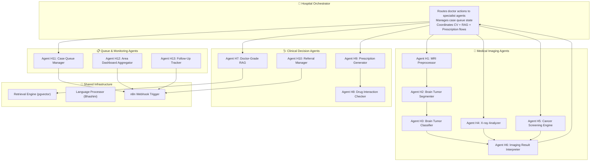

# Hospital Panel — ArogyaMitra

**Module Owner:** Hospital / Doctor-Facing Portal  
**Parent Spec:** [arogyamitra.md](file:///f:/Maverick2026/arogyamitra.md)  
**Receives Data From:** [Patient Panel (patient.md)](file:///f:/Maverick2026/patient.md)  
**Database:** Supabase (Postgres + pgvector + PostGIS + Storage + Realtime + Auth + Edge Functions)

> This document covers **everything the Hospital Panel does** — the doctor's case queue, medical imaging AI (MRI brain tumor, X-ray analysis, cancer screening), teleconsult, e-prescriptions, area-wide dashboards, and how Supabase serves as the unified database across all project modules. Architecture diagrams live in `arogyamitra.md`; this file is purely about hospital-side functionality, agent design, CV model details, and implementation.

---

## Table of Contents

1. [Panel Overview](#1-panel-overview)
2. [Doctor Authentication & Role System](#2-doctor-authentication--role-system)
3. [Feature 1 — Prioritized Case Queue (Triage Dashboard)](#3-feature-1--prioritized-case-queue-triage-dashboard)
4. [Feature 2 — Brain Tumor Detection (MRI)](#4-feature-2--brain-tumor-detection-mri)
5. [Feature 3 — Cancer Screening (Multi-Organ)](#5-feature-3--cancer-screening-multi-organ)
6. [Feature 4 — X-ray Analysis](#6-feature-4--x-ray-analysis)
7. [Feature 5 — Skin Screening Review (from Patient Panel)](#7-feature-5--skin-screening-review-from-patient-panel)
8. [Feature 6 — RAG Medical Assistant (Doctor-Grade)](#8-feature-6--rag-medical-assistant-doctor-grade)
9. [Feature 7 — E-Prescription System](#9-feature-7--e-prescription-system)
10. [Feature 8 — Teleconsult (One-to-One)](#10-feature-8--teleconsult-one-to-one)
11. [Feature 9 — Patient History & Records Access](#11-feature-9--patient-history--records-access)
12. [Feature 10 — Area-Wise Disease Dashboard](#12-feature-10--area-wise-disease-dashboard)
13. [Feature 11 — Tier Override & Clinical Judgment](#13-feature-11--tier-override--clinical-judgment)
14. [Feature 12 — Referral Management](#14-feature-12--referral-management)
15. [Feature 13 — AYUSH / Ayurvedic Recommendations](#15-feature-13--ayush--ayurvedic-recommendations)
16. [Multi-Agent Architecture (Hospital Side)](#16-multi-agent-architecture-hospital-side)
17. [Agent Node Specifications](#17-agent-node-specifications)
18. [Supabase — Unified Database for All Modules](#18-supabase--unified-database-for-all-modules)
19. [Hospital-Side Supabase Tables & Extensions](#19-hospital-side-supabase-tables--extensions)
20. [CV Model Datasets & Training (MRI / X-ray / Cancer)](#20-cv-model-datasets--training-mri--x-ray--cancer)
21. [Model Architecture & Deployment](#21-model-architecture--deployment)
22. [n8n Workflows (Hospital Side)](#22-n8n-workflows-hospital-side)
23. [Data Flow: Hospital Panel ↔ Patient Panel](#23-data-flow-hospital-panel--patient-panel)
24. [Hospital Panel UI/UX Specifications](#24-hospital-panel-uiux-specifications)
25. [Error Handling & Edge Cases](#25-error-handling--edge-cases)

---

## 1. Panel Overview

The Hospital Panel is the **doctor and medical staff-facing** interface of ArogyaMitra. Unlike the Patient Panel (which is built for low-literacy, offline-first, mobile-first use), the Hospital Panel is a **full-featured web application** designed for desktop/tablet use by qualified medical professionals.

### What a Doctor Can Do

| Capability | Description |
|---|---|
| **Review prioritized case queue** | All incoming patient cases sorted Red → Orange → Yellow → Green, with real-time updates |
| **Upload and analyze MRI scans** | AI-powered brain tumor detection with segmentation heatmaps |
| **Upload and analyze X-rays** | Chest X-ray screening for pneumonia, TB, cardiomegaly, and other conditions |
| **Upload and analyze cancer imaging** | Multi-organ cancer screening (lung, breast, brain) with confidence scores |
| **Review patient skin screenings** | View CV results from the Patient Panel with Grad-CAM heatmaps, confirm or override |
| **Issue e-prescriptions** | Structured prescription with drug name, dosage, frequency — sent to patient via WhatsApp/SMS |
| **Conduct teleconsults** | Audio/video/chat one-to-one with the patient or field health worker |
| **View full patient history** | Longitudinal record of all visits, screenings, prescriptions, vitals |
| **Override AI triage tier** | Confirm or change the computed Green/Yellow/Orange/Red tier with a logged reason |
| **View area-wide disease dashboard** | De-identified disease trend heatmaps for resource planning |
| **Refer to higher facility** | Refer the patient to a specialist/district hospital with full case packet |
| **Query RAG assistant (doctor-grade)** | Medical knowledge assistant with full clinical detail + citations |
| **Manage follow-up schedules** | Set follow-up intervals, review patient check-in responses |
| **Issue AYUSH recommendations** | Optional Ayurvedic/AYUSH wellness guidance using NAMASTE terminology |

---

## 2. Doctor Authentication & Role System

### 2.1 Who Uses the Hospital Panel

| Role | Access Level | What They See |
|---|---|---|
| **Doctor / Medical Officer** | Full access | Case queue, all CV tools, prescription, teleconsult, patient history, area dashboard, tier override |
| **Specialist (visiting)** | Referral cases only | Cases referred to their specialty + CV screening review |
| **Nurse / ANM (facility)** | Limited | Case queue (read-only), vitals entry, patient history — no prescription, no tier override |
| **Admin (District Health)** | Dashboard only | Area-wide disease stats, facility performance metrics — no patient-level data |

### 2.2 Authentication Flow

| Method | Detail |
|---|---|
| **Login** | Supabase Auth — email/password for doctors (higher security than OTP), or phone OTP for nurses |
| **Role claim** | JWT custom claims set at registration: `role: 'doctor'` / `'nurse'` / `'admin'` — enforced via RLS |
| **Facility binding** | Each user is bound to a `facility_id` — they can only see patients registered at their facility (RLS policy) |
| **Session** | Persistent session with refresh tokens — doctor doesn't need to re-login every visit |
| **MFA (optional)** | TOTP-based MFA for doctor accounts handling sensitive prescriptions |

### 2.3 Row Level Security Enforcement

```sql
-- Doctors see only their facility's patients
create policy "doctors_facility_patients" on patients for select
using (
  facility_id = (select facility_id from health_workers where id = auth.uid())
  and exists (select 1 from health_workers where id = auth.uid() and role = 'doctor')
);

-- Only doctors can insert prescriptions
create policy "only_doctors_prescribe" on prescriptions for insert
with check (
  exists (select 1 from health_workers where id = auth.uid() and role = 'doctor')
);

-- Admin sees only aggregated stats, never patient-level data
create policy "admin_stats_only" on area_disease_stats for select
using (
  exists (select 1 from health_workers where id = auth.uid() and role = 'admin')
);
```

---

## 3. Feature 1 — Prioritized Case Queue (Triage Dashboard)

This is the **landing screen** for every doctor — a real-time, auto-sorted list of all cases at their facility that need attention.

### 3.1 Queue Structure

```
╔══════════════════════════════════════════════════════════════════╗
║  🏥 ArogyaMitra — Doctor Dashboard         Dr. Priya Sharma     ║
╠══════════════════════════════════════════════════════════════════╣
║                                                                  ║
║  🔴 RED — Immediate (2)                                         ║
║  ┌──────────────────────────────────────────────────────────┐   ║
║  │ Ramesh K. | M/45 | SpO2: 84% | Suspected Melanoma       │   ║
║  │ 🔬 CV Skin Scan: 91% confidence | ⏱ 3 min ago           │   ║
║  │ [Review Case] [Start Teleconsult] [Refer]                │   ║
║  ├──────────────────────────────────────────────────────────┤   ║
║  │ Priya D. | F/32 | Chest pain + breathlessness            │   ║
║  │ 🚨 Red-flag symptoms | ⏱ 7 min ago                      │   ║
║  │ [Review Case] [Start Teleconsult] [Refer]                │   ║
║  └──────────────────────────────────────────────────────────┘   ║
║                                                                  ║
║  🟠 ORANGE — Urgent Same-Day (4)                                ║
║  ┌──────────────────────────────────────────────────────────┐   ║
║  │ Anil S. | M/56 | MRI uploaded | Suspected mass            │   ║
║  │ 🧠 Brain MRI Scan: 78% tumor probability | ⏱ 22 min ago  │   ║
║  │ [Review Scan] [View Heatmap] [Start Teleconsult]          │   ║
║  └──────────────────────────────────────────────────────────┘   ║
║  ... more orange cases ...                                       ║
║                                                                  ║
║  🟡 YELLOW — Review 24-48h (8)          🟢 GREEN — Routine (15) ║
╚══════════════════════════════════════════════════════════════════╝
```

### 3.2 Queue Data Sources

| Data | Source | Real-Time? |
|---|---|---|
| Patient vitals + RVS tier | Patient Panel → `vitals_readings` + `risk_flags` | ✅ Supabase Realtime |
| CV screening results (skin) | Patient Panel → `cv_screenings` | ✅ Supabase Realtime |
| CV screening results (MRI/X-ray) | Hospital Panel upload → `cv_screenings` | Immediate (doctor uploads it themselves) |
| Symptom queries + red-flags | Patient Panel → `symptom_queries` | ✅ Supabase Realtime |
| Appointment requests | Patient Panel → `appointments` | ✅ Supabase Realtime |
| Follow-up re-escalations | n8n → `risk_flags` | ✅ Supabase Realtime |

### 3.3 Real-Time Updates

The queue uses **Supabase Realtime** subscriptions:

```javascript
// Subscribe to new/updated risk flags at this facility
supabase
  .channel('risk-flags')
  .on('postgres_changes', {
    event: '*',
    schema: 'public',
    table: 'risk_flags',
    filter: `patient_id=in.(select id from patients where facility_id='${facilityId}')`
  }, (payload) => {
    updateCaseQueue(payload.new);
    if (payload.new.tier === 'red') playAlertSound();
  })
  .subscribe();
```

When a new Red case arrives, the dashboard:
- Plays an alert sound
- Shows a toast notification with patient summary
- Bumps the case to the top of the queue
- All without the doctor refreshing the page

---

## 4. Feature 2 — Brain Tumor Detection (MRI)

This is a **hospital-side only** feature — requires MRI scan images that can only come from a facility with imaging equipment.

### 4.1 How It Works

```
Doctor uploads MRI scan (DICOM or JPEG/PNG slices)
        │
        ▼
┌─────────────────────────────────┐
│  MRI Preprocessing Agent        │
│  • Convert DICOM → normalized   │
│    image array                   │
│  • Extract relevant slices       │
│    (axial T1-Gd, T2-FLAIR)      │
│  • Resize to model input size   │
│  • Normalize intensities        │
│  • Validate scan quality        │
└──────────┬──────────────────────┘
           │
           ▼
┌─────────────────────────────────┐
│  Segmentation Stage             │
│  (Stage 1 of 2-stage pipeline)  │
│  • U-Net / DeepLabV3 backbone   │
│  • Segments tumor region from   │
│    healthy brain tissue          │
│  • Outputs binary mask:         │
│    tumor vs. non-tumor           │
│  • Identifies sub-regions:      │
│    enhancing tumor, edema,      │
│    necrotic core                 │
└──────────┬──────────────────────┘
           │
           ▼
┌─────────────────────────────────┐
│  Classification Stage           │
│  (Stage 2 of 2-stage pipeline)  │
│  • ResNet50 / EfficientNet      │
│    backbone (transfer learning) │
│  • Classifies tumor type:       │
│    Glioma, Meningioma,          │
│    Pituitary, No Tumor          │
│  • Outputs class probabilities  │
│  • Generates Grad-CAM heatmap   │
└──────────┬──────────────────────┘
           │
           ▼
┌─────────────────────────────────┐
│  Result Display                  │
│  • Original MRI + segmentation  │
│    mask overlay                  │
│  • Tumor type + confidence      │
│  • Grad-CAM heatmap showing     │
│    which regions drove the       │
│    classification                │
│  • RAG-powered clinical info    │
│    about the detected condition  │
│  • Action: Confirm / Refer /    │
│    Request specialist review     │
└─────────────────────────────────┘
```

### 4.2 Tumor Classes Detected

| Class | Description | Urgency | Auto-Tier |
|---|---|---|---|
| **Glioma** | Most common primary brain tumor — can be low-grade (slow) or high-grade (aggressive, e.g., glioblastoma) | 🔴 High | Red |
| **Meningioma** | Usually benign, arises from meninges — but can compress brain tissue | 🟠 Medium | Orange |
| **Pituitary Tumor** | Arises from pituitary gland — often benign, but can affect hormones and vision | 🟡 Moderate | Yellow |
| **No Tumor** | Normal brain scan — no tumor-suggestive regions detected | 🟢 Clear | Green |

### 4.3 Two-Stage Pipeline Detail

**Why two stages?** A single classifier just says "tumor" or "no tumor." A segment-then-classify pipeline first *finds* the tumor region, then classifies *what kind* — and the segmentation mask itself is valuable clinical information (tumor size, location, extent of edema).

| Stage | Architecture | Input | Output |
|---|---|---|---|
| **Segmentation** | U-Net with ResNet50 encoder (or DeepLabV3+) | 240×240 MRI slice (T1-Gd or T2-FLAIR) | Binary segmentation mask — pixel-level tumor vs. non-tumor |
| **Classification** | ResNet50 / EfficientNet-B3 (transfer learning) | Cropped tumor region from segmentation | Class probabilities: glioma / meningioma / pituitary / no-tumor + Grad-CAM |

### 4.4 What the Doctor Sees

After uploading an MRI scan, the doctor's screen shows:

1. **Side-by-side comparison:**
   - Left: Original MRI slice
   - Center: MRI with segmentation mask overlay (tumor region highlighted in color)
   - Right: Grad-CAM heatmap showing classifier attention

2. **Classification result box:**
   - "Suspected: **Glioma** — 84% confidence"
   - Sub-type indicators if available (e.g., high-grade vs. low-grade features)
   - Tumor volume estimate from segmentation mask (in approximate cm³)

3. **RAG clinical context panel:**
   - Auto-fetched from RAG assistant: "Gliomas are the most common type of primary brain tumor..."
   - Standard referral pathway
   - Relevant WHO/ICMR guidelines
   - Expandable "Sources" section

4. **Action buttons:**
   - ✅ **Confirm finding** — logs the doctor's agreement, adds to patient history
   - 🔄 **Override** — doctor disagrees with the AI, records their own assessment
   - 🏥 **Refer to specialist** — generates referral packet to neurosurgeon/oncologist
   - 💬 **Discuss with patient** — opens teleconsult

5. **Safety disclaimer (always visible):**
   > *"This is an imaging screening aid. Definitive brain tumor diagnosis requires specialist review and histopathology. This result should not be used as the sole basis for clinical decisions."*

---

## 5. Feature 3 — Cancer Screening (Multi-Organ)

The Hospital Panel supports AI-assisted cancer screening across multiple imaging modalities.

### 5.1 Supported Cancer Screening Modules

| Module | Imaging Type | Model Architecture | Classes | Deployment |
|---|---|---|---|---|
| **Brain Cancer** | MRI (T1-Gd, T2-FLAIR) | ResNet50 + U-Net (2-stage) | Glioma, Meningioma, Pituitary, No Tumor | Server-side (Hugging Face Spaces) |
| **Lung Cancer** | Chest CT / X-ray | EfficientNet-B4 (transfer learning) | Adenocarcinoma, Large Cell, Squamous Cell, Normal | Server-side |
| **Breast Cancer** | Histopathology images / Mammogram | ResNet50 / DenseNet-121 (transfer learning) | Malignant, Benign | Server-side |
| **Skin Cancer** | Clinical photos (reviewed from Patient Panel) | MobileNetV2 (transfer learning) | Melanoma, BCC, SCC, Benign variants | On-device (Patient Panel) → reviewed here |

### 5.2 Cancer Screening Flow (Generic)

```
Doctor uploads scan/image
        │
        ▼
┌────────────────────────────────────┐
│  Image Validation & Preprocessing  │
│  • File type check (DICOM/JPEG/PNG)│
│  • Quality assessment              │
│  • Modality detection (auto)       │
│  • Resize + normalize for model    │
└──────────┬─────────────────────────┘
           │
           ▼
┌────────────────────────────────────┐
│  Model Selection (auto by modality)│
│  Brain MRI → brain_tumor_model     │
│  Chest X-ray → lung_screening_model│
│  Histopath → breast_cancer_model   │
│  Skin photo → skin_model (review)  │
└──────────┬─────────────────────────┘
           │
           ▼
┌────────────────────────────────────┐
│  Inference + Explainability        │
│  • Forward pass → class probs     │
│  • Grad-CAM / saliency map        │
│  • Confidence scoring              │
│  • Uncertainty estimation          │
└──────────┬─────────────────────────┘
           │
           ▼
┌────────────────────────────────────┐
│  Clinical Context (RAG)            │
│  • Auto-fetch condition info       │
│  • Referral pathway guidance       │
│  • Treatment protocol references   │
└──────────┬─────────────────────────┘
           │
           ▼
  Result card + Doctor action panel
  (Confirm / Override / Refer / Prescribe)
```

### 5.3 Cancer Severity Classification

All cancer screening modules map their output to a unified severity tier:

| Finding | Tier | Auto-Action |
|---|---|---|
| High-confidence malignancy (>80%) | 🔴 Red | Immediate referral to oncologist/specialist suggested |
| Moderate-confidence suspicious (50–80%) | 🟠 Orange | Same-day specialist consult recommended |
| Low-confidence / indeterminate (30–50%) | 🟡 Yellow | Re-scan recommended, monitor within 1–2 weeks |
| Likely benign (<30% malignancy probability) | 🟢 Green | Routine follow-up, document in history |
| No abnormality detected | 🟢 Green | Clear result logged |

---

## 6. Feature 4 — X-ray Analysis

### 6.1 Chest X-ray Screening

The most common imaging modality in rural/semi-urban facilities. Many PHCs and CHCs have basic X-ray capability but no radiologist on-site.

| Property | Detail |
|---|---|
| **What it detects** | Pneumonia, Tuberculosis (TB), Cardiomegaly, Pleural Effusion, Lung Mass/Nodule, Normal |
| **Architecture** | DenseNet-121 / CheXNet-style (transfer learning) |
| **Training data** | CheXpert + ChestX-ray14 + Montgomery TB set + Shenzhen TB set |
| **Input** | Standard PA (posteroanterior) chest X-ray — DICOM or JPEG |
| **Output** | Multi-label classification (can detect multiple conditions simultaneously) + bounding box / heatmap for each detected condition |
| **Deployment** | Server-side inference via Hugging Face Spaces API |

### 6.2 What the Doctor Sees

```
┌────────────────────────────────────────────────────────────┐
│  Chest X-ray Analysis — Patient: Anita M. (F/28)          │
├──────────────────────┬─────────────────────────────────────┤
│                      │  FINDINGS:                          │
│  [Original X-ray]    │                                     │
│  with heatmap        │  ⚠️ Pneumonia — 89% confidence     │
│  overlay showing     │     Region: Right lower lobe        │
│  affected region     │                                     │
│                      │  ⚠️ Possible TB — 42% confidence   │
│                      │     Recommendation: Sputum test     │
│                      │                                     │
│                      │  ✅ Cardiomegaly — Not detected     │
│                      │  ✅ Pleural Effusion — Not detected │
│                      │                                     │
│                      │  📋 RAG Context:                    │
│                      │  "Community-acquired pneumonia in   │
│                      │   young adults typically..."         │
│                      │  [Read more] [View sources]         │
├──────────────────────┴─────────────────────────────────────┤
│  [✅ Confirm] [🔄 Override] [💊 Prescribe] [🏥 Refer]     │
└────────────────────────────────────────────────────────────┘
```

### 6.3 Multi-Label Detection

Unlike brain tumor classification (single-label: one tumor type), chest X-ray analysis is **multi-label** — a single X-ray can show pneumonia AND cardiomegaly simultaneously. The model outputs independent probabilities for each condition:

```json
{
  "findings": [
    { "condition": "pneumonia", "probability": 0.89, "region": "right_lower_lobe" },
    { "condition": "tuberculosis", "probability": 0.42, "region": "bilateral_apical" },
    { "condition": "cardiomegaly", "probability": 0.12, "region": "cardiac_silhouette" },
    { "condition": "pleural_effusion", "probability": 0.08, "region": "costophrenic_angle" },
    { "condition": "lung_mass", "probability": 0.05, "region": null },
    { "condition": "normal", "probability": 0.11 }
  ],
  "overall_tier": "orange",
  "heatmap_paths": {
    "pneumonia": "storage/heatmaps/pneumonia_overlay.png",
    "tuberculosis": "storage/heatmaps/tb_overlay.png"
  }
}
```

### 6.4 TB-Specific Workflow

TB is a special case in rural India — high prevalence, public health importance, and specific follow-up protocols:

| Step | Action |
|---|---|
| X-ray flagged with TB probability > 40% | Auto-suggest sputum test (AFB smear / GeneXpert) |
| Doctor confirms TB suspicion | Auto-trigger n8n workflow: notify district TB officer, register in NIKSHAY (India's TB surveillance system, optional integration) |
| Treatment initiated | Structured DOTS-compliant prescription template pre-filled |
| Follow-up | n8n schedules TB-specific follow-up reminders (monthly sputum checks for 6 months) |

---

## 7. Feature 5 — Skin Screening Review (from Patient Panel)

When a patient uploads a skin image in the Patient Panel and the CV model runs on-device, the result is logged to `cv_screenings` and appears in the doctor's queue for review.

### 7.1 Doctor Review Flow

| Step | What Happens |
|---|---|
| **Case arrives** | Patient Panel sends: original photo + model classification + confidence + Grad-CAM heatmap + auto-tier |
| **Doctor opens** | Sees side-by-side: original photo, heatmap overlay, AI classification, confidence score |
| **Doctor reviews** | Inspects the heatmap to verify the model looked at the right region (not background noise) |
| **Doctor decides** | Confirm AI result / Override with their own assessment / Request clearer photo / Refer to dermatologist |
| **Action recorded** | `cv_screenings.reviewed_by` set to doctor's ID, `cv_screenings.doctor_assessment` logged |
| **Patient notified** | n8n sends WhatsApp/SMS: "Dr. Sharma has reviewed your skin screening. [Result summary]" |

### 7.2 Why Doctor Review Matters

The on-device model runs without a doctor present. The doctor review is the **safety net** that catches:
- False positives (model says melanoma, it's actually a benign mole)
- False negatives (model says benign, but the doctor's trained eye sees concern)
- Quality issues (heatmap shows model focused on background, not lesion)
- Context the model doesn't have (patient is immunocompromised, making even low-risk lesions worth investigating)

---

## 8. Feature 6 — RAG Medical Assistant (Doctor-Grade)

The same RAG pipeline used in the Patient Panel, but with **elevated detail and clinical language** since the user is a qualified doctor.

### 8.1 How Doctor-Grade RAG Differs from Patient-Grade

| Dimension | Patient Panel RAG | Hospital Panel RAG |
|---|---|---|
| **Language level** | Plain language, non-medical terms | Full clinical terminology — doctor expects it |
| **Detail depth** | Summary-level, actionable guidance | Full treatment protocols, differential diagnosis lists, contraindications |
| **Drug information** | "This medicine is for pain relief" | Full pharmacology: mechanism of action, drug interactions, dosing tables, contraindications |
| **Citation style** | "Source: WHO guideline" | Full reference: "WHO IMCI Ch. 4.2, Revised 2023, p. 47" |
| **Context awareness** | Knows CV result + patient symptoms | Additionally knows: patient history, past prescriptions, comorbidities, current vitals, all imaging results |
| **Safety boundaries** | Never prescribes, never diagnoses | Presents treatment options for doctor's consideration — still never auto-prescribes |

### 8.2 Doctor-Specific Query Examples

| Query | RAG Response Approach |
|---|---|
| "What's the standard treatment for community-acquired pneumonia in adults?" | Retrieves ICMR/WHO CAP guidelines → presents first-line antibiotics, dosing, duration, alternative for penicillin-allergic patients |
| "Drug interaction between metformin and ibuprofen?" | Retrieves drug interaction database entries → presents interaction severity, mechanism, clinical significance, alternatives |
| "Differential diagnosis for this MRI finding?" | Retrieves neuro-oncology guidelines → presents differential based on MRI characteristics (location, enhancement pattern, edema) |
| "Referral criteria for this brain tumor type?" | Retrieves oncology referral guidelines → presents when to refer urgently vs. elective, which specialist, what workup to order first |

### 8.3 Context-Aware RAG

When a doctor is reviewing a specific case, the RAG assistant has automatic access to:

```json
{
  "current_patient_context": {
    "patient_id": "uuid",
    "age": 45,
    "gender": "M",
    "current_vitals": { "spo2": 94, "temp": 38.9, "bp": "140/90" },
    "current_tier": "orange",
    "cv_results": [
      { "modality": "chest_xray", "finding": "pneumonia", "confidence": 0.89 }
    ],
    "active_prescriptions": ["metformin 500mg BD", "amlodipine 5mg OD"],
    "known_conditions": ["type_2_diabetes", "hypertension"],
    "allergies": ["penicillin"]
  }
}
```

So when the doctor asks "What antibiotic should I consider?", the RAG response automatically accounts for the penicillin allergy and diabetes — without the doctor having to re-state those facts.

---

## 9. Feature 7 — E-Prescription System

### 9.1 Who Can Prescribe

**Only doctors** — enforced by Supabase RLS. This is a hard boundary consistent with India's telemedicine practice framework.

### 9.2 Prescription Entry Flow

```
Doctor opens patient case
        │
        ▼
Reviews: vitals + CV results + RAG guidance + patient history
        │
        ▼
Clicks "Write Prescription"
        │
        ▼
┌─────────────────────────────────────────────┐
│  Prescription Form                           │
│                                              │
│  Medicine 1: [Azithromycin          ▼]      │
│  Dosage:     [500mg                 ▼]      │
│  Frequency:  [Once daily            ▼]      │
│  Duration:   [5 days                ▼]      │
│  Route:      [Oral                  ▼]      │
│  Instructions: [Take after meals     ]      │
│                                              │
│  [+ Add another medicine]                    │
│                                              │
│  Special Notes: [Complete the full course.   │
│  If fever persists after 3 days, return      │
│  immediately.                            ]   │
│                                              │
│  ☐ Add AYUSH recommendation (optional)      │
│                                              │
│  Follow-up in: [7 days ▼]                   │
│                                              │
│  [Submit Prescription]                       │
└─────────────────────────────────────────────┘
```

### 9.3 What Happens After Submission

1. **Saved to Supabase:** `prescriptions` table — linked to `patient_id` and `doctor_id`
2. **Patient history updated:** New `patient_history` entry of type `prescription`
3. **Drug interaction check:** RAG agent auto-checks the prescribed medicines against patient's existing prescriptions for interactions — warns doctor if any found
4. **Patient notified:** n8n sends WhatsApp/SMS in patient's preferred language:
   > "Dr. Sharma has prescribed: Azithromycin 500mg once daily for 5 days. Take after meals. Follow-up in 7 days. Reply HELP for more info."
5. **Follow-up scheduled:** n8n creates a reminder workflow for 7 days later
6. **Prescription viewable:** Patient can view the full prescription in their Patient Panel history

### 9.4 Prescription Data Structure

```json
{
  "prescription_id": "uuid",
  "patient_id": "uuid",
  "doctor_id": "uuid",
  "medicines": [
    {
      "name": "Azithromycin",
      "dosage": "500mg",
      "frequency": "once_daily",
      "duration_days": 5,
      "route": "oral",
      "instructions": "Take after meals"
    },
    {
      "name": "Paracetamol",
      "dosage": "650mg",
      "frequency": "thrice_daily",
      "duration_days": 3,
      "route": "oral",
      "instructions": "Take for fever above 38.5°C, max 4 tablets/day"
    }
  ],
  "ayush_recommendation": null,
  "notes": "Complete the full course of antibiotics. Return if fever persists after 3 days.",
  "follow_up_days": 7,
  "issued_at": "ISO8601"
}
```

---

## 10. Feature 8 — Teleconsult (One-to-One)

### 10.1 Communication Channels

| Channel | Use Case | Tech |
|---|---|---|
| **Video call** | Full teleconsult — doctor needs to see the patient | WebRTC (peer-to-peer, works on 3G+) |
| **Audio call** | Low-bandwidth areas, or when video isn't needed | WebRTC audio-only or WhatsApp voice |
| **Chat** | Quick text follow-ups, non-urgent queries | Supabase Realtime channels |
| **WhatsApp** | Patient doesn't have the app — falls back to WhatsApp for asynchronous text + images | WhatsApp Cloud API via n8n |

### 10.2 Teleconsult Flow

```
Doctor clicks "Start Teleconsult" on a case
        │
        ▼
Patient / Health Worker receives notification
(WhatsApp / SMS / in-app push)
        │
        ▼
Both join the session
        │
        ▼
Doctor has access during call:
  • Patient's vitals (live sidebar)
  • CV screening results (if any)
  • Patient history
  • RAG assistant (for looking up protocols)
  • Prescription pad (can write during call)
        │
        ▼
Call ends → Doctor writes notes
        │
        ▼
Teleconsult logged to patient_history
Prescription issued if needed
Follow-up scheduled
```

### 10.3 During the Teleconsult

The doctor's screen splits into:

| Section | Content |
|---|---|
| **Main area** | Video/audio call feed |
| **Left sidebar** | Patient info: name, age, vitals, tier, symptoms, past history |
| **Right sidebar** | CV results (if any) with heatmaps, RAG assistant chat |
| **Bottom bar** | Quick actions: Write prescription, Refer, End call, Record notes |

---

## 11. Feature 9 — Patient History & Records Access

### 11.1 What the Doctor Sees vs. What the Patient Sees

| Data | Doctor View | Patient View |
|---|---|---|
| Vitals readings | All readings with trends/graphs | Simplified, latest values |
| CV screenings | Full model output, heatmaps, confidence, raw probabilities | Result summary + Grad-CAM image |
| Prescriptions | Full details + their own notes | Medicine list, dosage, instructions |
| Symptom queries | Extracted entities, red-flag analysis, RAG response logs | Chatbot conversation history |
| Tier history | Every tier computation with rationale + any overrides | Current tier only |
| Teleconsult notes | Full clinical notes | Summary shared by doctor |
| Internal notes | Doctor-to-doctor notes (e.g., "watch for renal function given diabetes history") | ❌ Not visible to patient |

### 11.2 Longitudinal Trends

For patients with multiple visits, the doctor can view:
- **Vitals trend graphs:** SpO2, temperature, BP, heart rate over time — spot deterioration or improvement patterns
- **Tier trend:** How the patient's triage tier changed over visits — Red → Orange → Yellow → Green = recovering; Green → Yellow → Orange = deteriorating
- **CV comparison:** Side-by-side comparison of skin/X-ray/MRI scans from different dates — track lesion growth, lung clearing, tumor response

---

## 12. Feature 10 — Area-Wise Disease Dashboard

### 12.1 Purpose

For district health administrators and facility doctors — aggregated, de-identified disease trends across facilities to enable resource planning and outbreak detection.

### 12.2 Dashboard Components

| Component | Content | Data Source |
|---|---|---|
| **Disease heatmap** | Map view showing case concentration by village/block/district | `area_disease_stats` + PostGIS |
| **Trend charts** | Weekly/monthly case counts per disease category | `area_disease_stats` time series |
| **Alert system** | Auto-alerts when a disease cluster crosses a threshold | n8n cron job checking aggregated counts |
| **Facility comparison** | Cases per facility — helps identify overwhelmed vs. underutilized centers | `area_disease_stats` grouped by `facility_id` |
| **Top conditions** | Ranked list of most common conditions this week/month | Aggregated from `cv_screenings` + `symptom_queries` |

### 12.3 K-Anonymity Protection

To prevent re-identification of individuals in small villages:

```sql
-- Suppress any cell with fewer than 5 cases
update area_disease_stats
set suppressed = true
where case_count < 5;

-- Dashboard query excludes suppressed cells
select disease_category, case_count, facility_id
from area_disease_stats
where suppressed = false
  and period_end >= current_date - interval '30 days';
```

The dashboard NEVER shows patient-level data. Admin role users have NO access to `patients`, `vitals_readings`, `prescriptions`, or any PHI table — enforced by RLS.

---

## 13. Feature 11 — Tier Override & Clinical Judgment

### 13.1 Why Overrides Exist

The AI computes a triage tier based on rules and model outputs. But a doctor's clinical judgment should always take precedence. Common override scenarios:

| Scenario | AI Tier | Doctor Override | Reason |
|---|---|---|---|
| Model says melanoma, doctor sees it's a benign mole | 🔴 Red | 🟢 Green | Doctor's dermatological expertise |
| Model says normal, but doctor suspects cancer based on clinical context | 🟢 Green | 🔴 Red | Patient's symptoms + history not captured by CV model alone |
| Vitals score says Yellow, but doctor knows patient is a trained athlete with naturally low heart rate | 🟡 Yellow | 🟢 Green | Clinical context |
| Vitals score says Green, but patient is pregnant with pre-eclampsia signs the score doesn't account for | 🟢 Green | 🔴 Red | Pregnancy-specific risk not in current scoring |

### 13.2 Override Data

Every override is fully logged and auditable:

```json
{
  "risk_flag_id": "uuid",
  "original_tier": "red",
  "overridden_to": "green",
  "overridden_by": "doctor_uuid",
  "override_reason": "Clinical examination confirms benign seborrheic keratosis, not melanoma. Dermoscopic pattern consistent with benign lesion.",
  "overridden_at": "ISO8601"
}
```

These override logs feed back into model improvement — a systematic pattern of overrides (e.g., "the skin model consistently flags dark seborrheic keratosis as melanoma") identifies where the model needs retraining.

---

## 14. Feature 12 — Referral Management

### 14.1 Referral Flow

```
Doctor decides to refer patient to higher facility
        │
        ▼
┌────────────────────────────────────┐
│  Referral Form                      │
│  Destination: [District Hospital ▼] │
│  Department:  [Neurosurgery      ▼] │
│  Urgency:     [Emergency / Urgent  │
│                / Routine         ▼] │
│  Reason: [Suspected glioma on MRI, │
│  needs histopathological          │
│  confirmation and surgical        │
│  evaluation.                    ]  │
│  Attach: ☑ MRI scans  ☑ CV result │
│          ☑ Patient history         │
│  [Send Referral]                   │
└────────────────────────────────────┘
```

### 14.2 What Gets Sent in a Referral Packet

| Data | Included | Format |
|---|---|---|
| Patient demographics | ✅ | Name, age, gender, phone, village |
| Current vitals | ✅ | Latest readings + RVS score |
| CV screening results | ✅ | Images, model output, heatmaps, doctor's confirmed assessment |
| Symptom summary | ✅ | Extracted symptoms, chatbot interaction highlights |
| Full patient history | ✅ | Longitudinal timeline |
| Prescriptions | ✅ | All active and past prescriptions |
| Referring doctor's notes | ✅ | Free-text clinical reasoning |
| ABHA ID (if linked) | ✅ | For ABDM interoperability |

### 14.3 Referral Notifications

- **Patient:** WhatsApp/SMS — "Dr. Sharma has referred you to [Hospital Name], [Department]. Contact: [Phone]. Please bring your ArogyaMitra ID."
- **Receiving facility:** If they're also on ArogyaMitra, the referral appears in their case queue. If not, the referral packet is sent as a PDF via WhatsApp/email.
- **Nearest hospital auto-populated:** PostGIS query suggests the closest facility with the required specialty.

---

## 15. Feature 13 — AYUSH / Ayurvedic Recommendations

### 15.1 When AYUSH Recommendations Apply

Only for **Green-tier, low-acuity cases** where the doctor deems traditional medicine appropriate as a complement. This is an optional module.

### 15.2 How It Works

| Step | Detail |
|---|---|
| Doctor reviews a Green-tier case | E.g., mild cold, minor digestive issue, general wellness query |
| Doctor opens AYUSH panel | Selectable from prescription screen |
| NAMASTE-coded options shown | System presents relevant Ayurvedic formulations using the Ministry of AYUSH's standardized NAMASTE terminology — mapped to ICD-11 codes |
| Doctor selects recommendation | E.g., "Sitopaladi Churna for mild upper respiratory symptoms" |
| Logged separately | Stored in `prescriptions.ayush_recommendation` as structured NAMASTE-coded JSON, not free text |
| Patient receives | In their preferred language, with instructions |

### 15.3 Safety Boundary

- AYUSH recommendations for **treatment** (not just wellness) require a doctor's sign-off — same as allopathic prescriptions.
- The system never auto-dispenses Ayurvedic treatment advice.
- Herb-drug interaction checks are surfaced via the RAG assistant when both allopathic and AYUSH prescriptions exist for the same patient.

---

## 16. Multi-Agent Architecture (Hospital Side)

The Hospital Panel has its own set of specialized agents, distinct from the Patient Panel agents but sharing some infrastructure (RAG retrieval engine, language processor).

### 16.1 Agent Map



---

## 17. Agent Node Specifications

### Agent H0: Hospital Orchestrator

| Property | Detail |
|---|---|
| **Role** | Central coordinator for all hospital-side operations |
| **Input** | Doctor actions: case review, image upload, prescription write, referral, query |
| **Output** | Routed responses: imaging results, RAG answers, prescriptions, referral packets |
| **State** | Current case context, active patient, queue state |
| **Decision logic** | Image uploaded → detect modality → route to correct imaging pipeline. Query asked → route to doctor-grade RAG. Prescription submitted → route through drug interaction check. |

---

### Agent H1: MRI Preprocessor

| Property | Detail |
|---|---|
| **Role** | Validates and prepares MRI scans for the brain tumor pipeline |
| **Input** | Raw MRI upload (DICOM / JPEG / PNG / NIfTI) |
| **Output** | Normalized, standardized image tensor ready for segmentation |
| **Functions** | |
| `parse_dicom()` | Extracts pixel data from DICOM files, reads metadata (modality, sequence, patient position) |
| `extract_slices()` | For 3D volumes, extracts the most informative axial slices (T1-Gd and T2-FLAIR preferred) |
| `normalize_intensity()` | Z-score normalization to standardize across different MRI machines/protocols |
| `resize_and_pad()` | Resize to model input dimensions (240×240) with aspect-ratio-preserving padding |
| `validate_quality()` | Checks for motion artifacts, incomplete scans, wrong modality |
| **Failure mode** | "This MRI scan appears to have quality issues: [specific problem]. Please upload a clearer scan." |

---

### Agent H2: Brain Tumor Segmenter

| Property | Detail |
|---|---|
| **Role** | Segments tumor regions from healthy brain tissue in MRI scans |
| **Architecture** | U-Net with ResNet50 encoder (or 3D U-Net for volumetric analysis) |
| **Input** | Preprocessed MRI tensor from Agent H1 |
| **Output** | Binary segmentation mask + sub-region masks (enhancing tumor, edema, necrotic core) |
| **Functions** | |
| `run_segmentation()` | Forward pass through U-Net → pixel-level tumor probability map |
| `threshold_mask()` | Apply probability threshold (0.5) to generate binary mask |
| `identify_subregions()` | Separate tumor mask into BraTS-standard sub-regions: ET (enhancing tumor), ED (edema), NCR (necrotic core) |
| `calculate_volume()` | Estimate tumor volume in cm³ from the segmentation mask + known voxel spacing |
| `create_overlay()` | Generate colored overlay image: original MRI + tumor mask (red=enhancing, green=edema, yellow=necrotic) |
| **Model size** | ~100–150MB (server-side, not on-device) |
| **Inference time** | ~2–5 seconds per slice on GPU, 10–15 seconds on CPU |

---

### Agent H3: Brain Tumor Classifier

| Property | Detail |
|---|---|
| **Role** | Classifies the type of brain tumor detected by the segmenter |
| **Architecture** | ResNet50 / EfficientNet-B3 (transfer learning from ImageNet → fine-tuned on BraTS + Figshare brain tumor dataset) |
| **Input** | Cropped tumor region from Agent H2's segmentation |
| **Output** | Class probabilities: Glioma / Meningioma / Pituitary / No Tumor + Grad-CAM |
| **Functions** | |
| `classify_tumor()` | Forward pass → softmax probabilities over 4 classes |
| `generate_gradcam()` | Grad-CAM from last conv layer — shows which tumor features drove the classification |
| `assess_grade()` | For gliomas: attempt low-grade vs. high-grade subclassification based on enhancement patterns (if trained data supports it) |
| `compute_confidence()` | Returns top-1 confidence + uncertainty estimate (MC-dropout or ensemble disagreement) |
| **Accuracy** | Expected ~90–95% on BraTS-style test set (published benchmarks report 92–97% depending on architecture) |

---

### Agent H4: X-ray Analyzer

| Property | Detail |
|---|---|
| **Role** | Analyzes chest X-rays for multiple pathologies |
| **Architecture** | DenseNet-121 / CheXNet-style (pre-trained on CheXpert + fine-tuned on ChestX-ray14 + TB datasets) |
| **Input** | Preprocessed chest X-ray from doctor upload |
| **Output** | Multi-label classification with per-condition heatmaps |
| **Functions** | |
| `preprocess_xray()` | Normalize, resize, CLAHE contrast enhancement for improved feature visibility |
| `run_multilabel_inference()` | Forward pass → sigmoid probabilities for each condition (independent, not mutually exclusive) |
| `generate_per_condition_heatmap()` | Separate Grad-CAM for each detected condition — doctor sees exactly where in the lung each pathology is suspected |
| `detect_tuberculosis()` | Specialized TB detection branch — higher sensitivity tuning for TB given public health importance |
| `assess_severity()` | For pneumonia: unilateral vs. bilateral, extent of opacity. For TB: cavitary vs. non-cavitary. |
| **Conditions detected** | Pneumonia, TB, Cardiomegaly, Pleural Effusion, Lung Mass/Nodule, Atelectasis, Consolidation, Normal |
| **Accuracy** | Expected AUC 0.85–0.92 per condition (published CheXNet benchmarks) |

---

### Agent H5: Cancer Screening Engine

| Property | Detail |
|---|---|
| **Role** | General-purpose cancer screening across imaging modalities |
| **Input** | Medical image + modality type (auto-detected or doctor-specified) |
| **Output** | Cancer probability + type classification + heatmap |
| **Functions** | |
| `detect_modality()` | Auto-identifies: MRI / X-ray / CT / histopathology image based on image characteristics |
| `route_to_model()` | Routes to the correct specialized model: brain_tumor / lung_cancer / breast_cancer |
| `run_lung_cancer_inference()` | EfficientNet-B4 trained on lung CT/X-ray → Adenocarcinoma / Large Cell / Squamous Cell / Normal |
| `run_breast_cancer_inference()` | ResNet50/DenseNet-121 trained on histopathology → Malignant / Benign classification |
| `aggregate_findings()` | For multi-image uploads (e.g., multiple CT slices), aggregates across slices for a composite assessment |

---

### Agent H6: Imaging Result Interpreter

| Property | Detail |
|---|---|
| **Role** | Translates raw model outputs into doctor-understandable, clinically-framed results |
| **Input** | Raw model output from Agent H2/H3/H4/H5 |
| **Output** | Structured result card with clinical context |
| **Functions** | |
| `format_result_card()` | Assembles: images, overlays, classification, confidence, tier |
| `fetch_clinical_context()` | Calls Agent H7 (RAG) to auto-fetch relevant clinical information about the detected condition |
| `determine_tier()` | Maps imaging findings to Red/Orange/Yellow/Green tier |
| `suggest_next_steps()` | Based on finding: "Consider histopathology confirmation" / "Recommend sputum test" / "Schedule follow-up in 3 months" |
| `generate_report()` | Creates a structured radiology-style report for the patient record |
| `log_screening()` | Writes complete result to `cv_screenings` table |

---

### Agent H7: Doctor-Grade RAG

| Property | Detail |
|---|---|
| **Role** | Medical knowledge assistant with full clinical detail for doctors |
| **Input** | Doctor's query + current patient context (vitals, history, imaging results, prescriptions) |
| **Output** | Detailed clinical answer with full citations |
| **Functions** | |
| `build_clinical_prompt()` | Constructs prompt with patient context injected — so answers are personalized to this case |
| `retrieve_clinical_passages()` | Queries pgvector for relevant guideline passages — uses the same Retrieval Engine as Patient Panel but with a higher top-k (20 vs. 10) for more comprehensive answers |
| `generate_clinical_response()` | Calls OpenRouter (Gemma 4 31B) with clinical system prompt — full medical terminology, treatment protocols, differential diagnosis |
| `check_drug_interactions()` | Specialized retrieval from drug interaction database when prescription context is present |
| `format_clinical_citations()` | Full citation format: source document, chapter, page, revision date |

---

### Agent H8: Drug Interaction Checker

| Property | Detail |
|---|---|
| **Role** | Checks prescribed medicines against patient's existing medications for interactions |
| **Input** | New prescription + patient's active prescriptions from history |
| **Output** | Interaction report: safe / warning / contraindicated |
| **Functions** | |
| `check_pairwise_interactions()` | Checks each new drug against each existing drug for known interactions |
| `assess_severity()` | Classifies: Minor (monitor) / Moderate (use with caution) / Major (contraindicated, alert doctor) / Contraindicated (block prescription, require override) |
| `check_allergy_conflict()` | Cross-references with patient's recorded allergies |
| `check_condition_contraindication()` | E.g., metformin + renal impairment, NSAIDs + GI bleeding history |
| `format_alert()` | Creates a clear alert for the doctor: "⚠️ Ibuprofen + Metformin: Moderate interaction — NSAIDs may reduce renal function, affecting metformin clearance." |
| **Data source** | RAG retrieval from drug interaction database (DrugBank-style data embedded in pgvector) |

---

### Agent H9: Prescription Generator

| Property | Detail |
|---|---|
| **Role** | Manages the structured prescription creation workflow |
| **Input** | Doctor's prescription form data |
| **Output** | Validated, stored prescription + patient notification |
| **Functions** | |
| `validate_prescription()` | Checks completeness: drug name, dosage, frequency, duration all present |
| `run_interaction_check()` | Calls Agent H8 before saving — blocks if contraindicated, warns if moderate |
| `save_prescription()` | Writes to `prescriptions` table with doctor's ID and timestamp |
| `update_patient_history()` | Adds `prescription` event to `patient_history` |
| `trigger_notification()` | Fires n8n webhook to send WhatsApp/SMS to patient in their language |
| `schedule_follow_up()` | If doctor set a follow-up interval, creates n8n scheduled workflow |
| `generate_printable()` | Creates a printable prescription PDF (for clinics with printers) |

---

### Agent H10: Referral Manager

| Property | Detail |
|---|---|
| **Role** | Creates and manages patient referrals to higher facilities |
| **Input** | Doctor's referral request + patient data |
| **Output** | Referral packet sent to destination facility + patient notified |
| **Functions** | |
| `build_referral_packet()` | Assembles complete patient data package (§14.2 in this doc) |
| `find_appropriate_facility()` | PostGIS query for nearest facility with required specialty/capability |
| `send_referral()` | If destination is on ArogyaMitra → push to their queue. If not → PDF via WhatsApp/email |
| `notify_patient()` | WhatsApp/SMS with destination facility details, contact, and instructions |
| `track_referral()` | Logs referral status: sent → acknowledged → patient arrived → outcome |

---

### Agent H11: Case Queue Manager

| Property | Detail |
|---|---|
| **Role** | Manages the real-time prioritized case queue |
| **Functions** | |
| `sort_queue()` | Sorts by: tier (Red > Orange > Yellow > Green) → then by time (oldest first within each tier) |
| `push_real_time()` | Receives Supabase Realtime events for new/updated cases → inserts into queue |
| `alert_red_case()` | When a Red case arrives: play alert sound, show toast notification, vibrate device |
| `track_aging()` | Flags cases that have been in the queue too long without review (Orange > 2 hours, Yellow > 24 hours) |
| `compute_metrics()` | Queue depth, average wait time, cases reviewed per hour — for admin dashboard |

---

### Agent H12: Area Dashboard Aggregator

| Property | Detail |
|---|---|
| **Role** | Aggregates de-identified disease data for the area-wide dashboard |
| **Functions** | |
| `aggregate_by_region()` | Groups cases by facility/village/block — counts per disease category per time period |
| `apply_k_anonymity()` | Suppresses any cell with fewer than 5 cases to prevent re-identification |
| `detect_clusters()` | If a disease category exceeds a threshold (e.g., 20 fever+rash cases in one block in a week), triggers an outbreak alert |
| `generate_heatmap_data()` | Produces GeoJSON-formatted data for the map visualization |
| `run_on_schedule()` | Triggered by n8n cron (daily/weekly) — not real-time, to reduce computational load |

---

### Agent H13: Follow-Up Tracker

| Property | Detail |
|---|---|
| **Role** | Manages patient follow-up schedules and responses from the doctor's perspective |
| **Functions** | |
| `list_pending_followups()` | Shows doctor all patients due for follow-up today/this week |
| `display_responses()` | Shows patient's response to follow-up check-in message |
| `flag_concerning()` | Highlights responses that triggered red-flag re-escalation |
| `flag_non_responders()` | Lists patients who didn't respond to 2+ follow-up messages — suggests health worker in-person check |
| `close_follow_up()` | Doctor marks a follow-up as complete — patient condition resolved |

---

## 18. Supabase — Unified Database for All Modules

Supabase serves as the **single backend** for the entire ArogyaMitra ecosystem. Here's how it's used across ALL project modules:

### 18.1 Why Supabase for Everything

| Requirement | Supabase Feature | Alternative Avoided |
|---|---|---|
| Relational data (patients, vitals, prescriptions) | **Postgres** | No need for separate MySQL/MongoDB |
| RAG vector embeddings | **pgvector** extension | No need for Pinecone/Weaviate/Qdrant |
| Geospatial (nearby hospitals) | **PostGIS** extension | No need for separate geo-database |
| File storage (images, X-rays, MRIs) | **Supabase Storage** (S3-compatible) | No need for separate S3/Cloudinary |
| Authentication | **Supabase Auth** (phone OTP, email/password) | No need for Auth0/Firebase Auth |
| Real-time updates (case queue) | **Supabase Realtime** (WebSocket) | No need for Socket.io/Pusher |
| Access control | **Row Level Security** (RLS) | No custom middleware for auth checks |
| Serverless compute | **Edge Functions** (Deno) | No need for separate Lambda/Cloud Functions |

### 18.2 Supabase Usage by Module

| Module | Tables Used | Extensions Used | Features Used |
|---|---|---|---|
| **Patient Panel** | `patients`, `vitals_readings`, `symptom_queries`, `risk_flags`, `cv_screenings`, `consent_log`, `appointments` | pgvector (RAG), PostGIS (hospital locator) | Auth (phone OTP), Storage (skin photos), Edge Functions (tier computation) |
| **Hospital Panel** | `patients`, `vitals_readings`, `cv_screenings`, `prescriptions`, `patient_history`, `risk_flags`, `area_disease_stats`, `referrals`, `appointments` | pgvector (doctor RAG), PostGIS (referral facility lookup) | Auth (email/password), Storage (MRI/X-ray images), Realtime (case queue), Edge Functions (CV result processing) |
| **RAG Chatbot** | `rag_documents` | pgvector | Edge Functions (embedding + retrieval) |
| **n8n Automation** | `risk_flags`, `appointments`, `prescriptions`, `patient_history` | — | Webhooks (Edge Functions trigger n8n), database reads for digest generation |
| **Admin Dashboard** | `area_disease_stats`, `facilities` | PostGIS | Realtime (live dashboard updates) |
| **ABDM Integration** | `patients` (ABHA linkage), `consent_log` | — | Edge Functions (FHIR export) |

### 18.3 Supabase Free Tier Limits (Relevant for Hackathon)

| Resource | Free Tier | Enough for Hackathon? |
|---|---|---|
| Database | 500MB | ✅ More than enough — text data is tiny |
| Storage | 1GB | ✅ ~200 medical images at ~5MB each |
| Auth | 50,000 monthly active users | ✅ Overkill |
| Edge Functions | 500,000 invocations/month | ✅ Plenty for demo + testing |
| Realtime | 200 concurrent connections | ✅ Fine for prototype |
| Bandwidth | 5GB/month | ✅ Sufficient for demo |

---

## 19. Hospital-Side Supabase Tables & Extensions

Beyond the tables defined in `arogyamitra.md` §12, the Hospital Panel needs these additional tables:

### 19.1 Additional Tables

```sql
-- Appointments (Patient Panel creates, Hospital Panel manages)
create table appointments (
  id uuid primary key default gen_random_uuid(),
  patient_id uuid references patients(id),
  facility_id uuid references facilities(id),
  assigned_doctor uuid references health_workers(id),
  priority_tier text check (priority_tier in ('green','yellow','orange','red')),
  source text check (source in ('cv_screening','chatbot_flag','manual_request','follow_up_escalation')),
  cv_screening_id uuid references cv_screenings(id),
  symptom_summary text,
  vitals_snapshot jsonb,
  status text check (status in ('pending','accepted','in_consultation','completed','referred','cancelled'))
    default 'pending',
  notes text,
  scheduled_at timestamptz,
  completed_at timestamptz,
  created_at timestamptz default now()
);

-- Referrals
create table referrals (
  id uuid primary key default gen_random_uuid(),
  patient_id uuid references patients(id),
  from_facility uuid references facilities(id),
  to_facility uuid references facilities(id),
  from_doctor uuid references health_workers(id),
  department text,
  urgency text check (urgency in ('emergency','urgent','routine')),
  reason text,
  attached_data jsonb,     -- CV results, vitals, history summary
  status text check (status in ('sent','acknowledged','patient_arrived','completed','cancelled'))
    default 'sent',
  created_at timestamptz default now()
);

-- Teleconsult sessions
create table teleconsult_sessions (
  id uuid primary key default gen_random_uuid(),
  patient_id uuid references patients(id),
  doctor_id uuid references health_workers(id),
  appointment_id uuid references appointments(id),
  channel text check (channel in ('video','audio','chat','whatsapp')),
  started_at timestamptz,
  ended_at timestamptz,
  duration_minutes int,
  doctor_notes text,
  created_at timestamptz default now()
);

-- Doctor internal notes (not visible to patient)
create table doctor_notes (
  id uuid primary key default gen_random_uuid(),
  patient_id uuid references patients(id),
  doctor_id uuid references health_workers(id),
  note_text text,
  is_internal boolean default true,    -- true = doctor-only, false = shared with patient
  created_at timestamptz default now()
);

-- Imaging reports (structured radiology-style reports from CV analysis)
create table imaging_reports (
  id uuid primary key default gen_random_uuid(),
  cv_screening_id uuid references cv_screenings(id),
  patient_id uuid references patients(id),
  doctor_id uuid references health_workers(id),
  modality text,
  ai_findings jsonb,            -- raw model output
  doctor_assessment text,       -- doctor's interpretation
  doctor_agrees_with_ai boolean,
  final_tier text check (final_tier in ('green','yellow','orange','red')),
  recommendations text,
  created_at timestamptz default now()
);

-- RLS for Hospital-specific tables
alter table appointments enable row level security;
alter table referrals enable row level security;
alter table teleconsult_sessions enable row level security;
alter table doctor_notes enable row level security;
alter table imaging_reports enable row level security;

-- Only doctors at the facility can see appointments
create policy "facility_appointments" on appointments for select
using (
  facility_id = (select facility_id from health_workers where id = auth.uid())
);

-- Only the authoring doctor can see internal notes
create policy "own_notes" on doctor_notes for select
using (doctor_id = auth.uid() or is_internal = false);

-- Only doctors can create imaging reports
create policy "doctors_create_reports" on imaging_reports for insert
with check (
  exists (select 1 from health_workers where id = auth.uid() and role = 'doctor')
);
```

### 19.2 Storage Buckets (Supabase Storage)

| Bucket | Content | Access | Max File Size |
|---|---|---|---|
| `skin-photos` | Patient-uploaded skin images | Private — signed URLs, 1hr expiry | 10MB |
| `mri-scans` | MRI scan uploads (DICOM/JPEG/NIfTI) | Private — doctor access only | 100MB (multi-slice) |
| `xray-images` | Chest X-ray uploads | Private — doctor access only | 20MB |
| `heatmaps` | Grad-CAM overlays generated by CV models | Private — linked to cv_screenings record | 5MB |
| `prescriptions-pdf` | Generated printable prescriptions | Private — patient + doctor access | 2MB |
| `referral-packets` | Generated referral PDFs | Private — referring + receiving doctor | 10MB |

---

## 20. CV Model Datasets & Training (MRI / X-ray / Cancer)

### 20.1 Brain Tumor Detection (MRI)

| Dataset | Source | Size | Content | Use |
|---|---|---|---|---|
| **BraTS 2021** (Brain Tumor Segmentation) | [Kaggle — BraTS 2021](https://www.kaggle.com/datasets/dschettler8845/brats-2021-task1) | 2,000 MRI scans (4 modalities each: T1, T1-Gd, T2, T2-FLAIR) | Multi-modal brain MRI with expert segmentation masks (tumor sub-regions) | Primary training for U-Net segmentation (Agent H2) |
| **BraTS 2020** | [Kaggle — BraTS 2020](https://www.kaggle.com/datasets/awsaf49/brats2020-training-data) | 369 cases | 4-modality MRI + segmentation labels | Supplementary segmentation training + validation |
| **Figshare Brain Tumor Dataset** | [Figshare](https://figshare.com/articles/dataset/brain_tumor_dataset/1512427) | 3,064 T1-weighted CE-MRI images | 3 tumor types: Glioma (1426), Meningioma (708), Pituitary (930) | Primary training for ResNet50 classifier (Agent H3) |
| **Brain Tumor MRI Dataset (Kaggle)** | [Kaggle — Brain Tumor MRI](https://www.kaggle.com/datasets/masoudnickparvar/brain-tumor-mri-dataset) | 7,023 images | 4 classes: Glioma, Meningioma, Pituitary, No Tumor | Extended training + validation for classifier |
| **Brain Tumor Classification (Kaggle)** | [Kaggle](https://www.kaggle.com/datasets/sartajbhuvaji/brain-tumor-classification-mri) | 3,264 images | 4 classes (same as above) | Additional training data for robustness |

### 20.2 Chest X-ray Analysis

| Dataset | Source | Size | Content | Use |
|---|---|---|---|---|
| **CheXpert** | [stanfordmlgroup.github.io/competitions/chexpert](https://stanfordmlgroup.github.io/competitions/chexpert/) | 224,316 chest X-rays | 14 pathology labels (multi-label) from 65,240 patients | Primary training for DenseNet-121 X-ray analyzer (Agent H4) |
| **ChestX-ray14 (NIH)** | [Kaggle — NIH Chest X-rays](https://www.kaggle.com/datasets/nih-chest-xrays/data) | 112,120 frontal-view X-rays | 14 disease labels from 30,805 patients | Extended training + cross-dataset validation |
| **RSNA Pneumonia Detection** | [Kaggle — RSNA](https://www.kaggle.com/c/rsna-pneumonia-detection-challenge) | 30,000 chest X-rays | Pneumonia with bounding box annotations | Pneumonia-specific localization training |
| **Montgomery TB** | [LHNCBC](https://lhncbc.nlm.nih.gov/LHC-downloads/downloads.html#tuberculosis-image-data-sets) | 138 X-rays | 80 normal + 58 TB-positive | TB-specific fine-tuning (rural India focus) |
| **Shenzhen TB** | [LHNCBC](https://lhncbc.nlm.nih.gov/LHC-downloads/downloads.html#tuberculosis-image-data-sets) | 662 X-rays | 326 normal + 336 TB-positive | TB-specific fine-tuning |
| **VinDr-CXR** | [Kaggle — VinDr-CXR](https://www.kaggle.com/datasets/vinbigdata/vindr-cxr) | 18,000 chest X-rays | 22 local labels + 6 global labels, radiologist-annotated | Validation + diverse findings |

### 20.3 Lung Cancer

| Dataset | Source | Size | Content | Use |
|---|---|---|---|---|
| **Lung Cancer CT** | [Kaggle — Lung Cancer](https://www.kaggle.com/datasets/mohamedhanyyy/chest-ctscan-images) | 1,000 CT images | Adenocarcinoma, Large Cell, Squamous Cell, Normal | Primary training for lung cancer classifier (Agent H5) |
| **LIDC-IDRI** | [TCIA](https://wiki.cancerimagingarchive.net/display/Public/LIDC-IDRI) | 1,018 CT scans | Lung nodule annotations from 7 radiologists | Nodule detection + characterization |
| **LUNA16** | [luna16.grand-challenge.org](https://luna16.grand-challenge.org/) | 888 CT scans (subset of LIDC-IDRI) | Lung nodule detection challenge | Nodule detection model training |

### 20.4 Breast Cancer

| Dataset | Source | Size | Content | Use |
|---|---|---|---|---|
| **Breast Histopathology (BreakHis)** | [Kaggle — BreakHis](https://www.kaggle.com/datasets/ambarish/breakhis) | 7,909 images | Benign (2,480) + Malignant (5,429) histopathology at 4 magnifications | Primary training for breast cancer classifier |
| **CBIS-DDSM** | [TCIA](https://wiki.cancerimagingarchive.net/pages/viewpage.action?pageId=22516629) | 2,620 mammograms | Mass and calcification lesions with pathology-confirmed labels | Mammography screening model |
| **IDC (Invasive Ductal Carcinoma)** | [Kaggle](https://www.kaggle.com/datasets/paultimothymooney/breast-histopathology-images) | 277,524 patches (50×50) | IDC positive vs. negative patches | Large-scale histopathology training |

---

## 21. Model Architecture & Deployment

### 21.1 Complete Model Registry (Hospital Side)

| Model | Architecture | Training Data | Size | Inference Time | Platform | Deployment |
|---|---|---|---|---|---|---|
| Brain Segmenter | U-Net + ResNet50 encoder | BraTS 2021 + 2020 | ~150MB | 2–5s (GPU) / 10–15s (CPU) | Kaggle (train) | Hugging Face Spaces (serve) |
| Brain Classifier | ResNet50 (transfer learning) | Figshare + Brain Tumor MRI | ~90MB | <1s (GPU) / 2–3s (CPU) | Kaggle (train) | Hugging Face Spaces (serve) |
| X-ray Analyzer | DenseNet-121 / CheXNet | CheXpert + ChestX-ray14 + TB sets | ~80MB | <1s (GPU) / 3–5s (CPU) | Kaggle (train) | Hugging Face Spaces (serve) |
| Lung Cancer Classifier | EfficientNet-B4 (TL) | Lung Cancer CT + LUNA16 | ~70MB | <1s (GPU) / 2–3s (CPU) | Kaggle (train) | Hugging Face Spaces (serve) |
| Breast Cancer Classifier | ResNet50 / DenseNet-121 (TL) | BreakHis + IDC | ~90MB | <1s (GPU) / 2–3s (CPU) | Kaggle (train) | Hugging Face Spaces (serve) |

### 21.2 Training Pipeline (All Models — Kaggle)

```
Kaggle Notebook (GPU: T4 / P100)
        │
        ├── Load dataset (already on Kaggle)
        ├── Preprocess + augmentation
        ├── Load pretrained backbone (ImageNet)
        ├── Replace classifier head
        ├── Phase 1: Freeze backbone, train head (10 epochs, lr=1e-3)
        ├── Phase 2: Unfreeze, fine-tune all (40 epochs, lr=1e-4, cosine annealing)
        ├── Evaluate: confusion matrix, AUC-ROC, precision/recall
        ├── Grad-CAM visualization on test set
        ├── Export: .pt (PyTorch) + .onnx (ONNX)
        └── Upload to Hugging Face Hub
                │
                ▼
        Hugging Face Spaces (Gradio API)
                │
                ▼
        n8n / Frontend calls API for inference
```

### 21.3 How n8n Connects to CV Models

n8n calls the Hugging Face Spaces API using an HTTP Request node:

```
n8n HTTP Request Node:
  Method: POST
  URL: https://your-username-brain-tumor-detector.hf.space/api/predict
  Body: { "data": ["data:image/png;base64,<base64_encoded_mri>"] }
  
  Response:
  {
    "data": [
      {
        "label": "Glioma",
        "confidences": [
          { "label": "Glioma", "confidence": 0.84 },
          { "label": "Meningioma", "confidence": 0.09 },
          { "label": "Pituitary", "confidence": 0.05 },
          { "label": "No Tumor", "confidence": 0.02 }
        ]
      },
      "<heatmap_image_base64>"
    ]
  }
```

This result is then:
1. Parsed by n8n
2. Stored in `cv_screenings` table via Supabase node
3. If Orange/Red tier → triggers escalation workflow
4. RAG assistant auto-fetches clinical context about the detected condition

---

## 22. n8n Workflows (Hospital Side)

### 22.1 Hospital-Specific Workflows

| Workflow | Trigger | Steps | Output |
|---|---|---|---|
| **Red-flag case alert** | Supabase webhook on new `risk_flags` where `tier in ('orange','red')` | Look up on-call doctor → format case summary with CV results → send | WhatsApp/SMS to doctor with patient details + tier + CV summary |
| **New appointment notification** | Supabase webhook on new `appointments` | Check priority → if Red/Orange: immediate alert; if Yellow/Green: batch into digest | Real-time notification or daily digest |
| **CV result processing** | Supabase webhook on new `cv_screenings` | Fetch result → determine if doctor review needed → if flagged: add to queue + alert | Case added to doctor's queue |
| **Prescription confirmation** | Supabase webhook on new `prescriptions` | Format prescription in patient's language → send via WhatsApp/SMS | Patient receives prescription details |
| **Doctor daily digest** | Cron: 8 AM daily | Query pending Yellow/Orange cases + unreviewed CV screenings + due follow-ups → summarize | WhatsApp/email digest to doctor |
| **Area disease aggregation** | Cron: daily/weekly | Aggregate case counts by facility + category → apply k-anonymity → update `area_disease_stats` | Dashboard data updated |
| **Referral notification** | Supabase webhook on new `referrals` | Format referral packet → send to receiving facility + patient | Both parties notified with details |
| **Follow-up response processing** | WhatsApp webhook (patient replies) | Parse response → red-flag keyword check → if flagged: create new risk_flag → alert doctor | Re-escalation if concerning |
| **Aging case alert** | Cron: hourly | Check queue for unreviewed cases past SLA (Orange > 2h, Yellow > 24h) → alert doctor | "You have 3 cases pending review for over 2 hours" |

---

## 23. Data Flow: Hospital Panel ↔ Patient Panel

### 23.1 Complete Data Exchange Map

```
┌─────────────────────┐                    ┌─────────────────────┐
│   PATIENT PANEL      │                    │   HOSPITAL PANEL     │
│                      │                    │                      │
│ Vitals entry ────────┼──── Supabase ─────►│ Case queue           │
│ Symptom queries ─────┼──── Realtime ─────►│ (sorted by tier)     │
│ Skin CV results ─────┼──── Push ─────────►│                      │
│ Appointment request ─┼──── Webhook ──────►│ Appointment inbox    │
│                      │                    │                      │
│                      │◄─── Supabase ─────┼── Prescription       │
│ Prescription view ◄──┤◄─── Realtime ─────┼── Appointment status │
│ Appointment status ◄─┤◄─── Push ─────────┼── Referral details   │
│ Follow-up reminders ◄┤◄─── n8n ──────────┼── Follow-up schedule │
│ Referral info ◄──────┤◄─── WhatsApp ─────┼── Doctor notes       │
│                      │                    │    (shared only)      │
│                      │                    │                      │
│  Supabase is the     │                    │  Supabase is the     │
│  single source       │◄──── Supabase ────►│  single source       │
│  of truth for        │    (shared DB)     │  of truth for        │
│  both panels         │                    │  both panels         │
└─────────────────────┘                    └─────────────────────┘
```

### 23.2 Data That Only the Hospital Panel Can Create

| Data | Why Hospital-Only |
|---|---|
| Prescriptions | Only licensed doctors can prescribe — India's telemedicine framework |
| Tier overrides | Only a doctor's clinical judgment can override the AI's tier |
| Imaging reports | Doctor's interpretation of AI imaging results |
| Referrals | Doctor decides where and when to refer |
| Internal notes | Doctor-to-doctor communication, not patient-visible |
| MRI/X-ray CV screenings | These scans originate at facilities with imaging equipment |
| AYUSH recommendations (treatment-grade) | Requires AYUSH practitioner sign-off |

---

## 24. Hospital Panel UI/UX Specifications

### 24.1 Design Principles (Doctor-Facing)

| Principle | Implementation |
|---|---|
| **Information density** | Doctors need data, not simplification — show vitals, CV results, history in a dense layout |
| **Keyboard shortcuts** | Prescription entry, case navigation, tier override — all keyboard-accessible for speed |
| **Desktop-first** | Unlike Patient Panel (mobile-first), Hospital Panel is designed for 1080p+ screens |
| **Dark mode** | Default dark theme — doctors reviewing imaging scans benefit from dark backgrounds |
| **Split-pane layout** | Case list on left, case detail on right — no need to navigate back and forth |
| **Real-time without refresh** | Supabase Realtime pushes — new Red cases appear instantly with audio alert |
| **Quick actions** | Common workflows (prescribe, refer, confirm tier) accessible in 1–2 clicks max |

### 24.2 Screen Map

| Screen | Purpose | Primary User |
|---|---|---|
| **Dashboard / Case Queue** | Landing page — prioritized list of all cases needing attention | Doctor |
| **Case Detail** | Full patient view: vitals, symptoms, CV results, history, RAG assistant, actions | Doctor |
| **Image Viewer** | Full-screen medical image viewer: MRI/X-ray with overlays, zoom, pan, window/level | Doctor |
| **Prescription Pad** | Structured prescription entry form with drug interaction warnings | Doctor |
| **Teleconsult** | Video/audio/chat session with patient context sidebar | Doctor |
| **Patient History** | Longitudinal timeline + vitals trend graphs + CV comparison | Doctor |
| **Referral Form** | Referral creation with facility search and packet assembly | Doctor |
| **Area Dashboard** | Disease heatmaps, trend charts, facility metrics (de-identified) | Admin |
| **Settings** | Profile, notification preferences, on-call schedule | All roles |

---

## 25. Error Handling & Edge Cases

### 25.1 Imaging Upload Edge Cases

| Scenario | Handling |
|---|---|
| Wrong modality uploaded (e.g., skin photo in MRI uploader) | Agent H1 detects → "This doesn't appear to be an MRI scan. Please check the file." |
| Corrupted DICOM file | DICOM parser fails → "This file appears corrupted. Please re-export from the imaging system." |
| MRI from unsupported sequence (e.g., DWI only) | Agent H1 checks metadata → "This model works best with T1-Gd or T2-FLAIR sequences. Your scan appears to be [detected sequence]." |
| Very low resolution image | Quality check fails → "Image resolution is too low for reliable analysis. Minimum recommended: 224×224px." |
| Multiple tumor regions in one scan | Segmenter identifies multiple regions → each classified separately → doctor reviews each |

### 25.2 Clinical Edge Cases

| Scenario | Handling |
|---|---|
| Model confident but wrong (false positive) | Doctor overrides tier → override logged with reason → feeds model improvement pipeline |
| Model uncertain (all classes < 60%) | "AI analysis is inconclusive for this scan. Manual specialist review is strongly recommended." |
| Drug interaction detected in prescription | Alert shown with severity level → doctor can proceed (acknowledged) or change prescription |
| Patient has no prior history | Clearly displayed: "No prior records found. This is the patient's first interaction." |
| Referral to facility not on ArogyaMitra | Referral packet generated as PDF → sent via WhatsApp/email to receiving facility's contact |

### 25.3 System Edge Cases

| Scenario | Handling |
|---|---|
| Hugging Face Spaces API down | Retry with exponential backoff → if still down: "AI analysis temporarily unavailable. Image has been queued and will be processed when the service resumes." |
| Supabase Realtime connection lost | Auto-reconnect with exponential backoff → fallback to polling every 30 seconds → banner: "⚠️ Live updates paused. Refreshing data periodically." |
| OpenRouter API limit hit for RAG | Model rotation to fallback model (Gemma 26B → DeepSeek V4 Flash) → if all exhausted: "Knowledge assistant temporarily at capacity. Try again in a few minutes." |
| Large MRI upload on slow connection | Chunked upload with progress bar → resume capability if connection drops mid-upload |

---

> **Previous document:** [patient.md](file:///f:/Maverick2026/patient.md) — covers the Patient/Consumer Panel: image upload, skin CV screening, RAG chatbot, appointment booking, and all patient-facing features.
>
> **Parent document:** [arogyamitra.md](file:///f:/Maverick2026/arogyamitra.md) — covers the overall system architecture, database schema, design principles, and research references.
