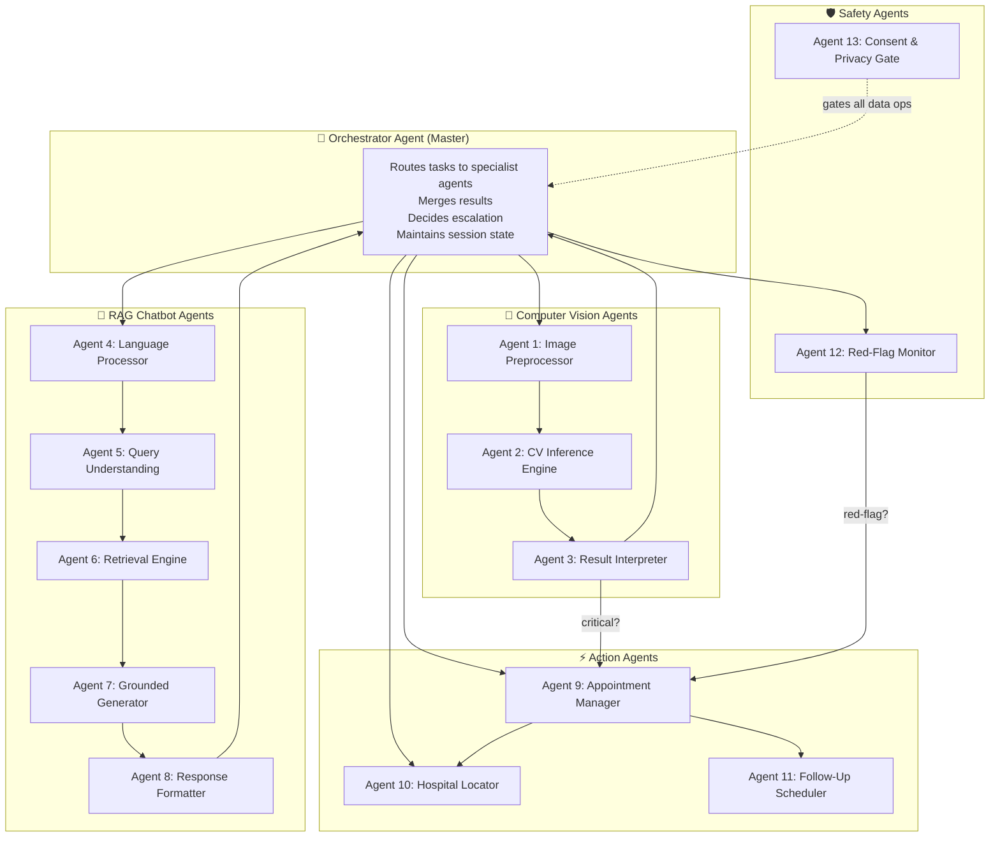

# Patient Panel — Anvaya

**Module Owner:** Patient / Consumer-Facing Interface  
**Parent Spec:** [anvaya.md](file:///f:/Maverick2026/anvaya.md)  
**Depends on:** Supabase Backend, n8n Automation, AI/ML Services  
**Feeds into:** Hospital Panel (covered in `hospital.md`)

> This document covers **what the Patient Panel does, how every feature works internally, which agents handle what, and which datasets power the models**. Architecture diagrams and database schema live in `anvaya.md` — this file is purely about functionality, agent design, data flow, and implementation detail.

---

## Table of Contents

1. [Panel Overview](#1-panel-overview)
2. [User Entry & Authentication](#2-user-entry--authentication)
3. [Feature 1 — Image Upload & CV Disease Detection](#3-feature-1--image-upload--cv-disease-detection)
4. [Feature 2 — RAG-Powered Medical Chatbot](#4-feature-2--rag-powered-medical-chatbot)
5. [Feature 3 — Appointment Booking & Escalation](#5-feature-3--appointment-booking--escalation)
6. [Feature 4 — Patient History & Timeline](#6-feature-4--patient-history--timeline)
7. [Feature 5 — Multilingual Voice Interface](#7-feature-5--multilingual-voice-interface)
8. [Feature 6 — Nearby Hospital Locator](#8-feature-6--nearby-hospital-locator)
9. [Feature 7 — Follow-Up & Reminders](#9-feature-7--follow-up--reminders)
10. [Multi-Agent Architecture](#10-multi-agent-architecture)
11. [Agent Node Specifications](#11-agent-node-specifications)
12. [Inter-Agent Communication Protocol](#12-inter-agent-communication-protocol)
13. [Datasets & Model Training Sources](#13-datasets--model-training-sources)
14. [Offline-First Behavior in Patient Panel](#14-offline-first-behavior-in-patient-panel)
15. [Patient Panel UI/UX Constraints](#15-patient-panel-uiux-constraints)
16. [Data Flow: Patient Panel → Hospital Panel](#16-data-flow-patient-panel--hospital-panel)
17. [Error Handling & Edge Cases](#17-error-handling--edge-cases)

---

## 1. Panel Overview

The Patient Panel is the **consumer-facing surface** of Anvaya. A patient (or a health worker assisting a patient) can:

- **Upload an image** (skin lesion, rash, wound, eye condition) and receive an AI-powered preliminary screening result with disease classification, confidence score, and a Grad-CAM heatmap showing what the model looked at.
- **Chat with a RAG-grounded medical assistant** that answers questions about diseases, medicines, symptoms, dosages, side-effects, and home-care — all grounded in cited medical literature, never hallucinated.
- **Raise an appointment** when the CV model or the chatbot flags a condition as critical — this appointment surfaces instantly on the Hospital Panel's queue.
- **View their full medical history** — past visits, screenings, prescriptions, and follow-ups in a longitudinal timeline.
- **Speak in their regional language** — voice-first input with text-to-speech output, so literacy is never a barrier.
- **Find the nearest hospital** capable of handling their condition.
- **Receive follow-up reminders** via WhatsApp/SMS for ongoing conditions.

The panel is a **PWA (Progressive Web App)** — installable, works fully offline for data entry and on-device CV screening, and syncs when connectivity returns.

---

## 2. User Entry & Authentication

### How a Patient Gets In

| Method | Flow | Literacy Requirement |
|---|---|---|
| **Phone OTP** (primary) | Patient enters phone number → receives OTP via SMS → verified → session created via Supabase Auth | Minimal — just read 4–6 digits |
| **Health Worker Assisted** | ASHA/ANM logs in with their own credentials → registers patient under their facility → patient gets a linked profile | None — health worker handles everything |
| **WhatsApp Bot** (zero-install) | Patient sends "Hi" to Anvaya's WhatsApp number → bot collects phone number → creates/links profile | None — conversational |

### What Happens at First Login

1. **Profile creation:** Name, age/DOB, gender, village, phone — minimal fields, all optional except phone (which doubles as the auth identifier).
2. **Consent capture:** Before any data is stored or synced, the patient (or assisting health worker) explicitly grants consent for data storage and follow-up messaging. Logged to `consent_log` table.
3. **Language preference:** Patient selects preferred language (or speaks, and ASR auto-detects). Stored in profile for all future interactions.
4. **Optional ABHA linkage:** If the patient has an Ayushman Bharat Health Account ID, it can be linked here for interoperability — but the system works fully without one.

---

## 3. Feature 1 — Image Upload & CV Disease Detection

This is the flagship patient-facing AI feature. The patient (or health worker) photographs a visible condition, and the system returns a screening result in seconds — **entirely on-device, no internet needed**.

### 3.1 Supported Modalities (Patient Panel)

| Modality | Model | Runs Where | Why |
|---|---|---|---|
| **Skin lesion / rash / wound** | MobileNetV2 / EfficientNet-Lite (transfer learning, quantized TFLite) | On-device | Most common patient-initiated screening; must work offline |
| **Eye condition** (conjunctivitis, cataract signs) | Lightweight CNN (EfficientNet-Lite) | On-device | Common rural complaint, visual |
| **Oral lesion** | Lightweight CNN | On-device | Oral cancer screening — high-impact, visual |

> **Note:** X-ray / MRI uploads are **Doctor Portal only** (not Patient Panel) since they require a facility with imaging equipment. Covered in `hospital.md`.

### 3.2 End-to-End Image Processing Flow

```
Patient captures photo
        │
        ▼
┌─────────────────────────┐
│  Image Preprocessing    │
│  Node (Agent 1)         │
│  • Resize to 224×224    │
│  • Normalize pixel vals │
│  • Validate image       │
│  • Check blur/quality   │
└──────────┬──────────────┘
           │
           ▼
┌─────────────────────────┐
│  CV Inference Node      │
│  (Agent 2)              │
│  • Load quantized model │
│  • Run forward pass     │
│  • Get class probs      │
│  • Generate Grad-CAM    │
└──────────┬──────────────┘
           │
           ▼
┌─────────────────────────┐
│  Result Interpreter     │
│  Node (Agent 3)         │
│  • Map class → disease  │
│  • Compute confidence   │
│  • Determine severity   │
│  • Decide: critical?    │
└──────────┬──────────────┘
           │
     ┌─────┴──────┐
     ▼            ▼
  Non-Critical  Critical
     │            │
     ▼            ▼
  Show result   Show result
  + RAG info    + AUTO-RAISE
  + self-care   appointment
  guidance      to Hospital
                Panel
```

### 3.3 What the Patient Sees

After uploading an image, the patient receives:

1. **Disease classification label** — e.g., "This looks like it could be Eczema (Dermatitis)"
2. **Confidence score** — displayed as a simple bar: "Model is 87% confident"
3. **Grad-CAM heatmap overlay** — the original image with a colored overlay showing which regions the model focused on, so a reviewing doctor can sanity-check
4. **Severity badge** — Green / Yellow / Orange / Red (same tier system as vitals)
5. **Plain-language explanation** — pulled from the RAG assistant: "Eczema is a skin condition that causes..."
6. **Action recommendation:**
   - 🟢 Green: "This appears manageable. Here's some care guidance." + self-care tips from RAG
   - 🟡 Yellow: "Consider seeing a doctor within 1–2 days." + option to book appointment
   - 🟠 Orange: "We recommend seeing a doctor today." + appointment auto-suggested
   - 🔴 Red: "This needs urgent attention." + appointment auto-raised + nearest hospital shown

### 3.4 Safety Disclaimers (Always Visible)

Every CV screening result is accompanied by:
> *"This is an AI screening aid, not a medical diagnosis. Please consult a qualified healthcare professional for confirmation and treatment."*

This is non-dismissible and rendered prominently — not buried in fine print.

### 3.5 Disease Classes Supported

**Skin module (primary — HAM10000-based + extensions):**

| Class | Clinical Name | Common Presentation |
|---|---|---|
| `akiec` | Actinic Keratoses / Intraepithelial Carcinoma | Scaly patches, pre-cancerous |
| `bcc` | Basal Cell Carcinoma | Pearly bumps, skin cancer |
| `bkl` | Benign Keratosis | Age spots, seborrheic keratosis |
| `df` | Dermatofibroma | Small hard bumps |
| `mel` | Melanoma | Irregular dark moles — **auto-Red** |
| `nv` | Melanocytic Nevi | Common moles — usually benign |
| `vasc` | Vascular Lesions | Angiomas, hemorrhages |
| `eczema` | Eczema / Dermatitis (extended) | Itchy, inflamed patches |
| `psoriasis` | Psoriasis (extended) | Thick silvery scales |
| `fungal` | Fungal Infection (extended) | Ringworm, tinea — common rural |
| `scabies` | Scabies (extended) | Intense itching, burrows — common rural |

> The base HAM10000 covers 7 classes. We extend with 4 additional classes highly relevant to rural India (eczema, psoriasis, fungal, scabies) using supplementary datasets listed in §13.

---

## 4. Feature 2 — RAG-Powered Medical Chatbot

The chatbot is the patient's **knowledge companion** — it can explain diseases, suggest when to seek care, describe medicines, explain side-effects, and answer health questions. All answers are **grounded in retrieved medical literature** with inline citations.

### 4.1 What the Chatbot Can Do

| Capability | Example Query | How It Works |
|---|---|---|
| **Disease explanation** | "What is diabetes?" / "मधुमेह क्या है?" | Retrieves relevant passages from WHO/ICMR guidelines → generates plain-language explanation with citations |
| **Symptom analysis** | "I have fever, body pain, and rash for 3 days" | Extracts symptoms → runs red-flag keyword check → retrieves differential guidance → responds with possible conditions + urgency level |
| **Medicine information** | "What is paracetamol used for?" / "पैरासिटामोल किसके लिए है?" | Retrieves drug formulary entries → explains usage, dosage range, common side-effects |
| **Side-effect queries** | "What are side effects of metformin?" | Retrieves from drug database → lists categorized side-effects with severity |
| **Home care guidance** | "How to treat a minor burn at home?" | Retrieves WHO/first-aid guidelines → provides non-pharmacological care steps |
| **Post-CV-screening Q&A** | (After skin scan) "Tell me more about eczema" | Context-aware — knows the CV result, retrieves condition-specific information |
| **When to see a doctor** | "Should I go to hospital for this cough?" | Runs symptom severity check → advises based on duration, associated symptoms, red flags |
| **Ayurvedic info (optional)** | "Any Ayurvedic remedy for cold?" | Retrieves NAMASTE-coded Ayurveda information — general wellness only, never treatment claims |

### 4.2 RAG Pipeline — How It Works Internally

```
Patient asks question (voice or text, any supported language)
        │
        ▼
┌─────────────────────────────┐
│  Language Processing Node   │
│  (Agent 4)                  │
│  • ASR if voice input       │
│  • Language detection       │
│  • Translation to English   │
│    (if corpus is English)   │
│  • Keep original for reply  │
└──────────┬──────────────────┘
           │
           ▼
┌─────────────────────────────┐
│  Query Understanding Node   │
│  (Agent 5)                  │
│  • Intent classification    │
│    (disease_info / medicine │
│     / symptom / emergency   │
│     / general_health)       │
│  • Medical entity extraction│
│    (symptoms, body parts,   │
│     drug names, conditions) │
│  • Red-flag keyword check   │
└──────────┬──────────────────┘
           │
           ▼
┌─────────────────────────────┐
│  Retrieval Node             │
│  (Agent 6)                  │
│  • Embed query (multilingual│
│    sentence transformer)    │
│  • pgvector similarity      │
│    search on rag_documents  │
│  • Top-k passage retrieval  │
│  • Cross-encoder reranking  │
│    for precision            │
└──────────┬──────────────────┘
           │
           ▼
┌─────────────────────────────┐
│  Generation Node            │
│  (Agent 7)                  │
│  • Grounded LLM generates   │
│    answer ONLY from          │
│    retrieved passages        │
│  • Inline citations added   │
│  • If retrieval returns      │
│    nothing → "I don't have  │
│    enough info" (never      │
│    guesses)                 │
│  • Plain-language, patient- │
│    friendly tone            │
└──────────┬──────────────────┘
           │
           ▼
┌─────────────────────────────┐
│  Response Formatting Node   │
│  (Agent 8)                  │
│  • Translate back to        │
│    patient's language       │
│  • Add TTS audio version   │
│  • Attach expandable        │
│    "Sources" section        │
│  • If red-flag detected →   │
│    prepend urgency banner   │
└─────────────────────────────┘
```

### 4.3 What the Chatbot Will NEVER Do

These are hard-coded safety boundaries, not guidelines:

- ❌ **Never prescribe specific drugs or dosages** — it can explain what a medicine does if asked, but never says "take X mg of Y." That's a doctor's job.
- ❌ **Never confirm a diagnosis** — it says "this could be" or "this is consistent with," never "you have."
- ❌ **Never discourage seeking care** — even for Green-tier assessments, it always includes "if symptoms worsen or persist, please see a doctor."
- ❌ **Never generate from model memory** — if retrieval returns no relevant passages, it declines rather than guessing. This is the core hallucination-prevention mechanism.
- ❌ **Never handle mental health crises autonomously** — suicidal ideation or self-harm mentions trigger an immediate escalation to the nearest helpline number + doctor notification.

### 4.4 Context Awareness

The chatbot maintains **session context** within a single patient interaction:

- If a CV screening was just performed, the chatbot knows the result and can answer follow-up questions about that specific condition.
- If vitals were just entered, the chatbot factors them into symptom analysis ("You mentioned fever — your recorded temperature was 39.2°C, which is high").
- Conversation history within the session is maintained, so follow-up questions work naturally ("What about its side effects?" after asking about a medicine).

---

## 5. Feature 3 — Appointment Booking & Escalation

### 5.1 When an Appointment Gets Created

Appointments flow from the Patient Panel to the Hospital Panel. They are created in three ways:

| Trigger | How | Priority |
|---|---|---|
| **CV model flags critical** | Automatic — if the CV result is Orange or Red tier, an appointment is auto-raised without patient action | 🔴 High / 🟠 Urgent |
| **Chatbot detects red-flag symptoms** | Automatic — if the RAG chatbot's symptom analysis detects emergency keywords (chest pain, severe breathlessness, etc.), it auto-raises | 🔴 High |
| **Patient manually requests** | Manual — patient taps "Book Appointment" after reviewing any screening result or chatbot guidance | 🟡 Normal / 🟢 Routine |

### 5.2 Appointment Data Structure

When an appointment is created, the following data packet is assembled and pushed to the Hospital Panel:

```json
{
  "appointment_id": "uuid",
  "patient_id": "uuid",
  "patient_name": "Ramesh Kumar",
  "patient_phone": "+91XXXXXXXXXX",
  "patient_village": "Chandpur",
  "priority_tier": "orange",
  "source": "cv_screening | chatbot_flag | manual_request",
  "cv_screening_id": "uuid | null",
  "cv_result_summary": "Suspected Melanoma — confidence 0.91",
  "cv_heatmap_path": "storage/path/to/heatmap.png",
  "symptom_summary": "Irregular dark mole on left forearm, growing for 2 months",
  "vitals_snapshot": {
    "spo2": 97,
    "resp_rate": 18,
    "temperature": 37.1,
    "consciousness": "alert"
  },
  "preferred_language": "hi",
  "nearest_facility_id": "uuid",
  "created_at": "ISO8601 timestamp",
  "status": "pending"
}
```

### 5.3 What Happens After Appointment Creation

1. **Patient Panel:** Shows confirmation — "Your appointment has been raised. A doctor will review your case." + estimated wait info.
2. **Hospital Panel:** The appointment appears in the doctor's **prioritized case queue**, sorted by tier (Red first, then Orange, Yellow, Green). Full details visible.
3. **n8n Automation:** For Orange/Red appointments, n8n fires a WhatsApp/SMS notification to the on-call doctor within minutes.
4. **Patient gets notified:** When the doctor reviews/accepts the appointment, the patient receives a WhatsApp/SMS confirmation with the doctor's name and any instructions.

### 5.4 Appointment Statuses (Visible to Patient)

| Status | Meaning | Shown As |
|---|---|---|
| `pending` | Raised, not yet reviewed by hospital | "⏳ Waiting for doctor review" |
| `accepted` | Doctor has accepted and scheduled | "✅ Doctor will see you — [date/time]" |
| `in_consultation` | Active teleconsult or in-person visit | "🩺 In consultation" |
| `completed` | Visit done, prescription issued | "✅ Completed — view prescription" |
| `referred` | Referred to a higher facility | "🏥 Referred to [Hospital Name]" |
| `cancelled` | Cancelled by patient or doctor | "❌ Cancelled" |

---

## 6. Feature 4 — Patient History & Timeline

Every interaction the patient has with Anvaya is recorded into a **longitudinal timeline** — creating a portable health record that follows the patient across visits and facilities.

### 6.1 What Gets Recorded

| Event Type | Logged From | Data Captured |
|---|---|---|
| `cv_screening` | Image upload + CV inference | Image, model output, class, confidence, heatmap, tier |
| `chatbot_session` | RAG chatbot interaction | Query, extracted symptoms, RAG response, any red-flag triggers |
| `vitals_reading` | Vitals entry (by patient or health worker) | All vitals parameters + computed RVS score + tier |
| `appointment` | Appointment creation/update | Appointment details, status changes, doctor assigned |
| `prescription` | Doctor issues prescription (from Hospital Panel) | Medicines, dosages, notes, issuing doctor |
| `follow_up` | Follow-up reminder sent/responded | Reminder content, patient response, any re-escalation |
| `referral` | Referral to higher facility | Referring doctor, destination facility, reason |

### 6.2 Timeline View

The patient sees a chronological, scrollable timeline:

```
───────────── Today ─────────────
🔬  Skin Screening — Eczema (Green)
    87% confidence | View heatmap →
    
💬  Chatbot — "What is eczema?"
    View conversation →

───────────── 3 days ago ─────────
🩺  Appointment — Dr. Sharma
    Status: Completed
    💊 Prescription: View →

📊  Vitals Check — Green
    SpO2: 98% | Temp: 37.0°C

───────────── 2 weeks ago ─────────
🔬  Skin Screening — Fungal Infection (Yellow)
    Referred to PHC
    
🏥  Referred to District Hospital
    Dr. Patel, Dermatology
```

### 6.3 Prescription View

When a doctor has issued a prescription (from the Hospital Panel), the patient can view it here with:
- Medicine name, dosage, frequency, duration — in their preferred language
- Any special instructions
- A "Listen" button (TTS) to hear the prescription read aloud
- Issuing doctor's name and date

---

## 7. Feature 5 — Multilingual Voice Interface

### 7.1 Voice Input Flow

```
Patient speaks in regional language
        │
        ▼
┌───────────────────────┐
│  ASR (Speech → Text)  │
│  Wav2Vec2 / Conformer │
│  via Bhashini API     │
└──────────┬────────────┘
           │
           ▼
┌───────────────────────┐
│  Language Detection   │
│  Auto-detect from     │
│  transcript or user   │
│  preference           │
└──────────┬────────────┘
           │
           ▼
┌───────────────────────┐
│  Translation (if      │
│  needed for RAG       │
│  retrieval in English)│
│  IndicTrans2-class    │
└──────────┬────────────┘
           │
           ▼
  Feeds into CV / RAG / Vitals pipeline
        │
        ▼
  Response generated in English
        │
        ▼
┌───────────────────────┐
│  Back-Translation to  │
│  patient's language   │
└──────────┬────────────┘
           │
           ▼
┌───────────────────────┐
│  TTS (Text → Speech)  │
│  Regional language    │
│  audio output         │
└───────────────────────┘
```

### 7.2 Supported Languages (Launch)

| Language | Code | ASR | MT | TTS | Priority |
|---|---|---|---|---|---|
| Hindi | `hi` | ✅ | ✅ | ✅ | P0 — Demo language |
| Tamil | `ta` | ✅ | ✅ | ✅ | P0 — Demo region |
| Telugu | `te` | ✅ | ✅ | ✅ | P1 |
| Kannada | `kn` | ✅ | ✅ | ✅ | P1 |
| Bengali | `bn` | ✅ | ✅ | ✅ | P2 |
| Marathi | `mr` | ✅ | ✅ | ✅ | P2 |
| English | `en` | ✅ | — | ✅ | P0 |

Architecture supports extension to all 22 scheduled languages via Bhashini without redesign.

---

## 8. Feature 6 — Nearby Hospital Locator

### 8.1 How It Works

When a patient's case is flagged Orange or Red (or they manually search):

1. **PostGIS query** runs against the `facilities` table using the patient's registered village or GPS coordinates.
2. Returns the **nearest N facilities**, optionally filtered by capability (e.g., "has dermatology," "has ICU").
3. Displays:
   - Facility name and type (PHC / CHC / District Hospital)
   - Distance (in km)
   - Contact phone number (tap-to-call)
   - Capabilities relevant to the patient's condition
   - A simple map view (offline-cached map tiles where possible, or a text-only list if fully offline)

### 8.2 Auto-Triggered vs. Manual

| Scenario | Behavior |
|---|---|
| Red-tier CV result or vitals | Nearest hospital auto-shown alongside the result — no extra tap needed |
| Orange-tier | Suggested — "We recommend visiting a facility. Here's the nearest one." |
| Yellow/Green | Available via a "Find Hospital" button, not auto-shown |
| Manual search | Patient can always search independently from the main menu |

---

## 9. Feature 7 — Follow-Up & Reminders

### 9.1 Reminder Types

| Type | Trigger | Channel | Content |
|---|---|---|---|
| **Post-appointment** | Doctor sets follow-up interval after consultation | WhatsApp / SMS | "How are you feeling? Any of these symptoms: [list]?" |
| **Medication reminder** | Prescription issued with schedule | WhatsApp / SMS | "Time to take [medicine]. Don't skip your dose." |
| **Condition monitoring** | Yellow/Orange case not yet resolved | WhatsApp / SMS | "It's been 3 days since your screening. How is the [condition]?" |
| **Missed appointment** | Patient didn't show for scheduled appointment | WhatsApp / SMS | "You missed your appointment with Dr. [Name]. Reschedule?" |

### 9.2 Smart Re-Escalation

When a patient responds to a follow-up message:
- The response is parsed for **red-flag keywords** (same list as the initial symptom red-flag check in §10.1 of `anvaya.md`).
- If red-flag detected → a new `risk_flags` row is created at Orange/Red tier → n8n fires escalation to the doctor.
- If response indicates improvement → logged, no further action.
- If no response after 2 attempts → flagged for health worker to check in person.

---

## 10. Multi-Agent Architecture

The Patient Panel runs on a **multi-agent model** where specialized agents handle distinct tasks and communicate through a central orchestrator. This is not a monolithic pipeline — each agent is independently deployable, testable, and swappable.

### 10.1 Why Multi-Agent?

- **Separation of concerns:** The CV model shouldn't know about appointment booking. The RAG retriever shouldn't know about image preprocessing. Each agent does one thing well.
- **Parallel execution:** Image preprocessing and language detection can run simultaneously. Retrieval and translation can overlap.
- **Fault isolation:** If the TTS agent fails, the text response still reaches the patient. If the CV model crashes, the chatbot still works.
- **Swappability:** Replace the skin model without touching the chatbot. Swap the LLM without touching retrieval.

### 10.2 Agent Map



---

## 11. Agent Node Specifications

### Agent 0: Orchestrator (Master Agent)

| Property | Detail |
|---|---|
| **Role** | Central coordinator — receives all patient inputs, routes to the correct specialist agent(s), merges results, decides final action |
| **Input** | Raw patient input (image, voice, text, button tap) + session context |
| **Output** | Unified response to patient (text + audio + visual components) |
| **State managed** | Current session context (patient ID, last CV result, conversation history, current tier) |
| **Decision logic** | Determines which agents to invoke based on input type: image → CV pipeline; text/voice → RAG pipeline; appointment button → Appointment Manager; etc. |
| **Concurrency** | Can invoke CV and Language agents in parallel when patient uploads image + describes symptoms simultaneously |
| **Failure handling** | If any child agent fails, serves a graceful degradation (e.g., CV fails → still show RAG guidance; RAG fails → still show CV result) |

---

### Agent 1: Image Preprocessor

| Property | Detail |
|---|---|
| **Role** | Validates and prepares patient-uploaded images for CV inference |
| **Input** | Raw image file (JPEG/PNG from phone camera) |
| **Output** | Preprocessed tensor (224×224×3, normalized) + quality report |
| **Functions** | |
| `validate_image()` | Checks file type, size (max 10MB), dimensions, corruption |
| `assess_quality()` | Detects blur (Laplacian variance), darkness, overexposure — rejects and asks for re-capture if below threshold |
| `detect_roi()` | Basic region-of-interest detection — crops to the lesion/affected area using simple saliency if the image contains a lot of background |
| `preprocess()` | Resize to 224×224, apply model-specific normalization (ImageNet mean/std), convert to tensor |
| `augment_for_robustness()` | Applies test-time augmentation (slight rotations, flips) to get more stable predictions — average across augmented copies |
| **Failure mode** | Returns `quality_insufficient` error with specific instruction ("Image too blurry — hold the phone steady and try again") |

---

### Agent 2: CV Inference Engine

| Property | Detail |
|---|---|
| **Role** | Runs the quantized neural network on the preprocessed image |
| **Input** | Preprocessed tensor from Agent 1 |
| **Output** | Class probability vector + Grad-CAM activation map |
| **Functions** | |
| `load_model()` | Loads the appropriate TFLite/ONNX model based on modality (skin/eye/oral) — cached in memory after first load |
| `run_inference()` | Forward pass through quantized model, returns softmax probability distribution over all classes |
| `generate_gradcam()` | Computes Grad-CAM heatmap from the last convolutional layer — shows which pixels drove the classification |
| `compute_confidence()` | Returns top-1 confidence + margin between top-1 and top-2 (low margin = uncertain, triggers more cautious messaging) |
| **Performance** | < 500ms inference on mid-range Android (Snapdragon 665-class), < 200ms on flagships |
| **Model size** | ~8–15MB (int8 quantized TFLite) |
| **Failure mode** | Returns `inference_failed` — Orchestrator falls back to chatbot-only guidance |

---

### Agent 3: Result Interpreter

| Property | Detail |
|---|---|
| **Role** | Translates raw model output into clinically meaningful, patient-understandable results and makes the escalation decision |
| **Input** | Class probabilities + Grad-CAM from Agent 2 |
| **Output** | Structured result: disease name, confidence, tier, explanation, action recommendation |
| **Functions** | |
| `map_class_to_disease()` | Maps model class labels to human-readable disease names (localized to patient's language) |
| `determine_severity_tier()` | Applies tier rules: Melanoma/BCC → auto-Red; high-confidence suspicious lesion → Orange; moderate → Yellow; clearly benign → Green |
| `generate_patient_explanation()` | Creates a plain-language, non-alarming explanation appropriate for a patient (not medical jargon) |
| `check_auto_escalation()` | If tier is Orange/Red → triggers appointment creation via Agent 9 |
| `build_result_card()` | Assembles the visual result card: image + heatmap overlay + labels + tier badge + explanation + action buttons |
| `log_screening()` | Writes the full result to `cv_screenings` table for the patient's history |
| **Safety rule** | If confidence < 60% on ALL classes → does not show any classification. Instead: "The image quality or condition isn't clear enough for screening. Please consult a doctor." |

---

### Agent 4: Language Processor

| Property | Detail |
|---|---|
| **Role** | Handles all speech-to-text and language translation for the RAG pipeline |
| **Input** | Raw voice audio OR text in any supported language |
| **Output** | English text (for retrieval) + original language text (for context) + detected language code |
| **Functions** | |
| `transcribe_speech()` | Runs ASR via Bhashini/AI4Bharat — converts regional language speech to text |
| `detect_language()` | Auto-detects language from transcript or uses patient's stored preference |
| `translate_to_english()` | Translates to English for RAG retrieval (most corpus is English). Uses IndicTrans2-class models |
| `translate_from_english()` | Back-translates the generated response to patient's language |
| `synthesize_speech()` | TTS — converts text response to audio in patient's language for the "Listen" button |
| **Latency** | ASR: ~1–2s for a 10-second utterance. MT: <500ms per sentence. TTS: ~1s per paragraph. |
| **Offline fallback** | If Bhashini API unavailable, falls back to on-device whisper-tiny-indic model for Hindi ASR (reduced accuracy, but functional) |

---

### Agent 5: Query Understanding

| Property | Detail |
|---|---|
| **Role** | Parses the patient's question to understand intent and extract medical entities |
| **Input** | Translated English text from Agent 4 |
| **Output** | Intent label + extracted entities + red-flag boolean |
| **Functions** | |
| `classify_intent()` | Determines query type: `disease_info`, `medicine_info`, `symptom_check`, `emergency`, `general_health`, `appointment_request`, `follow_up` |
| `extract_entities()` | Pulls out medical entities: symptom names, body parts, drug names, condition names, duration/frequency mentions |
| `check_red_flags()` | Scans for emergency keywords: chest pain, severe breathlessness, active convulsion, uncontrolled bleeding, sudden facial droop/slurred speech, severe abdominal pain in pregnancy, fever with neck stiffness, suicidal ideation |
| `contextualize()` | Merges with session context — "What about its side effects?" → resolves "its" to the previously discussed medicine |
| **Red-flag action** | If `check_red_flags()` returns true → immediately notifies Orchestrator → bypasses normal RAG flow → triggers escalation |

---

### Agent 6: Retrieval Engine

| Property | Detail |
|---|---|
| **Role** | Finds the most relevant medical knowledge passages for the patient's query |
| **Input** | Processed query + intent + entities from Agent 5 |
| **Output** | Ranked list of relevant passages with source metadata |
| **Functions** | |
| `embed_query()` | Generates query embedding using multilingual sentence-transformer (same model used to embed the corpus) |
| `vector_search()` | Runs cosine similarity search on `rag_documents` table via pgvector — retrieves top-20 candidates |
| `rerank()` | Cross-encoder reranking to improve precision — re-scores top-20 down to top-5 most relevant passages |
| `filter_by_intent()` | Applies intent-based filtering: if intent is `medicine_info`, boost drug formulary passages; if `disease_info`, boost WHO/ICMR guidelines |
| `format_context()` | Assembles the retrieved passages into a structured context block with source citations for the generator |
| **No-result behavior** | If no passage scores above the relevance threshold → returns empty context → Generator will decline to answer rather than guess |

---

### Agent 7: Grounded Generator

| Property | Detail |
|---|---|
| **Role** | Generates the actual answer text, strictly grounded in retrieved passages |
| **Input** | Retrieved passages from Agent 6 + original query + session context |
| **Output** | Generated answer text with inline citations |
| **Functions** | |
| `build_prompt()` | Constructs the LLM prompt: system instructions (grounding rules, safety boundaries, tone) + retrieved context + user query |
| `generate_response()` | Calls the grounded LLM (self-hosted small model or API) — generates answer conditioned ONLY on provided context |
| `add_citations()` | Tags each claim in the response with the source passage/document it came from — "[Source: WHO IMCI Guide, Ch. 4]" |
| `apply_safety_filter()` | Post-generation check: removes any content that violates safety rules (prescription-like language, diagnosis claims, harmful advice) |
| `check_confidence()` | If the generated answer has low grounding confidence (model reports uncertainty), appends a caveat: "This information may be incomplete. Please consult a healthcare professional." |
| **System prompt** | "You are a medical information assistant. Answer ONLY based on the provided reference passages. If the passages don't contain relevant information, say 'I don't have enough information to answer this reliably.' Never prescribe medications. Never confirm diagnoses. Always recommend consulting a doctor for serious concerns." |

---

### Agent 8: Response Formatter

| Property | Detail |
|---|---|
| **Role** | Formats the generated answer into a patient-friendly, multi-modal response |
| **Input** | Raw generated text from Agent 7 + language info from Agent 4 |
| **Output** | Final formatted response: translated text + TTS audio + visual components |
| **Functions** | |
| `translate_response()` | Calls Agent 4's back-translation to patient's language |
| `generate_audio()` | Calls Agent 4's TTS to create a "Listen" version |
| `format_citations()` | Renders citations as an expandable "Sources" section below the answer |
| `add_urgency_banner()` | If red-flag was detected, prepends a prominently styled urgency warning with action buttons |
| `add_follow_up_suggestions()` | Appends 2–3 suggested follow-up questions the patient might want to ask next |
| `render_result_card()` | Assembles everything into a rich card: answer text + audio button + sources + suggestions + action buttons |

---

### Agent 9: Appointment Manager

| Property | Detail |
|---|---|
| **Role** | Creates, tracks, and manages appointments between the Patient Panel and Hospital Panel |
| **Input** | Escalation trigger from Agent 3 (CV) or Agent 12 (Red-Flag) or manual patient request |
| **Output** | Created appointment record, pushed to Hospital Panel queue |
| **Functions** | |
| `create_appointment()` | Assembles the full appointment data packet (§5.2), writes to `appointments` table, triggers n8n webhook |
| `assign_nearest_facility()` | Calls Agent 10 to find the best facility for this condition |
| `notify_hospital()` | Pushes real-time notification to Hospital Panel via Supabase Realtime |
| `track_status()` | Monitors appointment status changes (from Hospital Panel) and notifies the patient |
| `handle_cancellation()` | Processes patient or doctor cancellation, logs reason, offers rescheduling |
| `queue_follow_up()` | After appointment completion, triggers Agent 11 to schedule post-visit follow-up |

---

### Agent 10: Hospital Locator

| Property | Detail |
|---|---|
| **Role** | Finds the nearest appropriate healthcare facility using geospatial queries |
| **Input** | Patient location (village/GPS) + condition type + required capabilities |
| **Output** | Ranked list of nearby facilities with distance, contact, capabilities |
| **Functions** | |
| `geocode_village()` | Resolves village name to coordinates (using a pre-seeded village→coordinate lookup for offline use) |
| `query_nearest()` | PostGIS nearest-neighbor query on `facilities` table, filtered by required capabilities |
| `rank_facilities()` | Ranks by: (1) capability match, (2) distance, (3) facility tier (district hospital > CHC > PHC for serious cases) |
| `format_results()` | Returns facility name, type, distance, phone, capabilities — localized to patient's language |

---

### Agent 11: Follow-Up Scheduler

| Property | Detail |
|---|---|
| **Role** | Schedules and manages follow-up reminders for patients |
| **Input** | Follow-up instructions from doctor (via Hospital Panel) or automatic schedule based on condition |
| **Output** | Scheduled n8n workflows for reminders |
| **Functions** | |
| `schedule_reminder()` | Creates an n8n scheduled workflow for the specified follow-up interval |
| `parse_response()` | When patient responds to a reminder, parses for red-flag keywords → re-escalates if needed |
| `track_compliance()` | Tracks whether patient responded, showed up for follow-up, etc. |
| `escalate_non_response()` | After 2 missed responses, flags for health worker in-person check |

---

### Agent 12: Red-Flag Monitor

| Property | Detail |
|---|---|
| **Role** | Cross-cutting safety agent that monitors ALL patient interactions for emergency signals |
| **Input** | Every piece of patient input — text, voice transcript, CV results, vitals, follow-up responses |
| **Output** | Red-flag alert → immediate escalation |
| **Functions** | |
| `scan_for_emergencies()` | Continuously checks for: emergency symptom keywords, critically abnormal vitals, high-confidence malignancy in CV results |
| `override_tier()` | Can override any Green/Yellow assessment to Orange/Red if an emergency signal is detected |
| `trigger_immediate_escalation()` | Bypasses normal appointment flow → sends instant WhatsApp/SMS to nearest on-call doctor via n8n |
| `log_alert()` | Records every red-flag trigger in `risk_flags` table with full rationale |
| **Priority** | This agent has the highest priority in the system — its output overrides all other agents |

---

### Agent 13: Consent & Privacy Gate

| Property | Detail |
|---|---|
| **Role** | Ensures no data operation occurs without proper patient consent |
| **Input** | Any data read/write/sync operation |
| **Output** | Allow / Deny + consent log entry |
| **Functions** | |
| `check_consent()` | Before any data storage, sync, or sharing — verifies the patient has granted consent for that specific operation |
| `request_consent()` | If consent not yet granted, presents a clear, localized consent prompt to the patient |
| `log_consent()` | Records every consent grant/revocation in `consent_log` table with timestamp |
| `gate_abdm_sync()` | Specifically gates any ABDM/FHIR data sharing behind explicit opt-in consent |
| `enforce_data_minimization()` | Ensures only necessary data is collected and stored for each operation |

---

## 12. Inter-Agent Communication Protocol

### 12.1 Message Format

All agents communicate via a standardized message envelope:

```json
{
  "message_id": "uuid",
  "from_agent": "agent_2_cv_inference",
  "to_agent": "agent_3_result_interpreter",
  "type": "result | error | escalation | query",
  "priority": "normal | high | emergency",
  "payload": { },
  "session_id": "uuid",
  "patient_id": "uuid",
  "timestamp": "ISO8601",
  "ttl_ms": 30000
}
```

### 12.2 Communication Patterns

| Pattern | Used For | Example |
|---|---|---|
| **Sequential pipeline** | CV screening flow (Agent 1 → 2 → 3) | Image processed → inference → interpretation, each step depends on the previous |
| **Parallel fan-out** | Orchestrator invokes CV + Language simultaneously | Patient uploads image AND speaks — both pipelines start at once |
| **Event-driven trigger** | Red-flag detection → appointment creation | Agent 12 detects emergency → fires event → Agent 9 creates appointment |
| **Callback** | Appointment status updates | Hospital Panel updates status → callback to Agent 9 → notifies patient |
| **Broadcast** | Session context updates | Orchestrator broadcasts updated session context to all active agents |

### 12.3 Failure Handling Between Agents

| Failure | Behavior |
|---|---|
| Agent times out | Orchestrator retries once, then serves degraded response (e.g., text-only if TTS agent fails) |
| Agent returns error | Error logged, Orchestrator routes around it (e.g., skip Grad-CAM if it fails, still show classification) |
| Multiple agents fail | Orchestrator shows generic "Please try again or visit your nearest clinic" message + logs the failure for debugging |
| Red-Flag Monitor fails | **Critical** — hardcoded fallback rule in Orchestrator: if ANY input contains keywords from the red-flag list, escalate regardless of monitor agent status |

---

## 13. Datasets & Model Training Sources

### 13.1 Skin Disease Detection

| Dataset | Source | Size | Classes | Use |
|---|---|---|---|---|
| **HAM10000** | [Harvard Dataverse](https://dataverse.harvard.edu/dataset.xhtml?persistentId=doi:10.7910/DVN/DBW86T) | 10,015 images | 7 skin lesion types (akiec, bcc, bkl, df, mel, nv, vasc) | Primary training set for skin lesion classification |
| **ISIC Archive** | [isic-archive.com](https://www.isic-archive.com/) | 70,000+ images | Multiple skin conditions | Extended training + validation, more diverse skin tones |
| **Dermnet** | [dermnet.com/images](https://www.dermnet.com/images) | 23,000+ images | 23 skin disease categories | Extended classes: eczema, psoriasis, fungal, etc. |
| **SD-198** | [GitHub — Skin Disease Dataset](https://github.com/jeremykenedy/skin-disease-dataset) | 6,584 images | 198 skin disease classes | Fine-grained classification for rare conditions |
| **PAD-UFES-20** | [Kaggle](https://www.kaggle.com/datasets/mahdavi1202/skin-lesion) | 2,298 images | 6 classes | Brazilian dataset — adds skin-tone diversity |
| **Fitzpatrick17k** | [GitHub](https://github.com/mattgroh/fitzpatrick17k) | 16,577 images | 114 conditions, labeled by Fitzpatrick skin type | **Critical** — for fairness/bias testing across skin tones |

### 13.2 Eye Disease Detection

| Dataset | Source | Size | Classes | Use |
|---|---|---|---|---|
| **ODIR-5K** | [Kaggle — Ocular Disease Recognition](https://www.kaggle.com/datasets/andrewmvd/ocular-disease-recognition-odir5k) | 5,000 images | 8 eye conditions | Primary training for eye screening |
| **APTOS 2019** | [Kaggle — APTOS Blindness Detection](https://www.kaggle.com/c/aptos2019-blindness-detection) | 3,662 images | 5 severity levels of diabetic retinopathy | Diabetic retinopathy screening |

### 13.3 Oral Disease Detection

| Dataset | Source | Size | Classes | Use |
|---|---|---|---|---|
| **Oral Cancer Dataset** | [Kaggle — Oral Cancer Images](https://www.kaggle.com/datasets/zaidpy/oral-cancer-dataset) | 1,600+ images | Normal, OSCC (oral squamous cell carcinoma) | Primary training for oral cancer screening |
| **Dental Condition Dataset** | [Kaggle](https://www.kaggle.com/datasets/salmansajid05/oral-diseases) | 5,000+ images | Multiple oral conditions | Extended oral condition classification |

### 13.4 RAG Knowledge Corpus

| Source | Type | Content | Link |
|---|---|---|---|
| **WHO IMCI Chart Booklet** | Clinical guideline | Integrated Management of Childhood Illness — symptoms, signs, treatment | [who.int/publications](https://www.who.int/publications/i/item/9789241506823) |
| **ICMR Standard Treatment Guidelines** | National guideline | India-specific treatment protocols | [icmr.gov.in](https://main.icmr.nic.in/) |
| **Indian National Formulary (INF)** | Drug reference | Drug information, dosages, contraindications | [cdsco.gov.in](https://cdsco.gov.in/) |
| **WHO Essential Medicines List** | Drug reference | Core medicines list with usage guidance | [who.int/medicines](https://www.who.int/groups/expert-committee-on-selection-and-use-of-essential-medicines/essential-medicines-lists) |
| **AYUSH NAMASTE Portal** | Traditional medicine | Standardized Ayurveda/Siddha/Unani terminology (ICD-11 mapped) | [namaste-portal.ayush.gov.in](https://namaste-portal.ayush.gov.in/) |
| **MedlinePlus** | Patient education | Plain-language health information | [medlineplus.gov](https://medlineplus.gov/) |
| **OpenMRS Medical Concepts** | Medical terminology | Standardized medical concept dictionary | [openmrs.org](https://openmrs.org/) |
| **State Health Department Advisories** | Regional guidelines | State-specific treatment protocols and disease alerts | Various state health department sites |

### 13.5 Symptom & NLP Training Data

| Dataset | Source | Size | Use |
|---|---|---|---|
| **MedQuAD** | [GitHub — NLM](https://github.com/abachaa/MedQuAD) | 47,457 QA pairs | Training the query understanding + intent classification |
| **HealthSearchQA** | [Google Research](https://github.com/google-research/google-research/tree/master/health_search_qa) | 3,375 health queries | Evaluating medical query understanding |
| **Symptom2Disease** | [Kaggle](https://www.kaggle.com/datasets/niyarrbarman/symptom2disease) | 1,200 entries | Symptom → disease mapping for the red-flag checker |
| **AI4Bharat IndicNLP** | [AI4Bharat](https://ai4bharat.iitm.ac.in/) | Multiple Indic language corpora | Indic language understanding + NER |

### 13.6 Model Architecture Summary

| Model | Base | Training Data | Size (Quantized) | Inference Time | Deployment |
|---|---|---|---|---|---|
| Skin Screener | MobileNetV2 (TL) | HAM10000 + ISIC + Dermnet + Fitzpatrick17k | ~10MB (TFLite int8) | <500ms on-device | On-device |
| Eye Screener | EfficientNet-Lite0 (TL) | ODIR-5K + APTOS | ~12MB (TFLite int8) | <500ms on-device | On-device |
| Oral Screener | EfficientNet-Lite0 (TL) | Oral Cancer Dataset | ~12MB (TFLite int8) | <500ms on-device | On-device |
| RAG Embedder | Multilingual MiniLM | Pre-trained, no fine-tuning needed | ~80MB | <100ms per query | Server-side |
| RAG Generator | Small instruction-tuned LLM (e.g., Phi-3-mini / Mistral-7B-GPTQ) | Pre-trained + RAG grounding | 2–4GB (quantized) | ~2–5s per response | Server-side |
| Red-Flag NER | DistilBERT (fine-tuned) | MedQuAD + custom red-flag annotations | ~60MB | <200ms | Server-side |

---

## 14. Offline-First Behavior in Patient Panel

### 14.1 What Works Fully Offline

| Feature | Offline? | How |
|---|---|---|
| Image capture + CV screening (skin/eye/oral) | ✅ Full | Model runs on-device via TFLite |
| View past history/prescriptions | ✅ Full | Cached in IndexedDB from last sync |
| Enter vitals | ✅ Full | Saved locally, synced later |
| View Grad-CAM heatmaps | ✅ Full | Generated on-device alongside inference |
| RAG chatbot | ⚠️ Degraded | Limited to a small pre-cached FAQ set; full RAG needs server |
| Voice input (ASR) | ⚠️ Degraded | Falls back to on-device whisper-tiny for Hindi; other languages need Bhashini API |
| Appointment booking | ⚠️ Queued | Created locally, synced + pushed to Hospital Panel when connectivity returns |
| Hospital locator | ⚠️ Limited | Uses pre-cached facility list; no live distance calculation without GPS/data |
| TTS (Listen button) | ⚠️ Degraded | Falls back to browser-native TTS (lower quality) |
| Follow-up reminders | ❌ Needs connectivity | WhatsApp/SMS delivery requires network |

### 14.2 Sync Behavior

- **Auto-sync** when connectivity returns — background sync via service worker.
- **Delta sync** — only changed fields, not full records.
- **Priority queue** — Red/Orange flagged cases sync first.
- **Conflict resolution** — last-write-wins at field level, all conflicts logged to audit table.

---

## 15. Patient Panel UI/UX Constraints

### 15.1 Design Principles for Rural Patients

| Principle | Implementation |
|---|---|
| **Large touch targets** | Minimum 48×48px tap targets, ideally 56×56px — accounts for rough/calloused fingers |
| **Minimal text, maximum icons** | Every action has an icon + short label. Color-coded consistently. |
| **Voice-first, not text-first** | The microphone button is the largest, most prominent element on the main screen |
| **No cognitive overload** | Maximum 3 actions per screen. Progressive disclosure for details. |
| **High contrast** | WCAG AA minimum contrast ratios — many users have uncorrected vision |
| **Color + icon + text for tier** | Never rely on color alone (color blindness) — every tier has a unique icon + text label |
| **Offline indicators** | Clear "📡 Offline — your data is saved locally" banner when disconnected |
| **No infinite scrolls** | Paginated, simple navigation — "Next" / "Previous" buttons, not gestures |

### 15.2 Screen Count (Patient Panel)

| Screen | Purpose |
|---|---|
| **Home** | Quick-access tiles: "Scan Skin" / "Talk to Assistant" / "My History" / "Find Hospital" / "My Appointments" |
| **Camera/Upload** | Full-screen camera or gallery upload for CV screening |
| **Screening Result** | CV result card: image + heatmap + classification + tier + action buttons |
| **Chat** | Conversational interface with the RAG assistant |
| **History** | Longitudinal timeline of all interactions |
| **Appointment Detail** | Status tracking for raised appointments |
| **Hospital Map** | Nearest facilities list/map |
| **Profile** | Patient info, language preference, consent management |

---

## 16. Data Flow: Patient Panel → Hospital Panel

This section documents exactly what data crosses from the Patient Panel to the Hospital Panel (covered in detail in `hospital.md`):

### 16.1 What the Hospital Panel Receives

| Data | Trigger | Format |
|---|---|---|
| **Appointment record** | CV escalation / chatbot flag / manual booking | Full appointment JSON (§5.2) |
| **CV screening result** | Every screening (even Green tier, for doctor audit) | Class, confidence, heatmap image, original photo |
| **Vitals readings** | Every vitals entry | All parameters + computed RVS score + tier |
| **Symptom summary** | Every chatbot interaction with symptom content | Extracted symptoms, red-flag status, RAG response |
| **Patient profile** | On first appointment or registration | Name, age, gender, village, phone, ABHA ID, language |
| **Patient history** | On demand (doctor pulls) | Full timeline accessible via patient_id lookup |

### 16.2 Real-Time Push (Supabase Realtime)

For Orange/Red cases, the Hospital Panel receives a **real-time push notification** (not a polling check) when:
- A new appointment is created
- A patient's tier changes (e.g., follow-up response triggers re-escalation)
- A CV screening flags a critical condition

### 16.3 What the Hospital Panel Sends Back

| Data | When | Visible to Patient |
|---|---|---|
| Appointment status update | Doctor accepts/schedules/completes | ✅ — shown in appointment tracker |
| Prescription | Doctor issues after consultation | ✅ — shown in history + notification sent |
| Referral | Doctor refers to higher facility | ✅ — shown with new facility details |
| Follow-up schedule | Doctor sets post-visit check-in | ✅ — patient receives reminders |
| Tier override | Doctor overrides AI-computed tier | ⚠️ — patient sees updated tier, not the override action |

---

## 17. Error Handling & Edge Cases

### 17.1 Image Upload Edge Cases

| Scenario | Handling |
|---|---|
| Image too blurry | Agent 1 detects, asks patient to re-capture with tips ("Hold phone steady, ensure good lighting") |
| Image too dark/bright | Agent 1 detects, suggests adjusting lighting |
| Image is not medical | Agent 2 returns low confidence on all classes → "This doesn't appear to be a skin condition. Try again or describe your symptoms to the assistant." |
| Non-image file uploaded | Agent 1 validates file type → rejects with clear message |
| Very large image | Agent 1 compresses before processing — never fails silently |

### 17.2 Chatbot Edge Cases

| Scenario | Handling |
|---|---|
| Query unrelated to health | "I can only help with health-related questions. How can I help with your health today?" |
| Abusive/spam input | Filtered → "I'm here to help with health concerns. Please ask a health-related question." |
| Query in unsupported language | "I currently support [list]. Please try in one of these languages, or visit your nearest clinic for help." |
| RAG retrieval returns no results | "I don't have enough information to answer this reliably. Please consult a healthcare professional." |
| Patient asks for prescription | "I cannot prescribe medicines. A doctor will need to review your case. Would you like to book an appointment?" |

### 17.3 Connectivity Edge Cases

| Scenario | Handling |
|---|---|
| Loses connection mid-chatbot-query | Response cached on server; delivered when patient reconnects |
| Appointment created offline | Queued locally; synced and pushed to Hospital Panel on reconnect — patient sees "⏳ Will be sent when online" |
| Follow-up reminder undeliverable | Retry 3x with exponential backoff; after 3 failures, flag for health worker in-person check |

---

> **Next document:** [hospital.md](file:///f:/Maverick2026/hospital.md) — covers the Hospital/Doctor Panel: case queue, teleconsult, e-prescription, area dashboard, and all features visible to the healthcare provider side.
