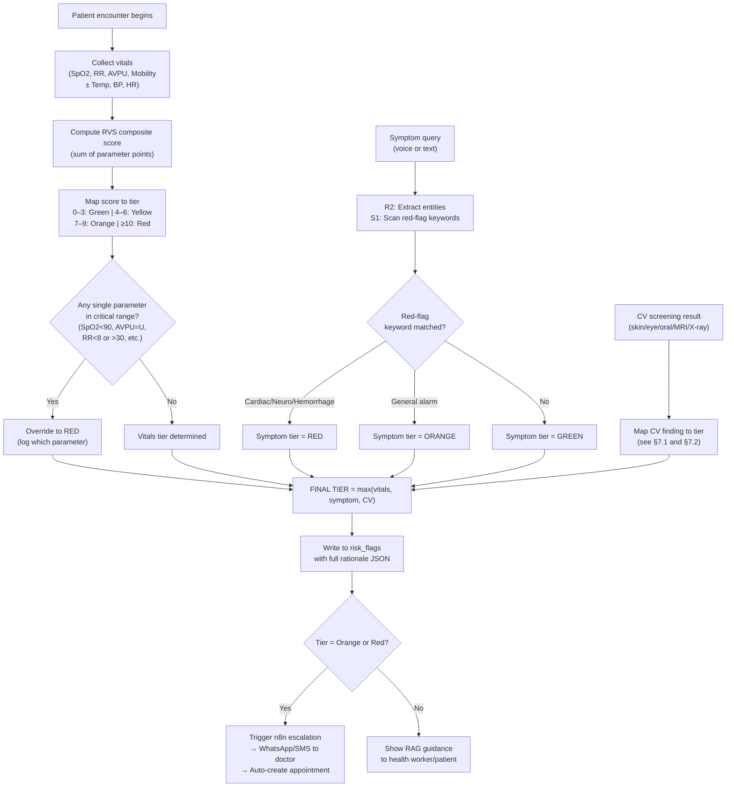

# Triage Engine — Anvaya

**Module Owner:** Clinical Risk-Scoring & Decision-Support System  
**Parent Spec:** [Anvaya.md](file:///f:/Maverick2026/Anvaya.md) §10  
**Backend Implementation:** [database_and_backend.md](file:///f:/Maverick2026/database_and_backend.md) (`risk_flags`, `vitals_readings`, `compute-risk-score` Edge Function)  
**Patient-Side Integration:** [patient.md](file:///f:/Maverick2026/patient.md) (Agents 3, 9, 12)  
**Hospital-Side Integration:** [hospital.md](file:///f:/Maverick2026/hospital.md) (Case Queue §3, Tier Override §13)  
**Agent Pipeline:** [Agents.md](file:///f:/Maverick2026/Agents.md) (S1 Red-Flag Monitor, P3 Result Interpreter)

> This document is the **single source of truth** for Anvaya's clinical risk-scoring algorithm — every vital-sign band, every point allocation, every override rule, every escalation decision, how CV screening and symptom analysis feed into the triage score, and how the score drives downstream actions. If `Anvaya.md` §10 is the "what" (summary-level), this is the "exactly how, exactly when, exactly what value."

---

## Table of Contents

1. [Why a Triage Engine — Clinical Rationale](#1-why-a-triage-engine--clinical-rationale)
2. [Design Principles — What the Score Must Do](#2-design-principles--what-the-score-must-do)
3. [Inputs — What Feeds the Engine](#3-inputs--what-feeds-the-engine)
4. [Rural Vitals Score (RVS) — Point System](#4-rural-vitals-score-rvs--point-system)
5. [Hard Override Rules — Single-Parameter Escalation](#5-hard-override-rules--single-parameter-escalation)
6. [Symptom-Based Override — Red-Flag Keywords](#6-symptom-based-override--red-flag-keywords)
7. [CV Screening Override — Image-Based Escalation](#7-cv-screening-override--image-based-escalation)
8. [Combined Tier Calculation — The Algorithm](#8-combined-tier-calculation--the-algorithm)
9. [Tier Definitions & Downstream Actions](#9-tier-definitions--downstream-actions)
10. [Pediatric & Special Population Adjustments](#10-pediatric--special-population-adjustments)
11. [Pregnancy-Specific Triage Rules](#11-pregnancy-specific-triage-rules)
12. [Worked Examples — Full Calculation Walkthroughs](#12-worked-examples--full-calculation-walkthroughs)
13. [Edge Function Implementation — `compute-risk-score`](#13-edge-function-implementation--compute-risk-score)
14. [Doctor Override System](#14-doctor-override-system)
15. [Score Calibration & Threshold Tuning](#15-score-calibration--threshold-tuning)
16. [How n8n Reacts to Each Tier](#16-how-n8n-reacts-to-each-tier)
17. [Data Schema — What Gets Stored](#17-data-schema--what-gets-stored)
18. [Safety Constraints — Non-Negotiable Rules](#18-safety-constraints--non-negotiable-rules)
19. [Research Basis & Clinical Validation](#19-research-basis--clinical-validation)
20. [Known Limitations & Ethical Considerations](#20-known-limitations--ethical-considerations)

---

## 1. Why a Triage Engine — Clinical Rationale

### 1.1 The Problem

A Community Health Worker (ASHA/ANM) at a Sub-Centre in rural India sees 30+ patients daily. She has:
- A pulse oximeter (₹500)
- A thermometer (₹100)
- Sometimes a BP cuff (₹800)
- No lab, no imaging, no on-site doctor

She needs to decide: **who needs to be seen by a doctor today, who can wait, and who needs an ambulance right now.** Currently, this decision is based entirely on experience and intuition — no standardized scoring system is available that works with this minimal equipment set.

### 1.2 The Solution

The **Rural Vitals Score (RVS)** is a simplified triage scoring system designed specifically for low-resource settings. It is:
- **Usable with minimal equipment:** The core score needs only a pulse oximeter and a watch — no BP cuff required for the minimum viable assessment.
- **Clinically grounded:** Built from the same parameter-weighting patterns as NEWS2 (UK), MEWS, and South African Triage Scale, adapted to Indian rural context.
- **Fail-safe by design:** Single-parameter override rules ensure that one dangerously abnormal reading always triggers escalation, even if the composite score is low.
- **Augmented by AI:** CV screening results and NLP-extracted red-flag symptoms can independently raise the tier, but never lower it.

### 1.3 What This Is NOT

> **This is decision support, not autonomous diagnosis.** The RVS score surfaces a tier recommendation. A doctor must confirm or override before treatment decisions are made. This mirrors how every real early-warning-score deployment in the research literature is used clinically — as a "track-and-trigger" prompt for a human response, not an autonomous decision-maker.

---

## 2. Design Principles — What the Score Must Do

| Principle | Implementation |
|---|---|
| **Work with minimal equipment** | Core score uses only SpO2 + Respiratory Rate + AVPU + Mobility. No lab tests, no imaging required. |
| **Never mask a critical sign** | Single-parameter override rules prevent averaging from hiding one badly abnormal reading in a sea of normals. |
| **Err on the side of caution** | Borderline cases round UP to the more urgent tier, not down. |
| **Be transparent** | Every tier computation logs its full rationale (which parameters scored how many points, which overrides triggered) — not just a final label. |
| **Support doctor override** | A doctor can always change the tier — with the override logged and reasoned. |
| **Adapt to the patient** | Pediatric, geriatric, and pregnancy-specific thresholds exist — a respiratory rate of 28 is normal for a 6-month-old but alarming for an adult. |
| **Monotonically escalate** | Multiple inputs (vitals + symptoms + CV screening) can raise the tier but never lower it. If vitals say Yellow and CV says Orange, the patient is Orange. |
| **Be auditable** | Full computation stored in `risk_flags.rationale` as structured JSON — every point, every rule, every override. |

---

## 3. Inputs — What Feeds the Engine

The triage engine consumes three independent input streams. Each can independently escalate the tier. None can reduce it.

```
┌─────────────────────────────────────────────────────────────┐
│                    TRIAGE ENGINE INPUTS                       │
├─────────────────────┬──────────────────┬────────────────────┤
│  STREAM 1: Vitals   │  STREAM 2: NLP   │  STREAM 3: CV     │
│  (Structured data)  │  (Text analysis)  │  (Image analysis)  │
├─────────────────────┼──────────────────┼────────────────────┤
│ Heart Rate          │ Symptom queries   │ Skin screening     │
│ Respiratory Rate    │ (voice or text)   │ Eye screening      │
│ SpO2               │ Red-flag keyword   │ Oral screening     │
│ Temperature         │ detection         │ MRI brain tumor    │
│ Systolic BP         │ Emergency phrase   │ X-ray analysis     │
│ Diastolic BP        │ recognition       │ Cancer screening   │
│ AVPU Consciousness  │                   │                    │
│ Mobility            │                   │                    │
├─────────────────────┼──────────────────┼────────────────────┤
│ → RVS composite     │ → Red-flag        │ → CV confidence    │
│   score (0–20)      │   override        │   + disease-class  │
│   + hard overrides  │   (≥ Orange)      │   override         │
├─────────────────────┴──────────────────┴────────────────────┤
│               FINAL TIER = max(all three streams)            │
└─────────────────────────────────────────────────────────────┘
```

### 3.1 Input Source Map

| Input | Source Table | Collected By | When |
|---|---|---|---|
| Vitals (HR, RR, SpO2, Temp, BP, AVPU, Mobility) | `vitals_readings` | Health worker via Patient Panel | Every patient encounter |
| Symptom text/voice | `symptom_queries` | Patient or health worker via chatbot | Any time a symptom query is submitted |
| CV screening result | `cv_screenings` | On-device (patient) or server-side (hospital) | When a medical image is analyzed |

---

## 4. Rural Vitals Score (RVS) — Point System

### 4.1 Minimum Tier (Low-Resource — No BP Cuff/Thermometer)

These four parameters are always available if there is at least a pulse oximeter:

#### SpO2 (Pulse Oximetry)

| SpO2 Range | Points | Clinical Significance |
|---|---|---|
| ≥ 96% | 0 | Normal |
| 94–95% | 1 | Mild hypoxemia — monitor |
| 92–93% | 2 | Moderate hypoxemia — supplemental O₂ if available |
| **< 92%** | **3** | Severe hypoxemia — **hard override to Red if < 90%** |

#### Respiratory Rate (breaths/minute — Adult)

| RR Range | Points | Clinical Significance |
|---|---|---|
| 12–20 | 0 | Normal |
| 9–11 | 1 | Mildly low — monitor |
| 21–24 | 1 | Mildly elevated — could be anxiety, fever, or early respiratory distress |
| 25–29 | 2 | Moderate tachypnea — respiratory distress likely |
| **≤ 8 or ≥ 30** | **3** | Severe — **hard override to Red** |

#### Consciousness (AVPU Scale)

| AVPU Level | Points | Clinical Significance |
|---|---|---|
| **A**lert | 0 | Normal — patient is awake, oriented, responsive |
| **V**oice — responds to voice | 1 | Mild alteration — may be drowsy, confused, or medicated |
| **P**ain — responds only to pain | 2 | Significant alteration — reduced consciousness |
| **U**nresponsive | **3** | **Hard override to Red** — coma/unconscious |

#### Mobility

| Status | Points | Clinical Significance |
|---|---|---|
| Can walk unassisted | 0 | Normal mobility |
| Needs assistance to walk | 1 | Functional limitation — could be weakness, pain, or dizziness |
| **Cannot walk due to acute weakness** | **2** | **Hard override to Red** if combined with any other abnormal vital |

### 4.2 Extended Tier (With BP Cuff and Thermometer)

If additional equipment is available, these parameters are added:

#### Temperature (°C)

| Temp Range | Points | Clinical Significance |
|---|---|---|
| 36.1–38.0 | 0 | Normal |
| 35.1–36.0 | 1 | Mild hypothermia — monitor |
| 38.1–39.0 | 1 | Low-grade fever — common in infections |
| 39.1–40.0 | 2 | High fever — active infection likely |
| **≤ 35.0 or > 40.0** | **3** | Severe hypo/hyperthermia — **triggers hard override consideration** |

#### Systolic Blood Pressure (mmHg)

| SBP Range | Points | Clinical Significance |
|---|---|---|
| 110–219 | 0 | Normal to high-normal |
| 100–109 | 1 | Mildly low — monitor |
| 220+ | 2 | Hypertensive crisis risk |
| **91–99** | **2** | Moderate hypotension |
| **≤ 90** | **3** | Severe hypotension (shock risk) — **hard override to Red** |

#### Heart Rate (beats/minute)

| HR Range | Points | Clinical Significance |
|---|---|---|
| 51–90 | 0 | Normal |
| 41–50 | 1 | Mild bradycardia |
| 91–110 | 1 | Mild tachycardia — could be anxiety, fever, dehydration |
| 111–130 | 2 | Moderate tachycardia |
| **≤ 40 or > 130** | **3** | Severe — **hard override to Red** |

### 4.3 Score Ranges and Tier Mapping

| Composite Score | Tier | Urgency |
|---|---|---|
| **0–3** | 🟢 **Green** | Routine — self-care guidance, standard follow-up |
| **4–6** | 🟡 **Yellow** | Review within 24–48 hours |
| **7–9** | 🟠 **Orange** | Urgent — same-day clinician review |
| **≥ 10** | 🔴 **Red** | Immediate — emergency escalation |

> **Note:** These thresholds apply to the **composite score only**. Hard override rules (§5) can independently set the tier to Red regardless of the composite score.

---

## 5. Hard Override Rules — Single-Parameter Escalation

These rules **always fire**, regardless of composite score. They exist because triage literature consistently shows that averaging can mask a single critically abnormal value when all other readings are normal.

### 5.1 Instant Red Override (Any ONE = Red Tier)

| Condition | Trigger | Clinical Reason |
|---|---|---|
| **SpO2 < 90%** | Single reading | Severe hypoxemia — risk of organ damage within minutes |
| **AVPU = Unresponsive** | Single reading | Coma — needs emergency assessment |
| **RR < 8** | Single reading | Respiratory failure — apnea risk |
| **RR > 30** | Single reading | Severe respiratory distress |
| **SBP ≤ 90 mmHg** | Single reading (if BP available) | Hypotensive shock — circulatory failure |
| **HR ≤ 40 bpm** | Single reading (if HR available) | Severe bradycardia — risk of cardiac arrest |
| **HR > 130 bpm** | Single reading (if HR available) | Severe tachycardia — circulatory compromise |
| **Temp ≤ 35.0°C** | Single reading (if temp available) | Severe hypothermia |
| **Temp > 40.0°C** | Single reading (if temp available) | Severe hyperthermia / febrile crisis |
| **Acute inability to walk + any other abnormal vital** | Combined | Acute deterioration — suggests systemic compromise |

### 5.2 Override Rationale (from NEWS2/MEWS Literature)

The single-parameter override pattern is directly modeled on the UK's National Early Warning Score 2 (NEWS2), which specifies:

> "A score of 3 in any individual parameter should trigger an urgent clinical review, irrespective of the aggregate score." — Royal College of Physicians, NEWS2 (2017)

In our system, a score of 3 in any parameter (the maximum) triggers hard override to Red. This is more aggressive than NEWS2's "urgent review" because our context is different — in a rural Sub-Centre, "urgent review" means the patient needs to physically reach a doctor, which may take hours. Erring on the side of triggering transport is safer than erring on the side of watching and waiting.

---

## 6. Symptom-Based Override — Red-Flag Keywords

Independent of vitals scoring, the **Red-Flag Monitor (Agent S1)** scans all text/voice inputs for emergency keywords.

### 6.1 Red-Flag Keyword List (Auto-Escalate to ≥ Orange)

| Category | Keywords / Phrases | Auto-Tier |
|---|---|---|
| **Cardiac** | "chest pain", "left arm pain", "crushing pain in chest", "heart attack", "palpitations with fainting" | 🔴 Red |
| **Respiratory** | "can't breathe", "severe breathlessness", "choking", "turning blue", "gasping for air" | 🔴 Red |
| **Neurological** | "sudden facial droop", "slurred speech", "one side weakness", "seizure", "convulsion", "fitting", "unconscious", "fainted and not waking" | 🔴 Red |
| **Hemorrhage** | "uncontrolled bleeding", "vomiting blood", "blood in stool (large)", "bleeding won't stop" | 🔴 Red |
| **Obstetric** | "severe abdominal pain in pregnancy", "heavy vaginal bleeding during pregnancy", "baby not moving" (third trimester), "water broke and cord visible" | 🔴 Red |
| **Meningitis/Sepsis** | "fever with neck stiffness", "fever with rash that doesn't fade", "fever with confusion" | 🔴 Red |
| **Psychiatric** | "wants to die", "suicidal", "self-harm", "poisoning", "overdose" | 🔴 Red |
| **Allergic** | "throat swelling", "tongue swelling", "can't swallow", "anaphylaxis" | 🔴 Red |
| **General alarm** | "getting worse rapidly", "sudden severe pain", "high fever in infant" | 🟠 Orange |

### 6.2 Multilingual Keyword Detection

These keywords are matched in **all supported languages** via Agent R1 (Language Processor) → Agent R2 (Query Understanding):

```
Patient speaks Hindi: "meri chhati mein bahut dard ho raha hai" (chest pain)
    │
    ├── R1 translates to English: "I have a lot of pain in my chest"
    │
    ├── R2 extracts entities: SYMPTOM="chest pain", BODY_PART="chest", SEVERITY="severe"
    │
    └── S1 matches: "chest pain" → RED FLAG → auto-Red
```

The keyword matching uses both:
- **Exact keyword match** on the translated English text
- **Entity-level match** from R2's NER extraction (more robust — catches paraphrases like "my chest hurts terribly" that don't literally contain "chest pain")

### 6.3 Override Behavior

- Symptom-based escalation can **raise** the tier (Green → Orange/Red, Yellow → Orange/Red)
- Symptom-based escalation can **never lower** the tier
- If vitals-based tier is already Red and symptom scan also finds Red flags, the tier stays Red but the rationale logs both reasons

---

## 7. CV Screening Override — Image-Based Escalation

When a CV model (patient-side skin/eye/oral screener, or hospital-side MRI/X-ray/cancer) produces a result, it can independently escalate the tier.

### 7.1 CV → Tier Mapping (Patient-Side Screening)

| CV Finding | Confidence | Auto-Tier | Rationale |
|---|---|---|---|
| **Melanoma** | Any confidence (even 30%) | 🟠 Orange minimum | Melanoma is too dangerous to downplay — even low confidence warrants doctor review |
| **Basal Cell Carcinoma (BCC)** | Any confidence | 🟠 Orange minimum | Malignant — needs dermatological review |
| **Squamous Cell Carcinoma** | Any confidence | 🟠 Orange minimum | Malignant — needs biopsy |
| **Oral Squamous Cell Carcinoma (OSCC)** | Any confidence | 🟠 Orange minimum | Oral malignancy — urgent ENT referral |
| **Diabetic Retinopathy (Severe/Proliferative)** | ≥ 70% | 🟠 Orange | Vision-threatening — needs ophthalmology |
| **Diabetic Retinopathy (Mild/Moderate)** | ≥ 70% | 🟡 Yellow | Needs follow-up, not emergency |
| **Any condition** | ≥ 80% confidence | 🟡 Yellow minimum | High-confidence finding warrants medical review |
| **Any condition** | < 60% all classes | ⬜ No classification | Confidence too low to classify — "We couldn't identify this clearly. Please consult a healthcare professional." |
| **Benign conditions** | ≥ 70% | 🟢 Green | Low risk — document and monitor |

### 7.2 CV → Tier Mapping (Hospital-Side Imaging)

| CV Finding | Auto-Tier | Action |
|---|---|---|
| **Glioma (brain MRI)** | 🔴 Red | Immediate neurosurgery/oncology referral |
| **Meningioma (brain MRI)** | 🟠 Orange | Same-day specialist review |
| **Pituitary tumor (brain MRI)** | 🟡 Yellow | Endocrinology + ophthalmology referral within 1–2 weeks |
| **Pneumonia (chest X-ray)** ≥ 80% | 🟠 Orange | Same-day treatment initiation |
| **Tuberculosis (chest X-ray)** ≥ 40% | 🟡 Yellow | Sputum test ordered, NIKSHAY notification |
| **Lung cancer** ≥ 70% | 🔴 Red | Immediate oncology referral |
| **Breast cancer (malignant)** ≥ 70% | 🔴 Red | Immediate oncology referral |
| **No tumor / Normal** | No tier change | Result logged, no escalation |

### 7.3 Combined CV + Vitals Escalation

The tier is always the **maximum** across all inputs:

```
Example:
  Vitals score: 4 → Yellow
  Symptom scan: no red-flag → no override
  CV screening: Melanoma 45% → Orange override

  FINAL TIER = max(Yellow, Green, Orange) = ORANGE
```

---

## 8. Combined Tier Calculation — The Algorithm

### 8.1 Algorithm (Pseudocode)

```python
def compute_final_tier(vitals, symptoms, cv_result):
    """
    Inputs:
      vitals: dict with HR, RR, SpO2, Temp, SBP, AVPU, Mobility
      symptoms: list of extracted symptom entities + red-flag boolean
      cv_result: dict with predicted_class, confidence, modality
    
    Returns:
      tier: 'green' | 'yellow' | 'orange' | 'red'
      score: int (composite RVS score)
      rationale: dict (full breakdown)
    """
    
    rationale = {}
    
    # ═══ STEP 1: Compute RVS composite score ═══
    score = 0
    point_breakdown = {}
    
    # Core parameters (always available with pulse oximeter)
    spo2_points = score_spo2(vitals['spo2'])
    rr_points = score_respiratory_rate(vitals['resp_rate'], vitals.get('age_years'))
    avpu_points = score_avpu(vitals['consciousness'])
    mobility_points = score_mobility(vitals['can_walk_unassisted'])
    
    score += spo2_points + rr_points + avpu_points + mobility_points
    point_breakdown = {
        'spo2': spo2_points, 'rr': rr_points,
        'avpu': avpu_points, 'mobility': mobility_points
    }
    
    # Extended parameters (if equipment available)
    if vitals.get('temp_c') is not None:
        temp_points = score_temperature(vitals['temp_c'])
        score += temp_points
        point_breakdown['temp'] = temp_points
    
    if vitals.get('systolic_bp') is not None:
        bp_points = score_systolic_bp(vitals['systolic_bp'])
        score += bp_points
        point_breakdown['sbp'] = bp_points
    
    if vitals.get('heart_rate') is not None:
        hr_points = score_heart_rate(vitals['heart_rate'])
        score += hr_points
        point_breakdown['hr'] = hr_points
    
    # Map composite score to tier
    if score >= 10:
        vitals_tier = 'red'
    elif score >= 7:
        vitals_tier = 'orange'
    elif score >= 4:
        vitals_tier = 'yellow'
    else:
        vitals_tier = 'green'
    
    rationale['vitals_score'] = score
    rationale['vitals_tier'] = vitals_tier
    rationale['point_breakdown'] = point_breakdown
    
    # ═══ STEP 2: Check hard override rules ═══
    hard_overrides = check_hard_overrides(vitals)
    if hard_overrides:
        vitals_tier = 'red'
        rationale['hard_overrides'] = hard_overrides
    
    # ═══ STEP 3: Check symptom-based override ═══
    symptom_tier = 'green'
    if symptoms.get('red_flag_hit'):
        symptom_tier = symptoms.get('red_flag_tier', 'orange')  # 'red' or 'orange'
        rationale['symptom_override'] = {
            'triggered': True,
            'keywords': symptoms.get('matched_keywords', []),
            'tier': symptom_tier
        }
    
    # ═══ STEP 4: Check CV screening override ═══
    cv_tier = 'green'
    if cv_result:
        cv_tier = compute_cv_tier(cv_result)
        rationale['cv_override'] = {
            'modality': cv_result['modality'],
            'predicted_class': cv_result['predicted_class'],
            'confidence': cv_result['confidence'],
            'tier': cv_tier
        }
    
    # ═══ STEP 5: FINAL TIER = max(all streams) ═══
    tier_order = {'green': 0, 'yellow': 1, 'orange': 2, 'red': 3}
    final_tier = max(
        [vitals_tier, symptom_tier, cv_tier],
        key=lambda t: tier_order[t]
    )
    
    rationale['final_tier'] = final_tier
    rationale['tier_sources'] = {
        'vitals': vitals_tier,
        'symptoms': symptom_tier,
        'cv': cv_tier,
        'determined_by': 'max_of_all'
    }
    
    return final_tier, score, rationale
```

### 8.2 Algorithm Visualization



---

## 9. Tier Definitions & Downstream Actions

### 9.1 Complete Tier Action Table

| Tier | Score Range | Meaning | Patient Panel Actions | Hospital Panel Actions | n8n Actions |
|---|---|---|---|---|---|
| 🔴 **Red** | ≥ 10 or hard override | Immediate life threat | Show "Seek emergency care NOW" banner, show nearest hospital (PostGIS), auto-create Red appointment | Red alert sound, case bumped to top of queue, auto-suggested referral | Instant WhatsApp/SMS to on-call doctor (<60s), escalation workflow fires |
| 🟠 **Orange** | 7–9 or symptom/CV override | Urgent same-day review | Show "See a doctor today" banner, create Orange appointment, show RAG guidance | Toast notification, case in Orange section of queue | Same-day WhatsApp alert to assigned doctor, appointment routing workflow |
| 🟡 **Yellow** | 4–6 | Review within 24–48h | Show RAG guidance, offer appointment booking, set follow-up reminder | Case in Yellow section, included in daily digest | Batched into daily digest WhatsApp (8 AM), follow-up scheduled |
| 🟢 **Green** | 0–3 | Routine / self-limiting | Show general self-care guidance from RAG, routine follow-up (if any) | Case visible but no alert, reviewed at doctor's pace | Follow-up reminder if doctor sets one, area stats aggregation |

### 9.2 Escalation Timing SLA

| Tier | Time-to-doctor-notification | Measured By |
|---|---|---|
| 🔴 Red | < 60 seconds from tier computation | `automation_events.latency_ms` — target in `Anvaya.md` §21 |
| 🟠 Orange | < 5 minutes | `automation_events.latency_ms` |
| 🟡 Yellow | < 24 hours (via daily digest) | Digest delivery timestamp |
| 🟢 Green | No forced notification | N/A |

---

## 10. Pediatric & Special Population Adjustments

Children have different normal ranges for vital signs. A respiratory rate of 28 is normal for a 1-year-old but triggers an Orange score for an adult.

### 10.1 Pediatric Respiratory Rate Bands

| Age Group | Normal RR (0 pts) | Mildly Abnormal (1 pt) | Moderate (2 pts) | Severe (3 pts + override) |
|---|---|---|---|---|
| 0–1 year | 30–40 | 25–29 or 41–50 | 20–24 or 51–60 | < 20 or > 60 |
| 1–5 years | 20–30 | 15–19 or 31–40 | 10–14 or 41–50 | < 10 or > 50 |
| 5–12 years | 15–25 | 12–14 or 26–30 | 10–11 or 31–35 | < 10 or > 35 |
| > 12 years | Adult bands (§4.1) | — | — | — |

### 10.2 Pediatric Heart Rate Bands

| Age Group | Normal HR (0 pts) | Mild (1 pt) | Moderate (2 pts) | Severe (3 pts + override) |
|---|---|---|---|---|
| 0–1 year | 100–160 | 90–99 or 161–180 | 80–89 or 181–200 | < 80 or > 200 |
| 1–5 years | 80–140 | 70–79 or 141–160 | 60–69 or 161–180 | < 60 or > 180 |
| 5–12 years | 70–120 | 60–69 or 121–140 | 50–59 or 141–160 | < 50 or > 160 |
| > 12 years | Adult bands (§4.2) | — | — | — |

### 10.3 Neonatal Considerations (< 28 days)

Neonates have additional critical signs not captured by the standard RVS:

| Sign | Action |
|---|---|
| Poor feeding / refusal to breastfeed | Auto-escalate to ≥ Yellow |
| Grunting or nasal flaring | Auto-escalate to ≥ Orange |
| Central cyanosis | Auto-escalate to Red |
| Bulging fontanelle | Auto-escalate to Red (meningitis risk) |
| Fever ≥ 38°C in neonate < 28 days | Auto-escalate to ≥ Orange (neonatal sepsis until proven otherwise) |

These are captured as **symptom-based overrides** via the red-flag keyword system (§6), not as additional vital parameters, since they're observed signs rather than measured values.

---

## 11. Pregnancy-Specific Triage Rules

Pregnancy introduces unique emergency patterns not covered by the standard RVS.

### 11.1 Pregnancy-Specific Overrides

| Finding | Auto-Tier | Action |
|---|---|---|
| **SBP ≥ 140 AND/OR DBP ≥ 90** (in pregnancy) | 🟠 Orange minimum | Pre-eclampsia screening — urgent obstetric review |
| **SBP ≥ 160 AND/OR DBP ≥ 110** (in pregnancy) | 🔴 Red | Severe pre-eclampsia / eclampsia risk — emergency obstetric care |
| **Severe headache + visual disturbances** (in pregnancy) | 🔴 Red | Eclampsia prodrome — emergency referral |
| **Heavy vaginal bleeding** (any trimester) | 🔴 Red | Hemorrhage — emergency obstetric care |
| **Severe abdominal pain** (in pregnancy) | 🔴 Red | Possible abruption / ectopic — emergency |
| **Reduced fetal movement** (third trimester) | 🟠 Orange | Fetal distress until proven otherwise |
| **Regular contractions before 37 weeks** | 🟠 Orange | Preterm labor — urgent obstetric assessment |

### 11.2 How Pregnancy Context Is Captured

The patient's record includes a `gender` field. If `gender = 'F'` and the patient's symptoms mention pregnancy-related keywords (or the health worker marks the patient as pregnant in the vitals form), the triage engine activates the pregnancy rule set alongside the standard RVS.

```python
# Pregnancy-specific rules activated when:
if patient.gender == 'F' and (
    'pregnant' in symptoms or
    vitals.get('is_pregnant') == True
):
    apply_pregnancy_overrides(vitals, symptoms)
```

---

## 12. Worked Examples — Full Calculation Walkthroughs

### Example 1: Healthy Adult (Green)

```
Patient: Male, 30 years old
Vitals: HR=72, RR=16, SpO2=98%, Temp=36.8°C, SBP=120, AVPU=Alert, Can walk=Yes
Symptoms: "Minor headache for 2 days"
CV: No screening performed

Calculation:
  SpO2 98% → 0 pts
  RR 16 → 0 pts
  AVPU Alert → 0 pts
  Mobility: walks → 0 pts
  Temp 36.8°C → 0 pts
  SBP 120 → 0 pts
  HR 72 → 0 pts
  
  Composite: 0 points
  Hard overrides: None
  Symptom scan: "headache" — not a red-flag keyword
  CV: Not performed
  
  FINAL TIER: GREEN (score 0, no overrides)
  Action: RAG chatbot provides guidance on headaches, suggests hydration and rest
```

### Example 2: Moderate Concern (Yellow)

```
Patient: Female, 55 years old
Vitals: HR=105, RR=22, SpO2=95%, Temp=38.5°C, SBP=135, AVPU=Alert, Can walk=Yes
Symptoms: "Cough and fever for 3 days"
CV: No screening performed

Calculation:
  SpO2 95% → 1 pt
  RR 22 → 1 pt
  AVPU Alert → 0 pts
  Mobility: walks → 0 pts
  Temp 38.5°C → 1 pt
  SBP 135 → 0 pts
  HR 105 → 1 pt
  
  Composite: 4 points
  Hard overrides: None (no parameter in critical range)
  Symptom scan: "cough", "fever" — not red-flag keywords
  CV: Not performed
  
  FINAL TIER: YELLOW (score 4)
  Action: Queued for doctor review within 24–48h. RAG provides guidance on managing fever.
  Follow-up reminder set for 3 days.
```

### Example 3: Red Override via Single Parameter

```
Patient: Male, 68 years old
Vitals: HR=78, RR=18, SpO2=87%, Temp=37.0°C, SBP=130, AVPU=Alert, Can walk=Yes
Symptoms: "Feeling slightly breathless"
CV: No screening performed

Calculation:
  SpO2 87% → 3 pts
  RR 18 → 0 pts
  AVPU Alert → 0 pts
  Mobility: walks → 0 pts
  Temp 37.0°C → 0 pts
  SBP 130 → 0 pts
  HR 78 → 0 pts
  
  Composite: 3 points → would be GREEN
  
  ⚠️ HARD OVERRIDE: SpO2 < 90% → AUTOMATIC RED
  
  FINAL TIER: RED (score 3, but hard override on SpO2)
  Action: Immediate WhatsApp/SMS to on-call doctor. Nearest hospital shown.
  Patient told: "Your blood oxygen is dangerously low. Seek emergency care immediately."
```

### Example 4: CV Screening Escalation

```
Patient: Female, 42 years old
Vitals: HR=75, RR=15, SpO2=98%, AVPU=Alert, Can walk=Yes (no BP/temp available)
Symptoms: "Noticed a dark spot on my arm that's been growing"
CV: Skin screener → Melanoma 68% confidence

Calculation:
  SpO2 98% → 0 pts
  RR 15 → 0 pts
  AVPU Alert → 0 pts
  Mobility: walks → 0 pts
  
  Composite: 0 points → GREEN from vitals
  Hard overrides: None
  Symptom scan: "dark spot growing" — not a red-flag keyword
  
  CV Override: Melanoma at ANY confidence → ORANGE minimum
  
  FINAL TIER: max(Green, Green, Orange) = ORANGE
  Action: Same-day doctor alert. Appointment auto-created.
  Patient told: "Our screening found something that needs a doctor's review today.
  This is a preliminary result — a doctor will examine you to confirm."
```

### Example 5: Multi-Stream Escalation (All Three Triggers)

```
Patient: Male, 60 years old
Vitals: HR=115, RR=26, SpO2=91%, Temp=39.5°C, SBP=95, AVPU=Voice, Can walk=No
Symptoms: "Severe chest pain, can't breathe"
CV: Chest X-ray → Pneumonia 89%

Calculation:
  SpO2 91% → 3 pts (92–93 range... wait, 91% is in 92–93? No — 91% < 92% → 3 pts)
  RR 26 → 2 pts
  AVPU Voice → 1 pt
  Mobility: can't walk → 2 pts (+ combined with other abnormals → override consideration)
  Temp 39.5°C → 2 pts
  SBP 95 → 2 pts
  HR 115 → 2 pts
  
  Composite: 14 points → RED from vitals alone
  
  Hard overrides:
    - SpO2 91% (not < 90, so no SpO2 hard override — but 3 points in the composite)
    - SBP 95 (not ≤ 90, so no BP hard override — but 2 points)
    - No single hard override triggered, but composite score is already 14 → RED
  
  Symptom override:
    - "chest pain" → RED FLAG (cardiac category)
    - "can't breathe" → RED FLAG (respiratory category)
    → Symptom tier: RED
  
  CV override:
    - Pneumonia 89% → ORANGE
  
  FINAL TIER: max(Red, Red, Orange) = RED
  
  Rationale logged:
  {
    "vitals_score": 14,
    "vitals_tier": "red",
    "point_breakdown": {"spo2":3,"rr":2,"avpu":1,"mobility":2,"temp":2,"sbp":2,"hr":2},
    "hard_overrides": [],
    "symptom_override": {"triggered":true, "keywords":["chest pain","can't breathe"], "tier":"red"},
    "cv_override": {"modality":"xray", "predicted_class":"pneumonia", "confidence":0.89, "tier":"orange"},
    "final_tier": "red",
    "tier_sources": {"vitals":"red", "symptoms":"red", "cv":"orange", "determined_by":"max_of_all"}
  }
  
  Actions:
  - Instant WhatsApp/SMS to on-call doctor (< 60s)
  - Nearest hospital with ICU capability shown
  - Red appointment auto-created
  - Doctor's case queue: Red alert sound, case bumped to top
```

---

## 13. Edge Function Implementation — `compute-risk-score`

This is the Supabase Edge Function that runs the triage algorithm. Referenced in `database_and_backend.md` §9.

### 13.1 Trigger

The function is called when:
1. A new `vitals_readings` row is inserted (primary trigger)
2. A new `symptom_queries` row with `red_flag_hit = true` is inserted
3. A new `cv_screenings` row is inserted (via `process-cv-result`)

### 13.2 Implementation Sketch (TypeScript / Deno)

```typescript
// Edge Function: compute-risk-score
// Triggered by: Supabase database webhook on vitals_readings INSERT

import { serve } from "https://deno.land/std/http/server.ts";
import { createClient } from "https://esm.sh/@supabase/supabase-js";

interface VitalsInput {
  patient_id: string;
  heart_rate?: number;
  resp_rate?: number;
  spo2?: number;
  temp_c?: number;
  systolic_bp?: number;
  diastolic_bp?: number;
  consciousness: 'alert' | 'voice' | 'pain' | 'unresponsive';
  can_walk_unassisted: boolean;
}

interface TierResult {
  tier: 'green' | 'yellow' | 'orange' | 'red';
  score: number;
  rationale: Record<string, any>;
}

function scoreSpO2(spo2: number): number {
  if (spo2 >= 96) return 0;
  if (spo2 >= 94) return 1;
  if (spo2 >= 92) return 2;
  return 3;
}

function scoreRR(rr: number): number {
  if (rr >= 12 && rr <= 20) return 0;
  if ((rr >= 9 && rr <= 11) || (rr >= 21 && rr <= 24)) return 1;
  if (rr >= 25 && rr <= 29) return 2;
  return 3; // <= 8 or >= 30
}

function scoreAVPU(level: string): number {
  switch (level) {
    case 'alert': return 0;
    case 'voice': return 1;
    case 'pain': return 2;
    case 'unresponsive': return 3;
    default: return 0;
  }
}

function scoreMobility(canWalk: boolean): number {
  return canWalk ? 0 : 2;
}

function scoreTemp(temp: number): number {
  if (temp >= 36.1 && temp <= 38.0) return 0;
  if ((temp >= 35.1 && temp <= 36.0) || (temp >= 38.1 && temp <= 39.0)) return 1;
  if (temp >= 39.1 && temp <= 40.0) return 2;
  return 3; // <= 35.0 or > 40.0
}

function scoreSBP(sbp: number): number {
  if (sbp >= 110 && sbp <= 219) return 0;
  if (sbp >= 100 && sbp <= 109) return 1;
  if (sbp >= 220 || (sbp >= 91 && sbp <= 99)) return 2;
  return 3; // <= 90
}

function scoreHR(hr: number): number {
  if (hr >= 51 && hr <= 90) return 0;
  if ((hr >= 41 && hr <= 50) || (hr >= 91 && hr <= 110)) return 1;
  if (hr >= 111 && hr <= 130) return 2;
  return 3; // <= 40 or > 130
}

function checkHardOverrides(vitals: VitalsInput): string[] {
  const overrides: string[] = [];
  if (vitals.spo2 !== undefined && vitals.spo2 < 90) 
    overrides.push('spo2_critical_below_90');
  if (vitals.consciousness === 'unresponsive') 
    overrides.push('avpu_unresponsive');
  if (vitals.resp_rate !== undefined && (vitals.resp_rate < 8 || vitals.resp_rate > 30)) 
    overrides.push('rr_critical');
  if (vitals.systolic_bp !== undefined && vitals.systolic_bp <= 90) 
    overrides.push('sbp_critical_below_90');
  if (vitals.heart_rate !== undefined && (vitals.heart_rate <= 40 || vitals.heart_rate > 130)) 
    overrides.push('hr_critical');
  if (vitals.temp_c !== undefined && (vitals.temp_c <= 35.0 || vitals.temp_c > 40.0)) 
    overrides.push('temp_critical');
  return overrides;
}

function computeTier(vitals: VitalsInput): TierResult {
  const breakdown: Record<string, number> = {};
  let score = 0;

  // Core parameters (always available)
  if (vitals.spo2 !== undefined) {
    breakdown.spo2 = scoreSpO2(vitals.spo2);
    score += breakdown.spo2;
  }
  if (vitals.resp_rate !== undefined) {
    breakdown.rr = scoreRR(vitals.resp_rate);
    score += breakdown.rr;
  }
  breakdown.avpu = scoreAVPU(vitals.consciousness);
  score += breakdown.avpu;
  breakdown.mobility = scoreMobility(vitals.can_walk_unassisted);
  score += breakdown.mobility;

  // Extended parameters
  if (vitals.temp_c !== undefined) {
    breakdown.temp = scoreTemp(vitals.temp_c);
    score += breakdown.temp;
  }
  if (vitals.systolic_bp !== undefined) {
    breakdown.sbp = scoreSBP(vitals.systolic_bp);
    score += breakdown.sbp;
  }
  if (vitals.heart_rate !== undefined) {
    breakdown.hr = scoreHR(vitals.heart_rate);
    score += breakdown.hr;
  }

  // Map score to tier
  let tier: 'green' | 'yellow' | 'orange' | 'red';
  if (score >= 10) tier = 'red';
  else if (score >= 7) tier = 'orange';
  else if (score >= 4) tier = 'yellow';
  else tier = 'green';

  // Check hard overrides
  const overrides = checkHardOverrides(vitals);
  if (overrides.length > 0) tier = 'red';

  return {
    tier,
    score,
    rationale: {
      vitals_score: score,
      vitals_tier: tier,
      point_breakdown: breakdown,
      hard_overrides: overrides,
      parameters_available: Object.keys(breakdown).length,
      timestamp: new Date().toISOString()
    }
  };
}

serve(async (req) => {
  const supabase = createClient(
    Deno.env.get('SUPABASE_URL')!,
    Deno.env.get('SUPABASE_SERVICE_ROLE_KEY')!
  );

  const { record } = await req.json(); // Webhook payload

  // Compute tier from vitals
  const result = computeTier(record as VitalsInput);

  // Check for existing symptom-based red flags for this patient
  const { data: symptoms } = await supabase
    .from('symptom_queries')
    .select('red_flag_hit, extracted_symptoms')
    .eq('patient_id', record.patient_id)
    .eq('red_flag_hit', true)
    .order('created_at', { ascending: false })
    .limit(1);

  if (symptoms?.length && symptoms[0].red_flag_hit) {
    const symptomTier = 'orange'; // minimum for symptom red-flag
    result.rationale.symptom_override = { triggered: true };
    if (['green', 'yellow'].includes(result.tier)) {
      result.tier = symptomTier as any;
    }
  }

  // Check for recent CV screening results
  const { data: cvResults } = await supabase
    .from('cv_screenings')
    .select('prediction, modality')
    .eq('patient_id', record.patient_id)
    .order('created_at', { ascending: false })
    .limit(1);

  // (CV tier calculation omitted for brevity — see §7)

  // Write risk_flag
  await supabase.from('risk_flags').insert({
    patient_id: record.patient_id,
    vitals_id: record.id,
    score: result.score,
    tier: result.tier,
    rationale: result.rationale
  });

  // If Orange/Red, trigger n8n escalation
  if (['orange', 'red'].includes(result.tier)) {
    await fetch(`${Deno.env.get('N8N_WEBHOOK_BASE_URL')}/escalation`, {
      method: 'POST',
      headers: { 'Content-Type': 'application/json' },
      body: JSON.stringify({
        patient_id: record.patient_id,
        tier: result.tier,
        score: result.score,
        rationale: result.rationale
      })
    });
  }

  return new Response(JSON.stringify(result), {
    headers: { 'Content-Type': 'application/json' }
  });
});
```

---

## 14. Doctor Override System

### 14.1 When a Doctor Overrides

A doctor can change the computed tier in either direction:

| Override Direction | Example | Logged As |
|---|---|---|
| **Downgrade** (AI says Red, doctor says Green) | CV says melanoma but doctor confirms benign seborrheic keratosis | `override_reason: "Clinical exam confirms benign lesion. Dermoscopy consistent with SK."` |
| **Upgrade** (AI says Green, doctor says Red) | Vitals normal but doctor suspects evolving MI based on history | `override_reason: "History of prior MI, current presentation concerning for ACS despite normal vitals."` |

### 14.2 Override Data Flow

```
Doctor reviews case in Hospital Panel
    │
    ├── Sees: AI-computed tier + score + rationale breakdown
    │
    ├── Clicks "Override Tier"
    │
    ├── Selects new tier + types mandatory reason
    │
    └── System:
        ├── Updates risk_flags row:
        │   overridden_by = doctor_uuid
        │   override_reason = "..."
        │   tier = new_tier (but original tier preserved in rationale JSON)
        │   reviewed_at = now()
        │
        ├── Logs to audit_log:
        │   action = 'override'
        │   before_data = { tier: 'red' }
        │   after_data = { tier: 'green' }
        │   reason = "..."
        │
        └── If downgraded: n8n cancels pending escalation
            If upgraded: n8n triggers new escalation for the higher tier
```

### 14.3 Override Analytics (Model Improvement Feedback Loop)

Systematic override patterns are the primary signal for model retraining:

```sql
-- Find CV model false positive patterns (doctor consistently downgrades)
select
  m.model_key,
  (r.rationale->'cv_override'->>'predicted_class') as cv_class,
  count(*) as override_count,
  count(*) filter (where r.tier < r.rationale->>'vitals_tier') as downgrades
from risk_flags r
join cv_screenings c on c.patient_id = r.patient_id
join model_registry m on m.model_key = c.model_version
where r.overridden_by is not null
group by m.model_key, cv_class
order by override_count desc;
```

---

## 15. Score Calibration & Threshold Tuning

### 15.1 How Thresholds Were Chosen

| Threshold | Value | Based On |
|---|---|---|
| Green/Yellow boundary | Score 4 | NEWS2 uses 1–4 as "low concern" — our system is less granular (4 parameters minimum vs. 7), so 4 is the equivalent boundary |
| Yellow/Orange boundary | Score 7 | NEWS2 uses 5–6 as "medium" — scaled up for our wider parameter range |
| Orange/Red boundary | Score 10 | NEWS2 uses ≥7 as "high" — our maximum possible score is 20 (7 parameters × ~3 each), so 10/20 = 50th percentile as the emergency threshold |
| Hard override threshold | 3 pts on any parameter | NEWS2 standard: "Any individual parameter score of 3 triggers urgent review" |

### 15.2 Calibration Process

After the hackathon (or during a pilot), thresholds should be tuned using real data:

```
Step 1: Collect 500+ risk_flags rows with doctor-confirmed outcomes
Step 2: For each tier boundary, compute:
         - Sensitivity: % of truly urgent cases caught at this threshold
         - Specificity: % of truly non-urgent cases correctly NOT escalated
         - PPV/NPV: Positive/Negative predictive values
Step 3: Adjust thresholds to maximize sensitivity (catching emergencies)
         while maintaining acceptable specificity (not overwhelming doctors)
Step 4: Re-deploy updated thresholds via Edge Function config — no model retraining needed
```

> **Hackathon reality:** For the hackathon, the thresholds above are reasonable starting points derived from published literature. Real calibration requires clinical validation data from the deployment context — different disease prevalence, altitude (affects SpO2 baselines), and population demographics would all influence optimal thresholds.

---

## 16. How n8n Reacts to Each Tier

Cross-references `Agents.md` §14 workflows with triage output:

```
TIER = RED
    │
    ├── n8n Workflow 2: Red-Flag Emergency Escalation
    │   ├── Immediate WhatsApp/SMS to on-call doctor
    │   ├── Auto-create Red-priority appointment
    │   ├── PostGIS: find nearest hospital with required capability
    │   └── automation_events logged with latency_ms
    │
    ├── n8n Workflow 7: Appointment Routing
    │   └── Route to "immediate alert" path (not daily digest)
    │
    └── Patient Panel: emergency banner + nearest hospital map

TIER = ORANGE
    │
    ├── n8n Workflow 2: Escalation (same-day variant)
    │   ├── WhatsApp/SMS to assigned doctor within 5 minutes
    │   └── Auto-create Orange-priority appointment
    │
    ├── n8n Workflow 7: Appointment Routing
    │   └── Route to "same-day alert" path
    │
    └── Patient Panel: urgent banner + appointment confirmation

TIER = YELLOW
    │
    ├── n8n Workflow 6: Doctor Daily Digest
    │   └── Batched into 8 AM morning summary
    │
    ├── n8n Workflow 5: Follow-Up Reminders
    │   └── Reminder scheduled for doctor-set interval (or 48h default)
    │
    └── Patient Panel: RAG guidance + optional appointment booking

TIER = GREEN
    │
    ├── n8n Workflow 9: Area Disease Aggregation
    │   └── Case counted in area stats (de-identified)
    │
    ├── n8n Workflow 5: Follow-Up (only if doctor explicitly sets one)
    │
    └── Patient Panel: self-care guidance from RAG
```

---

## 17. Data Schema — What Gets Stored

Every tier computation writes to `risk_flags` (defined in `database_and_backend.md` §3):

```sql
-- Existing table from database_and_backend.md
create table risk_flags (
  id uuid primary key default gen_random_uuid(),
  patient_id uuid references patients(id),
  vitals_id uuid references vitals_readings(id),
  score numeric,                           -- RVS composite score (0–20)
  tier text check (tier in ('green','yellow','orange','red')),
  rationale jsonb,                          -- FULL breakdown (see below)
  overridden_by uuid references health_workers(id),
  override_reason text,
  reviewed_at timestamptz,
  created_at timestamptz default now()
);
```

### 17.1 Rationale JSON Structure (Complete)

```json
{
  "engine_version": "1.0.0",
  "vitals_score": 14,
  "vitals_tier": "red",
  "point_breakdown": {
    "spo2": { "value": 91, "points": 3, "range": "< 92%" },
    "rr": { "value": 26, "points": 2, "range": "25-29" },
    "avpu": { "value": "voice", "points": 1 },
    "mobility": { "value": false, "points": 2 },
    "temp": { "value": 39.5, "points": 2, "range": "39.1-40.0°C" },
    "sbp": { "value": 95, "points": 2, "range": "91-99 mmHg" },
    "hr": { "value": 115, "points": 2, "range": "111-130 bpm" }
  },
  "parameters_available": 7,
  "parameters_possible": 7,
  "hard_overrides": [],
  "symptom_override": {
    "triggered": true,
    "keywords_matched": ["chest pain", "can't breathe"],
    "symptom_tier": "red",
    "source_query_id": "uuid"
  },
  "cv_override": {
    "triggered": true,
    "modality": "xray",
    "predicted_class": "pneumonia",
    "confidence": 0.89,
    "cv_tier": "orange",
    "source_screening_id": "uuid"
  },
  "final_tier": "red",
  "tier_sources": {
    "vitals": "red",
    "symptoms": "red",
    "cv": "orange",
    "determined_by": "max_of_all"
  },
  "computed_at": "2026-07-02T09:15:00Z"
}
```

---

## 18. Safety Constraints — Non-Negotiable Rules

These rules are hardcoded and cannot be overridden by configuration:

| Rule | Implementation | Why |
|---|---|---|
| **No tier downgrade by AI** | Multiple input streams can only raise the tier, never lower it | A benign vitals reading should not cancel a melanoma CV finding |
| **No diagnosis language** | UI always says "may suggest" / "consistent with" — never "you have" or "this is" | Diagnosis is a doctor's prerogative, not an algorithm's |
| **No prescription by AI** | The triage engine outputs a tier and guidance — never drug names or dosages | Indian telemedicine framework requires licensed practitioner for prescriptions |
| **Always recommend care** | Even Green-tier results include "if symptoms worsen, seek medical help" | Self-limiting conditions can evolve |
| **Override requires reason** | Doctors cannot change a tier without entering a free-text justification | Auditability and feedback loop |
| **Red-flag monitor is highest priority** | Agent S1 has override authority over all other agents | An emergency keyword in any input stream must escalate, regardless of what the vitals score says |
| **Fallback if S1 crashes** | Orchestrator (P0/H0) has hardcoded keyword list scan | Safety-critical agent must have a fallback that cannot be knocked out by a single agent failure |
| **SpO2 < 90% is always Red** | Hardcoded in the scoring function, not configurable | Severe hypoxemia is a medical emergency regardless of context |
| **Unresponsive (AVPU=U) is always Red** | Hardcoded | Coma/unconsciousness is a medical emergency |
| **Confidence < 60% = no classification** | CV result not shown if all classes are below threshold | Low-confidence results are more harmful than helpful |

---

## 19. Research Basis & Clinical Validation

### 19.1 Scoring Systems Referenced

| System | Published By | What We Took From It |
|---|---|---|
| **NEWS2** (National Early Warning Score 2) | Royal College of Physicians (UK), 2017 | Parameter-weighting approach, single-parameter override rule, aggregate-score-to-urgency tier mapping |
| **MEWS** (Modified Early Warning Score) | Subbe et al., 2001 | Simplified vital sign scoring for non-ICU settings |
| **South African Triage Scale (SATS)** | Wallis & Gottschalk, 2008 | Adaptation of triage scoring for resource-limited settings |
| **WHO IMCI** (Integrated Management of Childhood Illness) | WHO, 2014 | Pediatric vital sign normal ranges, danger sign recognition |
| **Indian Emergency Triage System** | AIIMS/MoHFW | Context-specific adaptation for Indian healthcare facilities |

### 19.2 Key Research References

| Reference | Relevance |
|---|---|
| Baker et al. (2006) — "Simplified scoring for respiratory distress" | Evidence that SpO2 + RR alone perform comparably to fuller scores in low-resource settings |
| Mwanga et al. (2021) — "Machine learning triage in low-resource settings" | Validation of simplified vitals-based triage in Sub-Saharan Africa — comparable patient population context |
| Esteva et al. (2017) — "Dermatologist-level classification of skin cancer with deep neural networks" | Foundation for CV-based dermatological triage |
| Rajpurkar et al. (2017) — "CheXNet: Radiologist-Level Pneumonia Detection on Chest X-Rays" | Foundation for CV-based chest X-ray triage |
| NEWS2 Implementation Guide (RCP, 2017) | "Any individual parameter score of 3 should trigger an urgent clinical review" — our hard override rule |

### 19.3 Limitations of the Evidence Base

> **Honest disclosure for judges:** The RVS thresholds are adapted from published scoring systems (NEWS2, MEWS, SATS) that were validated in contexts different from rural India. The specific score-to-tier boundaries (4, 7, 10) are reasonable engineering choices based on published evidence, but they have NOT been clinically validated in our specific deployment context. A real pilot would require prospective validation — comparing RVS tiers to clinical outcomes — before these thresholds could be considered clinically validated. This limitation is stated explicitly because technical hackathon judges reward honesty about evidence gaps over false confidence.

---

## 20. Known Limitations & Ethical Considerations

### 20.1 Technical Limitations

| Limitation | Mitigation |
|---|---|
| **No lab data integration** | Score works without labs — but conditions like diabetic ketoacidosis or severe anemia can't be detected from vitals alone. RAG chatbot can suggest lab tests if symptoms warrant. |
| **Altitude affects SpO2 baselines** | At high altitude (e.g., Ladakh), normal SpO2 may be 90–94%, which would trigger false alarms. Future: altitude-adjusted SpO2 thresholds based on facility location. |
| **Equipment quality** | A cheap pulse oximeter may read 2–3% higher or lower than actual. The scoring bands are designed with overlap zones to absorb this margin. |
| **Compliance depends on health workers** | If vitals aren't entered accurately, the score is meaningless. Validation checks (e.g., rejecting HR=300 as implausible) catch some errors. |
| **No temporal trends in current version** | The score is computed per-visit, not tracking deterioration over time. Future: "this patient's SpO2 dropped from 96% to 92% over 3 visits" → auto-escalate. |

### 20.2 Ethical Considerations

| Concern | How We Address It |
|---|---|
| **Over-reliance on AI triage** | Every screen states: "This is decision support, not a diagnosis." Doctor override is always available and encouraged. |
| **Alert fatigue** | If the system generates too many Orange/Red alerts, doctors will start ignoring them. Threshold calibration (§15) must balance sensitivity vs. specificity. |
| **Equity** | The scoring system must work equally well for all demographics. Pediatric adjustments (§10) and pregnancy rules (§11) are explicit design features, not afterthoughts. |
| **Transparency** | Full rationale JSON is logged for every computation — a patient or auditor can see exactly why they were flagged. |
| **Data privacy** | PHI (vitals, symptoms, tier) is protected by RLS policies (`database_and_backend.md` §7). Only the patient's facility staff can see their data. |

---

> **Related documents:**
> - [Anvaya.md §10](file:///f:/Maverick2026/Anvaya.md) — Original high-level triage specification
> - [database_and_backend.md](file:///f:/Maverick2026/database_and_backend.md) — `risk_flags` table, `compute-risk-score` Edge Function, `audit_log`
> - [patient.md](file:///f:/Maverick2026/patient.md) — Patient-side vitals entry and tier display
> - [hospital.md](file:///f:/Maverick2026/hospital.md) — Doctor-side case queue and tier override
> - [Agents.md](file:///f:/Maverick2026/Agents.md) — S1 Red-Flag Monitor, P3 Result Interpreter, n8n escalation workflows
